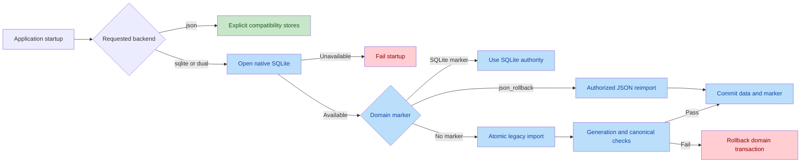
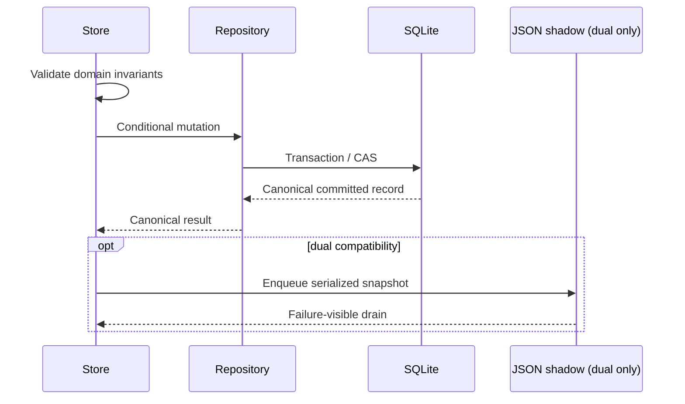

# P97 SQLite Storage Convergence Review

Date: 2026-08-16

## Scope And Intent

Scope: all workspace changes for `P97-sqlite-domain-storage-convergence`
against commit `95c02bcd879f1c5bcd9306a09e4421360065114f`.

Intent: move Goal, runtime checkpoints, Memory, Workspace, Multi-Agent
Session, reviewed Learning, Eval Candidate, and promoted eval fixtures from
JSON authority to SQLite while preserving conditional writes, terminal truth,
review state, migration conflict detection, rollback, and explicit file-backed
exclusions.

## Authority Flow

## Independent Code And Architecture Findings

| ID | Severity | Finding | Resolution | Evidence |
|---|---|---|---|---|
| SC08-01 | Major | CLI published domain markers before canonical `--verify` completed. | Marker publication now requires zero parse, write, conflict, and canonical mismatch results. | `scripts/migrate-to-sqlite.mjs:1041-1091` |
| SC08-02 | Major | Markerless bootstrap could replace a newer SQLite generation with stale JSON. | Bootstrap snapshots canonical authority inside `BEGIN IMMEDIATE`, rejects target-only/newer/equal conflicts, and rolls back the domain. | `src/main/storage/domainAuthorityBootstrap.ts:50-100` |
| SC08-03 | Major | Native SQLite failure could silently fall back to JSON and fork authority. | Requested `sqlite/dual` now fails closed; startup logs the failure and exits nonzero. | `src/main/storage/backendResolver.ts:51-60`, `src/main/container.ts:438-468`, `src/main/main.ts:953-960` |
| SC08-04 | Major | Recoverable JSONL parsing could skip malformed Goal ledger lines and still mark migration complete. | Bootstrap uses strict line parsing; one malformed line rolls back the complete Goal domain. | `src/main/storage/domainAuthorityBootstrap.ts:452-470` |
| SC08-05 | Major | SQLite-to-JSON rollback left SQLite markers active, so later JSON changes could be ignored. | Successful rollback publishes `json_rollback` markers; the next SQLite start performs an authorized full JSON reimport and restores SQLite markers. | `scripts/rollback-sqlite-to-json.mjs:559-577`, `src/main/storage/domainAuthorityBootstrap.ts:61-91` |
| SC08-06 | Major | A second-instance event could create a renderer after Electron readiness but before asynchronous bootstrap and IPC registration completed. | Window restoration now requires a separate `startupComplete` gate. | `src/main/main.ts:85-100`, `src/main/main.ts:924-960` |
| SC08-07 | Major | Multi-Agent mutations shared the `sessions` table and could update a Chat row when given its ID. | Creation, child append, and status mutation now reject non-`multi_agent` rows inside the authoritative boundary. | `src/main/storage/repositories/sessionRepository.ts:137-190`, `src/main/multiAgentSessionStore.ts:210-224` |

All seven findings are closed with focused regressions. Two fresh static passes
re-read each source/sink and lifecycle path after repair; no unresolved
Critical or Major code finding remains.

## Security Review

Result: `CLEAN`.

- SQL values use bound parameters. Dynamic SQL fragments are internal fixed
  table/column maps or fixed smoke queries, not renderer/model input.
- Rollback validates every database-derived identifier before constructing a
  file path for trajectories, Goals, checkpoints, or Plans.
- Goal migration and rollback traverse the production public Skill snapshot,
  acceptance-certificate, and final-judge sanitization paths.
- No credential, MCP environment/header, API key, or private signing material
  is added to SQLite payloads, renderer IPC, smoke evidence, or migration logs.
- No new shell, `eval`, dynamic function, unsafe deserialization, or
  authorization-bypass path is introduced.

No exploitable issue survived the required source-to-sink review.

## Verification

SC07 accepted evidence:

- focused convergence: 13 files / 155 tests before SC08 repairs;
- strict application and test type checks; 291/291 test files covered;
- migration/rollback round trip, idempotency, conflict, compensation, strict
  ledger, rollback-marker, and cross-kind session regressions;
- real Electron smoke: Electron ABI 146, Node ABI restored to 137, seven
  migrations, eight authority markers, eight persisted domain records, no
  JSON fallback, and no legacy P97 shadows;
- program, harness, audit, and whitespace checks; zero audit vulnerabilities.

Final SC08 acceptance:

- focused P97 suite: 14 files / 165 tests;
- full verify: 2,967 tests passed, 6 stress-only tests skipped by design;
- production build completed;
- Agent evals 26/26 and Memory evals 2/2;
- runtime stress 6/6, including 25k context/trajectory, 10k Chat, parallel,
  cancellation, and worker timeout recovery scenarios;
- real macOS Seatbelt effects 10/10;
- final Electron authority smoke: Node ABI 137 to Electron ABI 146 to Node ABI
  137, seven migrations, eight markers, all eight P97 records persisted, no
  JSON fallback, and no legacy P97 shadow;
- strict test types 291/291, program, harness, audit, and whitespace passed;
  audit reported zero vulnerabilities.

Independent code review: `ACCEPT`.

Independent security review: `CLEAN / ACCEPT`.

Independent architecture review: `ACCEPT`.

Independent test acceptance: `ACCEPT`.
