# KM08 Post-Migration Code And Security Review

## Scope

- Reviewed range: `8430d10..f06f288`
- Reviewed implementation: KM02-KM07
- Intent: migrate Chat and Goal production execution to the mode-aware Kernel
  while preserving surface-owned persistence, terminal parity, cancellation,
  rollback, and ToolRuntime authorization boundaries.
- Review methods:
  - repository-level code and call-chain review;
  - two independent correctness validators;
  - attacker-controlled source to dangerous-sink security tracing;
  - focused regression reproduction before and after remediation.

## Technical Flow

```mermaid
flowchart LR
    A[Caller request and AbortSignal] --> B[Chat or Goal surface]
    B --> C[Surface executes and owns cancellation]
    C --> D[Persist terminal domain state]
    D --> E[Return durable settlement receipt]
    E --> F[Kernel validates receipt and parity]
    F --> G[Publish exactly one run_end]
    B -. Signal remains surface-only .-> C
    style B fill:#bbdefb,color:#0d47a1
    style C fill:#fff3e0,color:#e65100
    style D fill:#c8e6c9,color:#1a5e20
    style E fill:#c8e6c9,color:#1a5e20
    style F fill:#f3e5f5,color:#7b1fa2
    style G fill:#c8e6c9,color:#1a5e20
```



## Code Review

| No. | Issue Title | Severity | Confirmation | Suggestion | Code Link |
| --- | --- | --- | --- | --- | --- |
| 1 | Shared surface and Kernel `AbortSignal` permits terminal re-arbitration and Goal replay | Major | High, 2/2 validators | Keep caller cancellation owned by the Chat or Goal surface. Pass only the final durable settlement to Kernel, and never rerun a milestone from Kernel abort settlement. | [Chat reviewed location](file:///Users/bytedance/Documents/trae_projects/zerox-agent/zerox-agent/src/main/chatService.ts#L2386-L2402), [Goal reviewed location](file:///Users/bytedance/Documents/trae_projects/zerox-agent/zerox-agent/src/main/goalRuntimeEngine.ts#L140-L150) |

Both validators confirmed:

- Chat could persist an assistant and emit `completed`, then observe a late
  Kernel abort and fail `run_end` parity while durable success already existed.
- Goal could invoke `executeDirect()` again from `settleAborted()` with the same
  `runId`, repeating milestone execution and persistence.
- Existing pre-abort and stale-success tests did not cover abort after the
  surface commit point.

## Remediation

- Chat no longer passes `runtimeOptions.signal` to `runChatKernelSegment()`.
- Goal no longer passes `runOptions.signal` to `runGoalKernelSegment()`.
- Production wrapper abort callbacks now fail closed if called, rather than
  synthesizing a competing terminal or rerunning domain execution.
- Surface runtimes still receive the original signal and return durable
  `paused` or `canceled` settlements for Kernel validation.
- Added regressions proving:
  - a persisted Chat assistant remains one successful terminal after late
    cancellation;
  - a persisted Goal milestone executes and records exactly once after late
    cancellation.

Pre-fix reproduction:

```text
Chat: Production Kernel status parity failed: failed != succeeded.
Goal: expected succeeded, received canceled after a second direct execution.
```

Post-fix focused regressions: 2 tests passed.

## Security Review

No migration change introduced a demonstrably exploitable attacker-controlled
source to dangerous-sink path. Tool execution continues through the existing
authorization, workspace, ToolRuntime, and OS sandbox boundaries.

Result:

```text
No exploitable issues found in the reviewed change set.
```

## Closure Status

The confirmed correctness issue is fixed and every KM08 gate passed:

- focused Chat and Goal gate: 2 files / 131 tests;
- full serial and verify gates: 271 files / 2,773 tests, with the six opt-in
  stress tests skipped for KM09;
- production build, Agent evaluations 26/26, and Memory evaluations 2/2;
- standard JSON fallback smoke and Electron SQLite smoke without fallback;
- Node ABI restoration and 4 files / 41 storage and dependency tests;
- dependency audit: zero vulnerabilities;
- active-state program, harness, and whitespace checks.

KM08 is complete. KM09 remains the mandatory stress and deferral gate.
