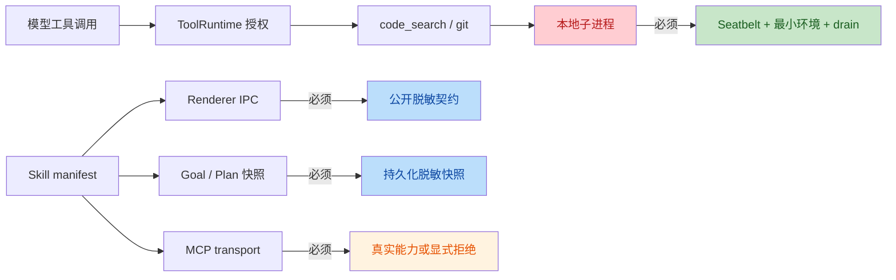
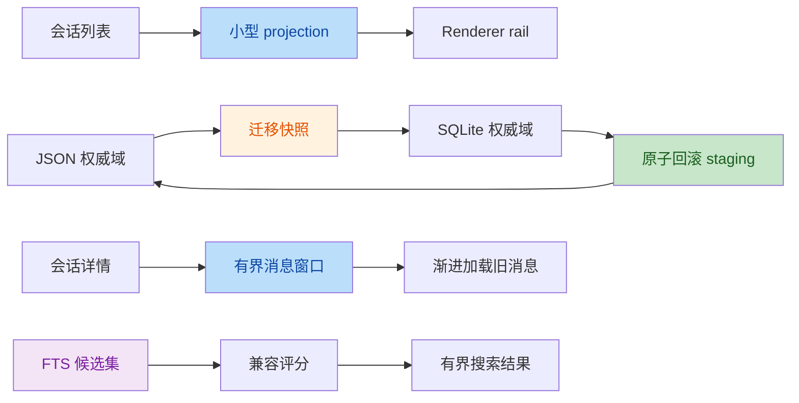

# P96 架构效率与一致性审查

日期：2026-08-16

## 范围与意图

审查意图：在不削弱 Zerox Agent 本地优先、显式授权、可观察轨迹和
Kernel 终态约束的前提下，消除可证明的进程权限逃逸、重复权威源、
无界同步热路径、持久化恢复缺口和长会话性能退化。

四名只读领域审查员分别覆盖 Runtime/Kernel、存储与迁移、系统边界、
renderer 与 IPC。主审合并候选后，两名新的独立验证员逐项检查完整
18 项候选的生产可达性、严重度和现有缓解。生产源码在本报告落盘前
未作修改。

## 结论摘要

- 16 项进入修复：1 Critical、10 个高置信 Major、5 个中置信显著问题。
- 11/16 项得到两名验证员一致的 Critical/Major 评级。
- 5/16 项均被确认存在，但一名验证员降级为 Minor；因其直接影响
  启动恢复、关闭排空、迁移完整性或长会话性能，仍纳入 P96。
- 2 项未进入严重问题清单：
  - `--verify` 二次运行错误被两名验证员一致降为 Minor；在迁移代码
    修复时作为同域改进处理。
  - 忽略 AbortSignal 的第三方模型 Promise 不 drain，被判定为内置
    provider 契约之外的问题，不改变生产取消语义。

## 权限与执行链

## 持久化与性能链

## 已确认问题

| ID | 严重度 / 置信度 | 问题 | 必需修复 | 证据 |
|---|---|---|---|---|
| AE-01 | Critical / 高 | `code_search` 将查询放在 `rg` 选项区，`--pre=COMMAND` 可绕过 Shell 授权启动进程。 | 用显式 pattern 参数和选项终止符；所有本地命令进入统一受限进程运行时。 | [nativeCodeTools.ts:52-70](file:///Users/bytedance/Documents/trae_projects/zerox-agent/zerox-agent/src/main/nativeCodeTools.ts#L52-L70) |
| AE-02 | Major / 高 | `code_search`、`git_status`、`git_diff` 直接 `execFile`，绕过 Seatbelt、最小环境、AbortSignal 和进程树 drain。 | 建立只读、无网络、可取消的统一 native process adapter，并禁用 Git 外部执行配置。 | [nativeGitTools.ts:174-189](file:///Users/bytedance/Documents/trae_projects/zerox-agent/zerox-agent/src/main/nativeGitTools.ts#L174-L189) |
| AE-03 | Major / 高 | MCP `env`/`headers` 经 `skills:list` 进入 renderer，并原样持久化到 Goal/Plan。 | 为 IPC 和持久化定义脱敏 Skill 快照；运行凭据只留在主进程发现结果中。 | [skills.ts:300-366](file:///Users/bytedance/Documents/trae_projects/zerox-agent/zerox-agent/src/shared/skills.ts#L300-L366), [ipc/index.ts:268](file:///Users/bytedance/Documents/trae_projects/zerox-agent/zerox-agent/src/main/ipc/index.ts#L268), [goalChatService.ts:896-902](file:///Users/bytedance/Documents/trae_projects/zerox-agent/zerox-agent/src/main/goalChatService.ts#L896-L902) |
| AE-04 | Major / 高 | 声称支持的 MCP SSE transport 从未建立 SSE 流，只向同一 URL POST JSON。 | 在完整协议实现前显式拒绝 SSE，防止把不可用能力暴露为已实现。 | [mcpTransport.ts:147-196](file:///Users/bytedance/Documents/trae_projects/zerox-agent/zerox-agent/src/main/mcpTransport.ts#L147-L196) |
| AE-05 | Major / 中 | MCP 在发现/连接成功前设置全局 initialized；首次瞬时失败后同进程无法重试。 | 改为逐 server 成功状态；失败 server 保持可重试，成功 server 不重复注册。 | [container.ts:2046-2163](file:///Users/bytedance/Documents/trae_projects/zerox-agent/zerox-agent/src/main/container.ts#L2046-L2163) |
| AE-06 | Major / 高 | 重叠 scheduler 轮次使用陈旧 due 快照，可在 reservation 释放后重复运行后续任务。 | 为整个 due sweep 建立 single-flight，或 dispatch 前原子 claim occurrence。 | [taskSchedulerService.ts:27-56](file:///Users/bytedance/Documents/trae_projects/zerox-agent/zerox-agent/src/main/taskSchedulerService.ts#L27-L56), [main.ts:608-615](file:///Users/bytedance/Documents/trae_projects/zerox-agent/zerox-agent/src/main/main.ts#L608-L615) |
| AE-07 | Major / 高 | Scheduled segment 持久化失败时未走 `settleFailed`，Kernel 可先发布 failed `run_end`。 | 在 Kernel failed terminal 前执行一次失败结算并验证 durable run/checkpoint 证据。 | [agentRuntimeEngine.ts:726-784](file:///Users/bytedance/Documents/trae_projects/zerox-agent/zerox-agent/src/main/agentRuntimeEngine.ts#L726-L784), [productionKernelDriver.ts:194-230](file:///Users/bytedance/Documents/trae_projects/zerox-agent/zerox-agent/src/main/kernel/productionKernelDriver.ts#L194-L230) |
| AE-08 | Major / 中 | Shutdown 嵌套 `allSettled` 把 active completion 和 MCP disconnect rejection 伪装成 fulfilled。 | 扁平化 drain promises；全部资源仍完成清理，但最终必须暴露首个失败。 | [container.ts:4382-4426](file:///Users/bytedance/Documents/trae_projects/zerox-agent/zerox-agent/src/main/container.ts#L4382-L4426) |
| AE-09 | Major / 高 | 全局存储后端与逐域权威不一致；回滚会用陈旧 SQLite 覆盖 JSON 权威域，Plan 的 SQLite 生产路径又未被迁移/回滚覆盖。 | 明确逐域权威矩阵；只导出 SQLite 权威域，并补齐 Plan 双向迁移。 | [container.ts:1166-1325](file:///Users/bytedance/Documents/trae_projects/zerox-agent/zerox-agent/src/main/container.ts#L1166-L1325), [migrate-to-sqlite.mjs:199-299](file:///Users/bytedance/Documents/trae_projects/zerox-agent/zerox-agent/scripts/migrate-to-sqlite.mjs#L199-L299) |
| AE-10 | Major / 高 | SQLite 回滚逐文件先 freeze 再直写；中途失败产生混合代际 JSON。 | 全量 staging 后提交；提交失败自动恢复旧文件，并保留恢复证据。 | [rollback-sqlite-to-json.mjs:39-58](file:///Users/bytedance/Documents/trae_projects/zerox-agent/zerox-agent/scripts/rollback-sqlite-to-json.mjs#L39-L58) |
| AE-11 | Major / 高 | Chat 搜索使用同步 `%term%` 全表扫描、无 SQL limit、全量物化后 JS 排序。 | 增加 FTS 候选索引和候选上限，再执行兼容评分。 | [chatSessionEventRepository.ts:290-330](file:///Users/bytedance/Documents/trae_projects/zerox-agent/zerox-agent/src/main/storage/repositories/chatSessionEventRepository.ts#L290-L330) |
| AE-12 | Major / 中 | Migration ledger 保存 SHA，但启动只按名称跳过，不能发现已应用迁移漂移。 | 在运行任何新迁移前校验所有已应用 name/ordinal/SHA，异常 fail closed。 | [storageDb.ts:94-110](file:///Users/bytedance/Documents/trae_projects/zerox-agent/zerox-agent/src/main/storage/storageDb.ts#L94-L110) |
| AE-13 | Major / 高 | Multi-Agent session 采用无锁 read-modify-write 和非原子整文件覆盖，并发 child run 会丢失。 | 串行化 mutation，使用同目录临时文件原子 rename，并增加并发回归。 | [multiAgentSessionStore.ts:45-89](file:///Users/bytedance/Documents/trae_projects/zerox-agent/zerox-agent/src/main/multiAgentSessionStore.ts#L45-L89) |
| AE-14 | Major / 高 | Tool result 元数据缺失/损坏时 scope 校验 fail-open；内容先于 metadata 写入还形成崩溃窗口。 | 内容与 metadata 原子成对提交；缺失 metadata 时拒绝有 scope 的读取。 | [toolResultOffloadStore.ts:66-73](file:///Users/bytedance/Documents/trae_projects/zerox-agent/zerox-agent/src/main/toolResultOffloadStore.ts#L66-L73), [toolResultOffloadStore.ts:145-175](file:///Users/bytedance/Documents/trae_projects/zerox-agent/zerox-agent/src/main/toolResultOffloadStore.ts#L145-L175) |
| AE-15 | Major / 中 | `listChatSessions` 每会话两次 hydration 全 transcript，并执行 N+1 Plan/Goal 查询；父子 renderer 又重复调用列表。 | 列表只读 projection metadata；去重 renderer 所有权和重复 refresh。 | [container.ts:852-892](file:///Users/bytedance/Documents/trae_projects/zerox-agent/zerox-agent/src/main/container.ts#L852-L892), [App.tsx:159-178](file:///Users/bytedance/Documents/trae_projects/zerox-agent/zerox-agent/src/renderer/App.tsx#L159-L178) |
| AE-16 | Major / 中 | 会话详情全量跨 IPC，renderer 对所有消息创建 DOM，30 秒 tick 重算完整列表。 | 增加 transcript 分页/窗口契约和渐进加载；时间更新不得强制重建全部消息。 | [AgentChatPanel.tsx:258-280](file:///Users/bytedance/Documents/trae_projects/zerox-agent/zerox-agent/src/renderer/components/AgentChatPanel.tsx#L258-L280), [AgentChatPanel.tsx:820-833](file:///Users/bytedance/Documents/trae_projects/zerox-agent/zerox-agent/src/renderer/components/AgentChatPanel.tsx#L820-L833), [AgentChatPanel.tsx:6157-6217](file:///Users/bytedance/Documents/trae_projects/zerox-agent/zerox-agent/src/renderer/components/AgentChatPanel.tsx#L6157-L6217) |

## 修复顺序

1. 先关闭 AE-01/02/03/14，恢复进程和凭据边界。
2. 修复 AE-06/07/08，恢复 scheduler、Kernel terminal 和 shutdown truth。
3. 修复 AE-09/10/12/13，再运行迁移和回滚故障注入。
4. 修复 AE-11/15/16，以 100k 搜索候选、10k transcript 和真实 Electron
   IPC/DOM 指标验收。
5. 最后修复 AE-04/05，并执行 MCP 首次失败重试和显式 SSE 拒绝验收。

## 验收约束

- 每个问题必须先有能在原代码上失败的聚焦回归。
- 不得绕过 ToolRuntime、ToolAuthorizationService、workspace guard 或 Seatbelt。
- `run_end` 只能在 surface settlement 和 persistence drain 之后出现。
- SQLite 回滚只能导出该域的真实权威数据，且失败不能暴露混合代际。
- 会话列表不得读取 transcript；长 transcript 首屏不得创建无界 DOM。
- 最终由未参与实现的测试工程师执行 focused、full verify、runtime stress、
  production smoke、program、harness、audit 和 whitespace gates。

## 验证共识

两名验证员均确认 AE-01 至 AE-16 的底层现象存在。AE-01 至 AE-04、
AE-06/07、AE-09/10/11、AE-13/14 得到一致的 Critical/Major 评级。
AE-05/08/12/15/16 的严重度为 Major/Minor 分歧，保留中置信标记。
未纳入项及理由保留在 P96 过程记录中，不作为修复完成度分母。

## 修复结果

状态：全部 16 项完成，经过独立安全复核、三轮系统架构验收和两轮独立
测试工程师验收。

- AE-01/02：新增统一只读 native process adapter；`rg` 使用 `-e` 和
  `--`，Git 禁用 hook、fsmonitor、pager、external diff 和 textconv；
  生产调用全部注入 Seatbelt、最小环境、AbortSignal 和进程树 drain。
- AE-03：公开/持久化 Skill 快照移除 MCP `env`/`headers`。Goal、Plan、
  renderer IPC、迁移和回滚使用同一脱敏函数；历史 Goal 和 Plan 的所有
  读取路径会清理并回写旧 payload。
- AE-04/05：SSE 在完整协议实现前显式 fail closed；MCP 使用逐 server
  成功集合，失败 server 可在同一进程重试，成功 server 不重复注册。
- AE-06/07/08：scheduler due sweep single-flight；failed/aborted settlement
  失败时不发布 `run_end`；shutdown 扁平排空所有 active completion 和
  MCP disconnect，并在完成其余 flush 后传播真实失败。
- AE-09/10/12/13：迁移仅覆盖 SQLite 权威域，补齐 Plan 双向迁移；
  rollback 全量 staging 并反向补偿；ledger 校验 name/ordinal/SHA；
  Multi-Agent 跨实例串行 mutation 并原子 rename。
- AE-11：Chat 搜索使用 trigram FTS；一至二字查询走按时间索引获取的
  最多 1,000 条候选，不再 `%LIKE%` 全表物化。
- AE-14：tool-result 内容与带 SHA-256 的 metadata 成对提交；scoped
  read 在 metadata 缺失、损坏或 hash 不匹配时 fail closed。
- AE-15/16：会话列表只读 projection metadata，Plan/Goal 批量读取；
  transcript 通过 message sequence cursor 分页，renderer 首屏窗口为
  80 条并渐进加载，时间刷新仅更新 timestamp 子树。

## 独立验收

第一次系统架构验收拒绝四个 Major 残留：Plan 批量读取未回写历史
凭据、abort settlement 失败仍发布 terminal、双字查询仍扫描、Goal
列表仍 N+1。修复后第二次复核接受前三项，第三名独立架构师最终确认
`AE-15 PASS / ACCEPT`。

第一次测试工程师验收因一个存储边界源码传感器变量名不匹配而
`REJECT`；同时指出性能 smoke 为空样本。边界契约恢复后，性能 smoke
改为在隔离 userData 中确定性生成 6 个会话和 480 条长 transcript。

最终独立测试工程师结论：`ACCEPT`。

- Strict test TypeScript coverage：284/284。
- P96 focused：28 files / 524 tests。
- Full verify：2,910 tests passed，0 failures；Agent eval 26/26，Memory
  eval 2/2。
- Runtime stress：6/6。
- macOS Seatbelt real effects：10/10。
- Electron/SQLite production smoke：Node ABI 137 → Electron ABI 146 →
  Node ABI 137；4 migrations，WAL 和 dual evidence 通过，无 JSON fallback。
- Performance smoke：6 sessions，selected transcript 480 messages，
  rendered messages 12，max switch 200.1 ms < 250 ms，long task 0 ms。
- 390 x 844 built smoke：通过。
- Program、Harness、Audit（0 vulnerabilities）和 `git diff --check`：通过。
- 最终安全复核：`CLEAN`，无新引入的可利用 source-to-sink 路径。
