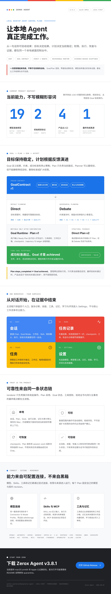

  

<h1 align="center">Zerox Agent</h1>

  <strong>把一句话变成一次可追踪、受权限约束、可恢复的本地 Agent 运行。</strong> 
  A local-first desktop control plane for observable, permissioned, recoverable agent work.

  
  
  
  

  <a href="#中文">中文</a> ·
  <a href="#english">English</a> ·
  <a href="https://github.com/ZeroxZhang/zerox-agent/releases/tag/v3.9.2">下载 v3.9.2</a> ·
  <a href="docs/product/zerox-positioning.md">产品定位</a>

  

---

# 中文

## Zerox Agent 是什么

Zerox Agent 是一个面向 macOS 的本地桌面智能体控制台。它把模型、工作区、技能、工具权限、长期记忆、计划、执行轨迹和验收证据放在同一个可审计的桌面工作台中。

它适合处理三类工作：

- 在会话中完成明确的本地任务，例如读取资料、修改文件、运行命令、检索网页和生成交付物。
- 通过 Goal Mode 推进需要多步骤、会变化、必须验收的长期目标。
- 把稳定任务保存为每日、工作日、每周或固定间隔执行的本地自动任务。

Zerox Agent 的重点不是“让模型无限自主”，而是让真实工作具备清晰的目标、受控的权限、可见的过程、可恢复的状态和有证据的完成判断。

> 当前版本是 **v3.9.2**。当前发布面向 Apple Silicon Mac，采用非 Apple 公证的兼容打包方式；安装说明见[下载与安装](#下载与安装)。

## 产品边界

Zerox Agent：

- 是一个 local-first desktop control plane，而不是云端 Agent 托管平台。
- 是会调用用户自选模型的本地应用，而不是完全离线模型本身。
- 是以工作区和权限为边界的执行环境，而不是对整台电脑的无限制控制。
- 是带恢复、验收和审计的 Agent Runtime，而不是一次性脚本启动器。
- 支持 parent/child multi-agent sessions，但不会把多 Agent 当作默认复杂度。
- 支持 user-reviewed learning；候选经验在用户审核前不会静默改变未来行为。

本地优先意味着任务状态、计划、运行记录、记忆和审计数据默认保存在本机。调用外部模型时，完成请求所需的对话与上下文仍会发送给用户选择的服务商；Zerox Agent 不额外引入云端 worker。

## 当前产品一览

| 用户入口 | 主要作用 | 状态真源 |
| --- | --- | --- |
| **会话** | 普通 Chat、Goal Mode、技能选择、工作区选择、决策与恢复 | 主进程保存的会话、Plan、Goal 与 session-work 投影 |
| **任务记录** | 查看运行结果、失败原因、轨迹、工具、检查点和下一步动作 | RunRecord、checkpoint、trajectory 与 kernel events |
| **任务** | 创建并管理每日、工作日、每周或间隔自动任务 | 本地调度记录与运行历史 |
| **设置** | 配置模型、工具、记忆、技能、学习、评测和系统状态 | 主进程配置与本地存储 |

设置页按真实使用顺序组织为：

1. **启动配置**：模型连接与模型档案。
2. **能力与边界**：工具、记忆、技能。
3. **审核与质量**：学习、评测、系统状态。

旧版本中的独立 Goal 页面已经并入会话。目标的创建、规划、执行、验收、恢复和历史都发生在同一个 session-native Goal Mode 中。

## v3.9.2 会话披露与运行韧性

v3.9.2 让长任务的过程既保持可读，也不丢失可审计证据：

- 会话默认呈现阶段、阻塞点和结果，技术步骤与原始证据按需展开，并能跳转到对应 Run 或 Trajectory。
- Chat、Goal、Plan、任务与审批共享一致的持久化状态投影；暂停、失败、授权和恢复不会被前端折叠成错误成功。
- 模型单次输出达到长度上限时，Chat 会保留部分内容并自动续写；连续无进展才进入可恢复暂停。
- 中文输入法组合阶段的 Enter 只确认候选文字，不会误发消息。
- Plan 生成和独立审查共享有界瞬时网络重试；模型生成时间不会再被错误的 30 秒连接计时器截断，审查重试会复用已经完成的计划。
- 长会话使用有界分页与重放；未知或旧版本事件保持可见并明确标记。
- 本地文件、运行所有权、轨迹序列、工具结果和跨重启恢复增加了失败关闭与幂等校验。

## v3.9.1 上下文编排修复

v3.9.1 修复 Plan 调查阶段漏传模型 Context Window、把最大输出 Token 误当输入预算来源的问题，并统一长任务的上下文治理：

- Context Window 默认来自版本化公开模型目录、Provider `/models` 或 Ollama `/api/show`，不要求用户手动配置。
- 已公开窗口使用 hard budget；未公开窗口明确显示为 advisory，不会再由客户端估算触发错误硬停止。
- 模型请求在接近上限时使用 Provider token count，并把 system、messages 和工具 schema 一起计入预算。
- 压缩只有在下一次完整请求确实进入预算后才成功；不可压缩内容会在模型调用前保留证据并给出可恢复错误。
- Plan 首轮按窗口投影 Skill 与 evidence，保留完整用户目标、证据引用和省略计数。
- 设置页和会话上下文卡会显式显示模型窗口、可用预算及公开来源。

## v3.9.0 核心特点与版本升级

v3.8.x 建立了多服务商模型、Direct/Debate 规划、Goal Contract、Chat SQLite event/projection 和统一 Runtime 的产品骨架。v3.9.0 的重点不是增加另一层界面，而是把这套能力收敛成更可靠的生产基础：本地状态只有一个明确真源，失败不会被伪装成成功，迁移和回滚可验证，原生工具也服从同一权限边界。

### 这个大版本的四个核心特点

1. **SQLite 成为结构化运行时的默认权威**：Goal、执行 checkpoint、Memory、Workspace、Multi-Agent Session、Learning、Eval Candidate 和 promoted fixture 不再各自以 JSON 为主存储。
2. **状态变更可事务化、可恢复**：Goal 终态、Plan 版本、ledger publication、checkpoint、Eval promotion 和 Multi-Agent child run 都有明确的 CAS、幂等或事务边界。
3. **安全边界覆盖原生执行路径**：代码搜索和 Git 读取也进入受管进程、最小环境、只读 Seatbelt、无网络、取消和进程树回收；MCP 私密配置不会进入 renderer 或业务快照。
4. **性能与发布质量有可量化证据**：Chat 使用 FTS、projection、metadata 和 cursor 分页；大规模 stress、真实 Seatbelt、Electron ABI、签名和六资产 Release 都属于发布门禁。

### 相比 v3.8.x 的主要升级

| 领域 | v3.8.x 及更早版本 | v3.9.0 |
| --- | --- | --- |
| **本地存储** | Chat、Run、Task 等已使用 SQLite，但 Goal、Memory、Workspace、Multi-Agent、Learning/Eval 仍以 JSON 为权威，存在混合存储 | 结构化运行时默认统一到 `zerox.db`，八个新增收敛域使用持久化 authority marker |
| **Goal 与 checkpoint** | 已有验收证书、恢复和终态保护，但跨进程条件写与 ledger 唯一性仍主要依赖应用层 | 增加 Goal status/Plan version CAS、不可逆终态保护、事务序号分配、publication key 唯一约束和 checkpoint 终态防复活 |
| **Memory 与多 Agent** | JSON 全量快照容易产生写放大，并发更新需要进程内串行化 | Memory expected-snapshot transaction 防止并发覆盖；Workspace/Multi-Agent 使用 SQLite 事务、幂等 child run 和 Chat/Multi-Agent kind 隔离 |
| **学习与评测** | Learning、Eval Candidate、promoted fixture 分散写入 JSON，promotion 跨记录更新 | 审核状态与复合 identity 进入 SQLite；accepted → promoted 与 fixture upsert 在同一事务完成 |
| **迁移与回滚** | 迁移覆盖面和验证粒度有限，主要确认可导入和记录数量 | 八域 canonical record 校验、更新代冲突拒绝、逐域原子 bootstrap、严格 JSONL、rollback staging 与逆序补偿；显式 JSON 回滚后可安全重导 |
| **安全与一致性** | Shell/MCP 主路径已有授权和 Seatbelt，但原生只读工具、凭据快照和部分失败终态仍有残余边界 | 封堵 `rg --pre` 注入；原生 `rg`/Git 统一受管；MCP `env/headers` 脱敏；Tool Result metadata 和 Kernel durable settlement fail closed |
| **Chat 性能** | 已有 append-only event/projection，但搜索、列表和详情读取仍可能产生扫描、N+1 或大 transcript 传输 | trigram FTS、有界短词候选、批量 Goal/Plan 读取、metadata-only 列表和 80-message cursor 窗口 |
| **发布可信度** | 已有生产 smoke 和兼容打包 | 2,970 项测试、6/6 runtime stress、10/10 Seatbelt、Electron ABI 137→146→137、Ed25519 manifest 和精确六资产 digest 复核 |

### 升级与兼容性

- 从旧版本首次启动时，应用会按数据域原子导入旧 JSON；只有 canonical 校验通过才写入 marker，失败域会完整回滚。
- 如果旧 JSON 与现有 SQLite 都包含不同代际，应用拒绝用旧数据覆盖新权威；可使用迁移 CLI 查看具体冲突。
- `sqlite`/`dual` 模式在 native SQLite 不可用时拒绝启动，避免静默回退后形成两个真源；`json` 仅保留给显式回滚和诊断。
- 加密模型设置、大型 Tool Result、Workspace Run ledger、raw history 和 artifact payload 仍是明确的文件型边界，不会被误称为 SQLite 业务记录。
- 离线迁移校验命令：`node scripts/migrate-to-sqlite.mjs --configDir "<userData>/config" --verify`。

## 选择正确的工作方式

| 任务特征 | 推荐入口 | 为什么 |
| --- | --- | --- |
| 单步、明确、低风险 | 普通 Chat 或快速操作 | 不需要额外规划成本 |
| 步骤固定、重复执行 | 自动任务或脚本型 Skill | 运行方式稳定、容易复用 |
| 多步骤，但路径基本清楚 | Goal Mode · Direct | 生成计划并经过独立冷审与质量门禁 |
| 约束多、方案争议大、需要对抗审查 | Goal Mode · Debate | A/B 对抗审查，C 独立综合 |
| 执行中路径整体失效 | 运行期 Direct 重规划 | 保留原目标和历史计划，只替换当前路径 |
| 高风险或不可逆操作 | 固定权限门禁 + 人工确认 | 不因 Goal 自动授权而跳过极高风险确认 |

Goal Mode 默认使用 Direct；Debate 是用户显式选择的规划协议。普通 Chat、Goal 执行和自动任务共用同一套工作区、工具授权与运行证据边界。

## Goal 与 Plan

### 核心关系

**Goal 定义要达到什么结果，Plan 定义当前如何达到这个结果。**

一个 Goal 由冻结的 `GoalContractSnapshot` 约束，包含：

- 目标结果、交付物、范围和显式假设。
- 质量、时间、成本、安全、权限和来源等约束。
- 语义级成功标准。
- 达标、取消、外部阻塞、不可实现和安全阻断等停止策略。
- 普通操作与极高风险操作的确认策略。

Plan 可以是步骤列表、条件分支、依赖图或动态策略。Planner 可以根据真实反馈调整路径，但不能未经授权改变 Goal 语义、删除成功标准、放松硬约束或扩大权限。

### Direct 与 Debate 兼容

两种初始规划协议读取同一份冻结 Goal Contract：

| 协议 | 规划流程 | 适用场景 | 保留内容 |
| --- | --- | --- | --- |
| **Direct** | 调查 → direct 生成 → 独立冷审 → quality | 默认路径；目标清楚、方案可直接收敛 | 生成轮次、冷审、质量报告、模型绑定 |
| **Debate** | 调查 → A1 → B1 → A2 → B2 → C → quality | 约束复杂、需要对抗审查或保留少数意见 | 所有 A/B/C 轮次、Claim Ledger、少数意见、质量报告、模型绑定 |

A/B 只能质疑 Plan 路径。发现目标冲突时，它们必须报告 `goalContractIssues`，不能直接重写 Goal。C 只能综合符合当前 Goal Contract 的最终方案。

Planning 阶段是只读的。Plan Agent 可以调查工作区、代码、Git、运行历史、记忆和已授权网页，但不能写文件、执行 Shell、启动执行型 Actor/Workflow 或写入记忆。只有用户确认 Ready Plan 后，主进程才创建新的可写 Goal Run。

### 动态 Plan 谱系

Goal 相对稳定，Plan 可以随反馈演进。每次结构性重规划创建新的 `PlanRecord`，而不是覆盖旧计划：

~~~text
GoalContract r1
  ├─ Plan v1 · Debate · A1/B1/A2/B2/C
  └─ Plan v2 · Direct · 运行反馈触发
       └─ Plan v3 · Direct · 再次路径失效

GoalContract r2 · 用户批准目标修订
  └─ Plan v4 · Direct
~~~

- `PlanRecord.revision` 表示一次规划过程内部的修改。
- `goalPlanVersion` 表示同一 Goal 的 Plan v1、v2、v3。
- 初始 Debate 后发生运行期重规划时，界面会显示“初始 Debate → 当前 Direct v2”，不会把 Debate 历史静默降级。
- 运行期结构性重规划统一使用 Direct。初始 Direct Goal 继承原 direct profile；初始 Debate Goal 继承原 C profile 的综合意图。
- 精确修复、同一 milestone 重试或局部替代策略继续由 Goal Controller 处理，不会无意义地制造新 Plan。

新的运行期 Plan 只有在质量门禁通过、Goal Contract 未改变、权限未扩大、风险未提高时才可自动采用；否则进入用户确认或目标修订流程。采用由主进程事务完成，renderer 不能直接切换活动 Plan。

### Plan 完成不等于 Goal 达成

Zerox Agent 严格区分两个事实：

~~~text
所有 milestone 完成
        ↓
Plan = steps_completed
        ↓
Goal 最终验收
   ├─ 有效验收证书 → Goal = achieved
   └─ 验收失败/不可用 → Goal 尚未完成，可恢复或重规划
~~~

只有 Goal 的成功标准通过最终验收并产生有效验收证书，界面才会显示目标达成。Plan 已执行完但验收未通过时，产品会明确显示“当前路径已执行，目标尚未通过验收”，不会把步骤完成误报成目标完成，也不会把已达成 Goal 恢复成失败 Plan。

验收优先使用确定性证据，例如文件存在、命令退出码、测试结果和断言；`model_review` 只作为有证据引用的推断性补充。

### Debate 首次执行可靠性

Debate 规划使用结构化输出协议和 Goal Contract 感知修复：

- 调查、A1/B1/A2/B2/C 各阶段使用明确 schema。
- 标量与列表字段做无损归一化，避免模型形式差异被误判为内容失败。
- 解析失败保留有界原文证据和修复诊断，不把 `finishReason=stop` 误当作有效计划。
- 手动重试从失败深度继续，复用已完成的调查和有效轮次，不重复消耗前置工作。
- 模型不可用时暂停并提示恢复，不静默替换角色模型或降级为 Direct。

## 会话、状态与用户交互

### 主对话只保留真正需要用户处理的内容

| 信息 | 主对话 | 右侧状态栏 |
| --- | --- | --- |
| 用户与助手消息 | 是 | 否 |
| Plan 模式选择、补充问题、确认、恢复和验收决策 | 决策卡 | 摘要状态 |
| Thinking、工具预览、Debate 轮次、Goal milestone、授权历史 | 默认收纳 | 最新状态，可展开详情 |
| 常规执行进度 | 不重复刷屏 | 进度、运行环境与上下文 |

已提交的决策卡会退出阻塞状态。Plan 生成、失败重试和 Goal 恢复期间，输入仍归属于对应 Plan/Goal，不会因为切换页面、重启应用或切换 Goal Mode 按钮而意外落入普通 Chat。

### 上下文数字如何理解

“会话上下文”卡同时展示两类不同指标：

- **累计 Token**：本会话历史上 Chat、Plan 和 Goal 请求累计产生的用量，用于成本与活动审计。
- **当前占用**：下一次模型请求实际装入上下文的消息与记忆，占当前模型上下文窗口的比例。
- **消息**：进入当前运行上下文的消息数量。
- **压缩**：当前上下文是否已经进行过可恢复压缩。

因此累计 Token 可能远大于当前上下文窗口；两者不是同一个分母。Chat、Plan、Goal 的分项用于解释累计用量来源，不代表三份内容会同时完整进入下一次模型请求。

### 恢复与状态真实性

主进程通过共享 session-work projection 统一决定“当前正在执行什么、是否已完成、是否需要恢复”。会话列表、主消息、右侧进度、运行环境和恢复入口不各自猜测状态。

- 已达成 Goal 优先显示“已完成”，不会被旧 Plan 失败覆盖。
- 可恢复 Goal 显示原 Goal、原 Plan、milestone 和验收记录，并提供继续、重试或重规划。
- 同一个 Goal 的继续执行保留原始谱系，不会另起无关 Chat。
- 运行失败只更新当前活动 Plan 的真实执行结果，不会把全部历史 Plan 一律标记为失败。
- checkpoint、trajectory 和 ledger 支持应用重启后的恢复与审计。

## 模型与服务商

模型设置采用“连接优先”的信息架构：

~~~text
Provider Descriptor
└── Connection
    ├── 公开端点与协议配置
    ├── 加密或环境凭证
    ├── 与 revision 绑定的连接验证
    └── Model Profile
        ├── 模型 ID 与生成参数
        ├── 能力配置
        ├── 与 connection/profile revision 绑定的验证
        └── 默认 Chat / Embedding 用途
~~~

当前内置连接类型包括：

- OpenAI、Claude（Anthropic）、Gemini。
- AWS Bedrock、Vertex AI。
- Z AI（GLM）、DeepSeek、Kimi、MiniMax、Qwen、阿里云百炼 Coding Plan。
- xAI、Mistral、Meta Model API、Together AI、Fireworks AI、OpenRouter。
- Ollama 本地模型。
- 自定义 OpenAI Chat Completions 或 Anthropic Messages 网关。

同一服务商可保存多个 Connection。API Key 由 Electron `safeStorage` 加密；renderer、日志、Plan 和轨迹只读取是否存在凭证、来源与 revision，不读取已保存密钥。

保存后的 Connection 与 Model Profile 必须对当前 revision 验证成功，才能成为默认模型或被分配给 Plan 角色。修改连接、模型或凭证会清除旧验证，避免把历史成功带到新的配置。Plan 一旦开始，会冻结自己的模型绑定。

Embedding 是可选能力。当前实现覆盖 OpenAI、OpenAI-compatible custom 与 Ollama 路径；未配置 Embedding 时，记忆仍可使用关键词检索。

## 工具、权限与工作区

Zerox Agent 的工具覆盖文件、代码搜索、Shell、测试、Git、网页、浏览器资料、记忆、工作流和多 Agent 协作等类别。具体工具列表由当前运行、Skill 和权限动态决定，不在 README 中维护容易漂移的固定数字。

所有执行都经过三层边界：

1. **工具可见性**：模型只看到当前任务允许使用的工具。
2. **主进程授权**：`ToolAuthorizationService` 根据任务策略、来源、风险和批准状态裁决。
3. **工作区沙箱**：文件路径、符号链接、Shell 工作目录、网络域名和额外读写目录再次收窄。

Goal Mode 会锁定普通操作的自动授权，使长目标不必为每次低风险读写停下来等待；极高风险、不可逆或超出既有权限的操作仍必须人工确认。renderer 的按钮状态不构成授权，最终决定始终在主进程。

Shell 使用结构化命令分析；文件访问执行路径与符号链接边界检查；Web 访问受搜索开关和域名范围约束。工具调用会写入审计日志与轨迹。

## Skills、MCP 与多 Agent

Skill 是 Zerox Agent 的主要扩展机制。每个 Skill 以 `SKILL.md` 描述：

- 名称、用途、输入参数和执行模式。
- 文件、Shell、Web、记忆等权限。
- 是否需要规划及可用工具。
- 可选脚本入口与 MCP Server。

应用启动时扫描内置和用户 Skill 目录。会话中可通过 `@skill` 搜索并选择技能；执行记录会固定 Skill 的来源和哈希，避免运行途中被静默替换。

Skill 声明的 MCP Server 默认拒绝启动。自动初始化必须同时设置
`ZEROX_ENABLE_SKILL_MCP=1` 和精确的
`ZEROX_SKILL_MCP_ALLOWLIST=skill-name/server-name,...`；allowlist 不支持通配符，
未列出的 Skill/Server 即使出现在 manifest 中也不会启动。该 allowlist 是启动配置，
需由 shell、launch agent 或应用启动器持久设置，修改后重启应用生效。

stdio MCP 默认只能读取 Skill 根目录、写入独立进程沙箱且不能联网；manifest
可通过 `readRoots` 和 `network: true` 显式扩展已信任 Server 的能力。子进程只继承
最小环境白名单与 manifest 明确声明的 `env`。远程 MCP 使用 `transport: http`
或 `transport: sse`，必须声明 HTTPS `url`，可选 `headers` 会原样传给该受信 Server。

复杂任务可创建 parent/child multi-agent sessions。子任务继承工作区和权限边界，并带有 parent run、session、role 和 depth 元数据；父任务在接收结果前可以设置审查门禁。

## 记忆、学习与评测

本地记忆支持：

- `core`：稳定的用户事实与偏好。
- `session`：当前会话的短期上下文。
- `semantic`：概念和知识。
- `episodic`：一次任务的经历与结果。
- `procedural`：可复用的操作流程。

检索默认支持关键词搜索；配置 Embedding 后可使用向量或混合检索。记忆治理会识别重复、冲突和低信号内容。

运行轨迹可以生成学习候选和回归评测候选，但学习默认需要用户审核。Zerox Agent 不会把一次模型输出直接写成永久行为规则，也不会进行未经审核的自我修改。

评测层覆盖任务结果、Goal 验收、权限拒绝、恢复、上下文压缩、Plan/Debate、模型路由、存储一致性和 renderer 状态投影。`episode:export` 可导出 `run-graph.json`、`eval-candidate.json` 与 `trajectory.jsonl` 供复盘。

## 本地数据与隐私

### 正式本地数据模式

Electron 桌面端把会话、任务、Plan、Goal、运行记录、轨迹、记忆和审计数据写入：

~~~text
Electron userData/config
~~~

macOS 通常对应：

~~~text
~/Library/Application Support/Zerox Agent/config
~~~

SQLite 是正式运行时的默认存储权威。Chat、Run、Trajectory、Task、Validation、MemoryProfile、ToolAudit、Goal、执行 checkpoint、Memory、Workspace、Multi-Agent Session、审核后的 Learning、Eval Candidate 和 promoted fixture 都写入 `zerox.db`；首次升级会逐域原子导入旧 JSON，并写入持久化 marker，旧 shadow 不会在后续启动时复活已删除的 SQLite 数据。`ZEROX_STORAGE_BACKEND=dual` 仅用于显式兼容，SQLite 仍先提交且保持权威；`json` 仅用于显式回滚和诊断。若 native SQLite 无法加载，`sqlite/dual` 会拒绝启动，而不是静默回退并分裂权威。

加密模型设置、受作用域约束的大型 Tool Result、Workspace Run ledger、raw history 和 artifact payload 继续保留为明确的文件型边界。API Key 不以明文进入业务记录：Electron `safeStorage` 加密后的密文保存在 `model-settings.json`，renderer、Plan 和运行轨迹不会获得已保存密钥。

常见记录包括会话、Plan、Goal、checkpoint、trajectory、tool audit、memory、scheduled task、`agent-validation.json` 和 multi-agent session。

### 浏览器演示数据模式

只在浏览器中打开 renderer 时，应用显示静态或 `localStorage` 演示数据，不连接 Electron IPC，也不会写入正式桌面数据。界面会明确标记“浏览器演示数据模式”，避免把预览数据误认为真实运行状态。

## 下载与安装

### 下载当前版本

- [Zerox Agent v3.9.2 发布页](https://github.com/ZeroxZhang/zerox-agent/releases/tag/v3.9.2)
- [Zerox-Agent-3.9.2-arm64.dmg](https://github.com/ZeroxZhang/zerox-agent/releases/download/v3.9.2/Zerox-Agent-3.9.2-arm64.dmg)

当前包适用于 Apple Silicon Mac。v3.9.2 使用 `legacy-adhoc` 兼容发布模式，没有 Apple Developer ID 公证。macOS 可能阻止首次打开。

只应对从本项目 GitHub Release 下载且你信任的文件执行以下命令。移除 quarantine 会绕过这份文件的 Gatekeeper 隔离检查。

下载 DMG 后：

~~~bash
xattr -dr com.apple.quarantine ~/Downloads/"Zerox-Agent-3.9.2-arm64.dmg"
~~~

如果已经把应用拖到“应用程序”：

~~~bash
xattr -dr com.apple.quarantine "/Applications/Zerox Agent.app"
~~~

然后重新打开应用。也可以先在 Finder 中右键应用并选择“打开”。

## 首次启动引导

1. 打开 **设置 → 模型**。
2. 新建服务商 Connection，填写凭证或选择环境/系统凭证来源。
3. 测试并保存连接。
4. 为该连接创建 Chat Model Profile，测试当前 revision，并设为默认 Chat 模型。
5. 可选：配置 Embedding Model Profile。
6. 返回 **会话**，选择工作区。
7. 先用普通 Chat 完成一个小任务，再根据任务复杂度选择 Goal Mode · Direct 或 Debate。
8. 在执行前检查 Plan 的目标契约、成功标准、权限和风险；确认 Ready Plan 后才进入可写 Goal Run。
9. 需要完整桌面验收时运行 `npm run validate:agent`；结果会写入 `agent-validation.json`。

## 从源码运行

推荐环境：

- macOS。
- Node.js 22 LTS。
- 与 `package-lock.json` 配套的 npm。

~~~bash
git clone https://github.com/ZeroxZhang/zerox-agent.git
cd zerox-agent

./init.sh
less AGENTS.md
npm ci

npm run doctor
npm run start:prod
~~~

开发模式：

~~~bash
npm run dev
~~~

它会同时启动 renderer 的 Vite 开发服务器、Electron 主进程 TypeScript watch 和 Electron 窗口。

## 验证与开发命令

| 命令 | 用途 |
| --- | --- |
| `npm run dev` | 开发模式：Vite + TypeScript watch + Electron |
| `npm run start:prod` | 生产构建后启动桌面应用 |
| `npm test -- --maxWorkers=1` | 单 worker 运行完整 Vitest，适合规避本地存储并发清理竞争 |
| `npm run build` | TypeScript 与 renderer 生产构建 |
| `npm run verify` / `npm run doctor` | 测试、构建、Agent eval、Memory eval |
| `npm run smoke:prod` | 启动生产 Electron 并验证 renderer |
| `npm run smoke:llm` | 读取 `.api_info.md` 做真实模型连通性冒烟 |
| `npm run smoke:providers` | 校验服务商注册表；真实调用必须显式 opt-in |
| `npm run validate:agent` | 在 Electron 主进程执行完整桌面验收 |
| `npm run eval:agent` / `npm run eval:memory` | 确定性 Agent / Memory 评测 |
| `npm run harness:check` / `npm run harness:score` | 检查 repo-local harness / 输出质量评分 |
| `npm run episode:export -- --config-dir <dir> --run-id <id>` | 导出指定运行证据包 |
| `npm run episode:export -- --config-dir <dir> --latest-validation` | 导出最近一次桌面验收证据 |
| `npm run pack:mac` | 生成本地 `.app` |
| `npm run dist:mac` | 生成 `.dmg` 与 `.zip` |
| `npm run release:mac` | 打包、更新清单签名与发布前检查 |
| `npm run release:publish -- /absolute/path/to/release-notes.md` | 发布精确资产集合到 GitHub Release |

如果仓库根目录存在 `.api_info.md`，`npm run smoke:llm` 会读取其中的本地测试配置；不要把包含密钥的文件提交到 Git。

## 打包与发布

本地兼容打包：

~~~bash
npm run build
npm run smoke:prod
npm run pack:mac
npm run dist:mac
~~~

正式发布链需要独立的 Ed25519 更新签名私钥：

~~~bash
export ZEROX_RELEASE_MODE=legacy-adhoc
export ZEROX_UPDATE_SIGNING_PRIVATE_KEY_FILE=/absolute/path/to/update-signing-private.pem
npm run release:mac
npm run release:publish -- "/absolute/path/to/release-notes.md"
~~~

私钥必须位于仓库外、属于当前用户、权限为 `0600` 或更严格。`release:mac` 会检查源码树、应用签名、嵌入提交、公钥、更新清单签名、哈希、blockmap 和资产白名单。GitHub Release 固定发布 ZIP、DMG、两个 blockmap、`latest-mac.yml` 与 `latest-mac.yml.sig`。

仓库也包含 tag 驱动的 GitHub Actions 发布流程；它运行单 worker 测试、构建、Agent/Memory eval、harness 检查、兼容打包、签名和远端资产复核。

## 项目结构

~~~text
src/
├── main/                  Electron 主进程、服务、运行时、存储、工具与 IPC
│   ├── providers/         Provider Router、原生/兼容适配器与模型矩阵
│   ├── storage/           JSON/JSONL、SQLite 迁移路径与 repositories
│   ├── kernel/            Kernel events、permission rules、compaction、stop policy
│   └── tools/             文件、Shell、Web、Git、测试、工作流等工具
├── renderer/              React UI、会话、任务记录、自动任务与设置
│   └── components/chat/   消息、决策卡、Plan/Goal 与运行状态展示
├── preload/               contextIsolation 下的受控 IPC bridge
├── shared/                Goal、Plan、权限、模型、记忆、轨迹等共享契约
├── skills/                内置 Skill 与示例
├── scripts/               构建、评测、冒烟、打包、发布和证据导出
├── docs/                  产品、架构、设计与验收文档
└── .zerox/                功能清单、进度与 repo-local harness 状态
~~~

关键运行链路：

~~~text
会话输入
  → ChatService
  → PlanDebateOrchestrator（仅 Goal 规划）
  → 用户确认
  → Goal Controller
  → Agent Runtime Engine
  → ToolAuthorizationService
  → 本地 checkpoint / trajectory / ledger
  → Goal 最终验收
~~~

renderer 只展示和发起操作；Plan 采用、Goal 状态、工具授权、验收证书和持久化事务的最终裁决都在主进程。

## 设计与架构文档

| 文档 | 内容 |
| --- | --- |
| [产品定位](docs/product/zerox-positioning.md) | 用户、核心任务、非目标和产品决策矩阵 |
| [Goal Mode 架构](docs/architecture/agent-goal-mode.md) | Goal 状态机、验收、连续性与恢复 |
| [Agent Runtime](docs/architecture/agent-runtime.md) | checkpoint、trajectory、kernel 与权限边界 |
| [工作区与多 Agent](docs/architecture/agent-workspaces.md) | workspace sandbox 与 parent/child context |
| [学习闭环](docs/architecture/agent-learning-loop.md) | memory、learning candidate 与评测晋升 |
| [Plan Debate](docs/design/zerox-agent-3-8-0-plan-debate.md) | Direct/Debate、只读规划、确认与角色隔离 |
| [Plan Debate 用户路径验收](docs/design/zerox-agent-3-8-0-debate-user-path-acceptance.md) | 状态、动作、失败与恢复矩阵 |
| [3.8.1 模型与会话 UX](docs/design/zerox-agent-3-8-1-model-and-conversation-ux.md) | Connection-first 模型设置与信息披露策略 |

历史方案和设计审计保留在 `docs/superpowers/` 与 `docs/design/` 中，但不再承担当前产品说明书的职责。

## 当前限制

- 公开测试包当前仅提供 macOS arm64。
- v3.9.2 未经过 Apple Developer ID 签名与公证。
- 用户需要自备模型服务商账号、API Key 或本地 Ollama。
- 浏览器预览只用于 UI 演示，不能执行桌面任务。
- Zerox Agent 不提供云端 worker、远程托管 Agent 或未经审核的自我修改。
- Windows、Linux、Apple 公证分发和可选崩溃报告尚未作为当前版本能力交付。

---

# English

## What is Zerox Agent?

Zerox Agent is a local-first desktop control plane for personal AI agents on macOS. It turns natural-language work into observable, permissioned, recoverable agent runs across local files, tools, memory, scheduled tasks, and user-reviewed learning.

The current release: v3.9.2.

Zerox Agent is not a hosted agent cloud, an unbounded autonomous loop, or a generic chat wrapper. Durable state lives on the Mac, execution is scoped to a workspace, high-risk actions remain gated, and completion is decided from acceptance evidence rather than an assistant's claim.

External model calls still send the context required for a request to the provider selected by the user. Local-first describes the control plane and durable state; it does not mean every configured model is offline.

## Product surfaces

| Surface | Purpose |
| --- | --- |
| **Chat** | Ordinary conversation, Skills, workspace selection, Goal planning, execution, review, and recovery |
| **Runs** | Outcomes, checkpoints, trajectories, tools, failures, and next actions |
| **Tasks** | Daily, weekday, weekly, and interval local automation |
| **Settings** | Model connections, tools, memory, Skills, learning, evals, and system health |

The primary app flow is Chat, Runs, Tasks, and Settings. Diagnostics, skills, tools, memory, learning, and evals live under Settings instead of competing with the core workflow.

## What changed in v3.9.2

v3.9.2 makes long-running work readable without discarding its audit trail:

- Chat shows phases, blockers, and outcomes by default while keeping bounded technical evidence available on demand and addressable in Runs or Trajectory.
- Chat, Goal, Plan, Tasks, and approvals share durable status projections, so pause, failure, authorization, and recovery cannot be rendered as false success.
- Productive model output-limit responses continue automatically from the preserved partial answer; repeated no-progress responses still pause safely.
- Enter during IME composition confirms the candidate text instead of submitting the message.
- Plan generation and cold review share bounded transient transport retries. Model generation time is no longer mislabeled as a 30-second connection timeout, and review retry reuses the completed candidate.
- Long sessions use bounded paging and replay while unknown or legacy events remain visibly represented.
- Local file, run ownership, trajectory sequence, Tool-result, and restart recovery paths use stricter fail-closed and idempotency checks.

## What changed in v3.9.1

v3.9.1 fixes a Plan investigation path that dropped the model Context Window and incorrectly derived a hard input budget from maximum output tokens.

- Context windows resolve automatically from the versioned public catalog, Provider `/models`, or Ollama `/api/show`; there is no manual window setting.
- Published limits use a hard budget. Unknown limits remain visibly advisory and cannot cause a client-side hard stop from estimation alone.
- Near the limit, Provider token counting covers system instructions, messages, and tool schemas.
- Compaction is accepted only when the complete next request fits, while Plan projects Skills and evidence into the first-request budget.
- Settings and session context surfaces show the resolved window, usable budget, and provenance.

## What changed in v3.9.0

v3.8.x established multi-provider models, Direct/Debate planning, Goal Contracts, Chat event projections, and the unified Runtime. v3.9.0 turns that foundation into a stricter production system: one explicit authority for structured local state, transactional mutations, verifiable migration and rollback, complete native-process controls, and measurable release evidence.

### Defining characteristics

1. **SQLite is the default structured-runtime authority** for Goal, execution checkpoints, Memory, Workspace, Multi-Agent sessions, reviewed Learning, Eval candidates, and promoted fixtures.
2. **State transitions are transactional and recoverable** through CAS, irreversible terminal protection, idempotent publication, and cross-record transactions.
3. **Native paths share the trust boundary**: code search and Git reads use owned processes, minimal environments, read-only Seatbelt, no network, cancellation, and process-tree drain.
4. **Performance and release quality are measured** through FTS/projections/cursor paging, large-scale stress, real Seatbelt effects, Electron ABI smoke, signed update metadata, and exact asset verification.

### Upgrade from v3.8.x

| Area | v3.8.x and earlier | v3.9.0 |
| --- | --- | --- |
| **Storage** | SQLite and JSON authorities coexisted across core domains | Structured runtime state converges on `zerox.db` with eight durable domain markers |
| **Goal/checkpoint truth** | Recovery and certificates existed, while several conditional writes remained application-level | Goal status/Plan-version CAS, unique ledger publication, transactional sequences, and terminal checkpoint resurrection protection |
| **Memory and multi-agent state** | Whole-file JSON snapshots amplified writes and relied on process-local serialization | Expected-snapshot Memory transactions, transactional sessions, idempotent child runs, and Chat/Multi-Agent kind isolation |
| **Learning and evals** | Review candidates and promoted fixtures were separate JSON authorities | Composite identities and one-transaction accepted-to-promoted fixture publication |
| **Migration/rollback** | Narrower migration coverage and count-oriented verification | Canonical record comparison, generation conflict rejection, atomic per-domain bootstrap, strict JSONL, staged rollback, and reverse compensation |
| **Security** | Main Shell/MCP paths were sandboxed, with residual native-read and snapshot gaps | Managed `rg`/Git execution, `rg --pre` injection closure, MCP secret stripping, and fail-closed result/settlement metadata |
| **Chat scale** | Event projections existed, but search/list/detail paths could still scan or hydrate too much | Trigram FTS, bounded short-query candidates, batched metadata reads, and 80-message cursor windows |
| **Release evidence** | Production smoke and compatibility packaging | 2,970 tests, 6/6 stress, 10/10 Seatbelt, ABI 137→146→137, Ed25519 manifest, and six verified assets |

### Upgrade behavior

- First launch imports legacy JSON atomically per domain and writes a marker only after canonical verification succeeds.
- Newer SQLite generations are never overwritten by stale JSON; conflicts fail closed with explicit migration evidence.
- `sqlite` and `dual` refuse startup when native SQLite is unavailable. Explicit `json` remains a rollback and diagnostic mode.
- Encrypted settings, large tool results, workspace-run ledgers, raw history, and artifact payloads remain intentional file-backed boundaries.
- Offline verification: `node scripts/migrate-to-sqlite.mjs --configDir "<userData>/config" --verify`.

## Chat, Direct, and Debate

Use ordinary Chat for small, clear work. Use session-native Goal Mode when a task needs multiple milestones, dynamic decisions, recovery, or final acceptance.

| Mode | Protocol | Best for |
| --- | --- | --- |
| **Direct** | investigation → generation → independent cold review → quality | the default Goal path |
| **Debate** | investigation → A1 → B1 → A2 → B2 → C → quality | adversarial review, complex constraints, minority opinions |
| **Runtime Direct replan** | feedback investigation → generation → cold review → quality | structural path failure after Goal execution starts |

Direct and Debate receive the same frozen `GoalContractSnapshot`. Planners may change the path but cannot silently change the objective, remove success criteria, relax hard constraints, or expand permissions.

Plan runs are read-only. Only user-confirmed Ready plans create writable Goal runs.

## Goal–Plan contract and lineage

A Goal defines the outcome, constraints, success criteria, and stop policy. A Plan defines the current path.

~~~text
GoalContract r1
  ├─ Plan v1 · Debate · A1/B1/A2/B2/C
  └─ Plan v2 · Direct · runtime feedback
       └─ Plan v3 · Direct · another structural replan
~~~

Every structural replan creates a new `PlanRecord` with a parent reference. The original Direct review or Debate rounds remain attached to their own Plan. A Goal amendment is a separate proposal that requires user approval before the contract revision changes.

Completing every milestone sets the active Plan to `steps_completed`. It does not set the Goal to `achieved`. Goal achievement requires final acceptance against the Goal Contract and a valid acceptance certificate.

## Reliable planning and recovery

Structured planning uses schema-aware extraction, lossless normalization, bounded repair evidence, and explicit quality gates. A failed Debate retry resumes from the failed depth and retains valid investigation or completed rounds. Model bindings are frozen per Plan; the system pauses when a required model is unavailable instead of silently switching roles.

A shared main-process session-work projection drives the session list, transcript status, right rail, progress, and recovery entry points. Persisted Goal state takes precedence over stale Plan activity, so an achieved Goal cannot be presented as an unfinished or failed planning run.

## Context disclosure

The main transcript keeps user/assistant messages and decisions that actually block progress. Routine thinking, tool activity, Debate rounds, milestones, approvals, and context telemetry live in the right rail with optional detail.

The context card separates:

- **Cumulative tokens** across historical Chat, Plan, and Goal requests.
- **Current occupancy** of the next model request against that model's context window.
- **Messages in context** and whether recoverable compaction has occurred.

Cumulative usage can be much larger than current occupancy; they measure different things.

## Models

Provider setup is connection-first. A saved Connection owns encrypted or ambient credentials, revision-bound verification, and one or more Model Profiles. A model can become a default or Plan role only after that exact Connection/Profile revision passes verification.

Built-in connection types cover OpenAI, Anthropic, Gemini, Bedrock, Vertex AI, Z AI, DeepSeek, Kimi, MiniMax, Qwen, Alibaba Model Studio Coding Plan, xAI, Mistral, Meta Model API, Together AI, Fireworks AI, OpenRouter, Ollama, and custom OpenAI-compatible or Anthropic endpoints.

Stored secrets are encrypted with Electron `safeStorage` and are never exposed to the renderer, Plan artifacts, or trajectories. Plan model bindings are frozen for reproducibility.

## Trust boundary

- Tool visibility is narrowed before a model request.
- `ToolAuthorizationService` performs the main-process authorization decision.
- Workspace sandboxing rechecks paths, symlinks, shell working directories, network scope, and extra roots.
- Goal autonomy auto-approves ordinary in-scope work, while extreme-risk, irreversible, or expanded-permission actions still require confirmation.
- Checkpoints, trajectories, ledgers, and run records remain local and recoverable.
- Learning candidates require user review before they affect future behavior.
- Renderer state is never the source of truth for tool permission, Plan adoption, Goal completion, or acceptance certificates.

SQLite is the default authority for structured runtime domains, including
Chat, Goal, execution checkpoints, Memory, Workspace, Multi-Agent sessions,
reviewed Learning, Eval candidates, and promoted fixtures. Startup imports each
legacy JSON domain atomically once and records a durable marker. Encrypted model
settings, scoped large tool results, workspace-run ledgers, raw history, and
artifact payloads remain explicit file-backed boundaries. If native SQLite is
unavailable, `sqlite` and `dual` fail startup instead of silently forking writes
into legacy JSON.

## Skills, memory, and multi-agent work

`SKILL.md` files define inputs, execution mode, permissions, planning requirements, custom tools, and optional MCP servers. Skills are discoverable through `@skill` and are provenance-pinned for execution. Skill MCP servers are denied by default: startup requires both `ZEROX_ENABLE_SKILL_MCP=1` and an exact, wildcard-free `ZEROX_SKILL_MCP_ALLOWLIST=skill-name/server-name,...` launch configuration. stdio servers default to the Skill root, an isolated writable sandbox, no network, and a minimal child environment; trusted manifests may explicitly add `readRoots`, `network`, or `env`. Remote `http` and `sse` transports require HTTPS URLs.

Memory supports core, session, semantic, episodic, and procedural records with lexical retrieval and optional embedding-backed search. Parent/child multi-agent sessions inherit workspace and authorization context and preserve parent run, session, role, and depth metadata.

## Download and install

Download [Zerox Agent v3.9.2](https://github.com/ZeroxZhang/zerox-agent/releases/tag/v3.9.2) or the [arm64 DMG](https://github.com/ZeroxZhang/zerox-agent/releases/download/v3.9.2/Zerox-Agent-3.9.2-arm64.dmg).

This compatibility build is not notarized by Apple. Only for a package downloaded from the trusted project release, remove quarantine with:

~~~bash
xattr -dr com.apple.quarantine ~/Downloads/"Zerox-Agent-3.9.2-arm64.dmg"
~~~

After copying the app to Applications:

~~~bash
xattr -dr com.apple.quarantine "/Applications/Zerox Agent.app"
~~~

Removing quarantine bypasses Gatekeeper's quarantine check for that file.

## Run from source

Recommended: macOS, Node.js 22 LTS, and the npm version compatible with the lockfile.

~~~bash
git clone https://github.com/ZeroxZhang/zerox-agent.git
cd zerox-agent

./init.sh
less AGENTS.md
npm ci

npm run doctor
npm run start:prod
~~~

Development mode:

~~~bash
npm run dev
~~~

## Verification and packaging

~~~bash
npm test -- --maxWorkers=1
npm run build
npm run verify
npm run smoke:prod
npm run harness:check

npm run pack:mac
npm run dist:mac
~~~

Additional checks include `npm run smoke:llm`, `npm run smoke:providers`, `npm run validate:agent`, `npm run harness:score`, and `npm run episode:export -- --latest-validation`.

For release packaging:

~~~bash
export ZEROX_RELEASE_MODE=legacy-adhoc
export ZEROX_UPDATE_SIGNING_PRIVATE_KEY_FILE=/absolute/path/to/update-signing-private.pem
npm run release:mac
npm run release:publish -- "/absolute/path/to/release-notes.md"
~~~

## Architecture docs

- [Product positioning](docs/product/zerox-positioning.md)
- [Goal Mode architecture](docs/architecture/agent-goal-mode.md)
- [Agent Runtime architecture](docs/architecture/agent-runtime.md)
- [Workspaces and multi-agent context](docs/architecture/agent-workspaces.md)
- [Learning loop](docs/architecture/agent-learning-loop.md)
- [Plan Debate](docs/design/zerox-agent-3-8-0-plan-debate.md)
- [Plan Debate user-path acceptance](docs/design/zerox-agent-3-8-0-debate-user-path-acceptance.md)
- [v3.8.1 model and conversation UX](docs/design/zerox-agent-3-8-1-model-and-conversation-ux.md)

## Development and testing

- Toolchain: Node 22 pinned (.nvmrc, engines). After switching Node versions
  run `npm rebuild better-sqlite3`.
- Test gate: `npm test` runs the full live-tree suite through plain vitest
  (no historical state rewinding). `npm run test:watch` for watch mode - both
  share the same semantics.
- Governance gates: `npm run harness:check` and `npm run program:check` run
  green locally without secrets.
- Lint: `npm run lint` (eslint flat config: layer boundaries + type hygiene).
- Full pre-push check: `npm run verify`.

## License

ISC

---

  macOS-first · local-first · permissioned · observable · recoverable

