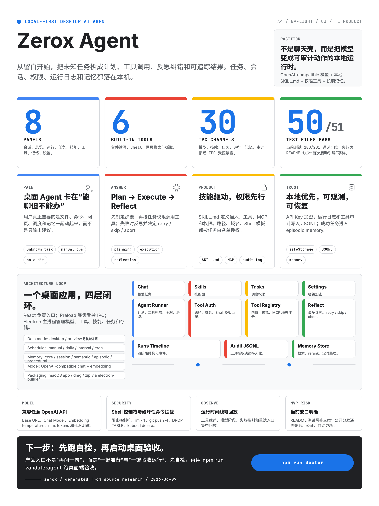

<p align="center">
  
</p>

<h1 align="center">Zerox Agent</h1>

<p align="center">
  <strong>Local-First Desktop AI Agent · macOS · Electron + React + TypeScript</strong><br />
  <sub>从留白开始，把未知任务转成可执行动作。&nbsp;|&nbsp;Start from Zero. Turn unknown into action.</sub>
</p>

<p align="center">
  
  
  
  
  
  
</p>

---

> **Language**：English first &nbsp;|&nbsp; <a href="#chinese">简体中文</a> follows after the English section.

---

<h1 id="english">Zerox Agent</h1>

> A local-first desktop AI Agent built module by module. macOS-first. Electron + React + TypeScript + Vite.

---

## Table of Contents (English)

- [Overview](#overview-en)
- [Architecture](#architecture)
- [Core Capabilities](#core-capabilities)
- [Quick Start](#quick-start-en)
- [Development Guide](#development-guide)
- [Project Structure](#project-structure-en)
- [Skill System](#skill-system)
- [Agent Run Lifecycle](#agent-run-lifecycle)
- [Memory System](#memory-system-en)
- [Tools & Permissions](#tools--permissions)
- [Packaging & Distribution](#packaging--distribution)
- [Testing](#testing-en)
- [Roadmap](#roadmap)

---

<h2 id="overview-en">Overview</h2>

**Zerox Agent** is a local-first desktop control plane for personal AI agents. The current release is **v2.3.5**. The name derives from **Zero + X**: starting from a blank slate and turning unknown local workflows into observable, permissioned, workspace-scoped runs.

It is not a chat wrapper or a generic hosted agent surface. It runs locally, configures OpenAI-compatible models, scans local `SKILL.md` skill files, executes recoverable agent runs, invokes permission-controlled tools, tracks parent/child multi-agent sessions, persists experiential knowledge into local long-term memory, and keeps learning user-reviewed before it changes future behavior.

The product boundary is documented in [`docs/product/zerox-positioning.md`](docs/product/zerox-positioning.md): Zerox optimizes for trusted local control, recoverable agent runs, explicit permissions, workspace-scoped runs, observable trajectories, parent/child multi-agent sessions, and user-reviewed learning. Runtime, workspace, and learning details live in [`docs/architecture/agent-runtime.md`](docs/architecture/agent-runtime.md), [`docs/architecture/agent-workspaces.md`](docs/architecture/agent-workspaces.md), and [`docs/architecture/agent-learning-loop.md`](docs/architecture/agent-learning-loop.md).

v2.1.2 stabilized the command-first agent release after the v2.1.1 UI/runtime controls. Chat sessions now use short deterministic names instead of leaking full slash-command prompts into the header, long live-status capsules stay collapsed until the user expands them, planner JSON recovery handles fenced or explanatory model responses, offloaded tool results can be read back through `tool_result_read` or compatible `file_read` refs, and Goal Mode now resolves natural-language output paths such as `/Users/name/Downloads目录下的文件` back to the real folder before checking artifact evidence. Milestone `running` state is persisted before runtime dispatch, so the right progress rail updates while work is happening instead of after the loop finishes.

v2.2.0 hardens the system-level harness after a MiMo-Code research pass while preserving Zerox's local-first trust boundaries and the command-first agent stage. Agent prompts are now model-profiled with runtime metadata, Goal Mode carries an eleven-section continuity checkpoint through compaction, and evidence-based `model_review` checks can use a transcript-backed goal judge that emits `goal_judged` before `acceptance_checked`. The deterministic agent eval suite covers 22 runtime, native-tool, recovery, compaction, checkpoint, model-retry, research-writing, eval-candidate, multi-agent lineage, and goal-mode contracts, including adversarial coverage for removed goal judge events.

v2.3.0 introduces the Agent Runtime Kernel foundation for long-running local work. It adds a typed kernel event contract, process-local event bus, checkpointed context compaction with rebuildable refs, retry-after-aware model retries, evidence-driven stop policies, rule-based permission evaluation inside `ToolAuthorizationService`, and a renderer Kernel Event Bridge that replays checkpoint, compaction, retry, judge, and run-end evidence in Runs. The deterministic eval suite now includes Agent Runtime Kernel coverage for kernel event replay and permission-rule behavior.

v2.3.1 is a desktop stability hotfix for the v2.3.0 release. It restores the sandboxed Electron preload bridge so packaged builds open in formal local-data mode instead of browser preview/demo mode, model settings can save through the desktop IPC API again, production smoke fails when the desktop bridge is missing, and the chat-first shell keeps a draggable top strip when the normal topbar is hidden.

v2.3.2 hardens Goal execution after live desktop testing. Goal runs now finish by delivering a visible terminal answer back into chat, Chrome bookmark inspection uses a deterministic native `chrome_bookmarks_read` capability instead of probing browser profile files with generic tools, chat/goal JSON state is written atomically to avoid truncated session data, and IPC send-message failures now return structured errors instead of surfacing raw JSON parse exceptions.

v2.3.5 adds Run Graph Harness evidence across the shared model, Runs UI, and episode export path. Runs now project runtime, trajectory, kernel, goal, milestone, tool, checkpoint, summary, and gate evidence into one stable graph; gate nodes are explicit and edge-safe; validation episodes export `run-graph.json` and `eval-candidate.json`; and `episode:export --latest-validation` packages the most recent local validation run for review.

<p align="center">
  
</p>

### Design Principles

| Principle | Description |
|-----------|-------------|
| **Local-First** | All data (tasks, runs, permissions, memory, sessions) is stored in the local `userData` directory. Nothing is uploaded to the cloud. |
| **Privacy-Safe** | API keys are encrypted with Electron `safeStorage`. Every tool call is authorized per-task and audit-logged. |
| **Skill-Driven** | Behavior is defined by composable `SKILL.md` files supporting agent mode (LLM-driven) and script mode, with optional MCP tool extensions. |
| **Observable** | Every run produces a structured event timeline across memory lookup, model calls, public reasoning fields, tool calls, pauses, cancellation, and completion. |
| **Recoverable** | Agent work should be inspectable, cancelable, and resumable instead of disappearing into one-shot chat turns or hard-stopping at a fixed loop limit. |
| **Modular** | The primary app flow is Chat, Overview, Runs, Tasks, and Settings. Skills, Tools, Memory, Learning, and Evals live as collapsed secondary Settings sections; legacy `#goals` hashes redirect to Chat. |

---

<h2 id="architecture">Architecture</h2>

```
┌─────────────────────────────────────────────────────┐
│                  Electron Shell                      │
│  ┌──────────┐  ┌──────────┐  ┌───────────────────┐  │
│  │  Tray    │  │  Window  │  │  safeStorage       │  │
│  └──────────┘  └──────────┘  └───────────────────┘  │
├─────────────────────────────────────────────────────┤
│                  Main Process                        │
│  ┌─────────────┐  ┌────────────┐  ┌──────────────┐  │
│  │ AgentRunner  │  │ TaskSched  │  │ MemoryStore  │  │
│  └─────────────┘  └────────────┘  └──────────────┘  │
│  ┌─────────────┐  ┌────────────┐  ┌──────────────┐  │
│  │ ToolExecutor │  │ SkillRegistry│ │ ChatService  │  │
│  └─────────────┘  └────────────┘  └──────────────┘  │
│  ┌─────────────┐  ┌────────────┐  ┌──────────────┐  │
│  │ ToolAuth    │  │ MCPClient  │  │ ModelConn    │  │
│  └─────────────┘  └────────────┘  └──────────────┘  │
├────────────────────── IPC ──────────────────────────┤
│                 Preload (Bridge)                      │
├─────────────────────────────────────────────────────┤
│               Renderer Process                       │
│  ┌────────┐ ┌────────┐ ┌────────┐ ┌───────────────┐ │
│  │ Chat   │ │Overview│ │ Runs   │ │ Tasks ·Skills │ │
│  └────────┘ └────────┘ └────────┘ └───────────────┘ │
│  ┌────────┐ ┌────────┐ ┌────────┐ ┌───────────────┐ │
│  │ Tools  │ │Memory  │ │Settings│ │ React 19 +    │ │
│  │        │ │        │ │        │ │ Material UI   │ │
│  └────────┘ └────────┘ └────────┘ └───────────────┘ │
└─────────────────────────────────────────────────────┘
```

### Tech Stack

| Layer | Technology | Purpose |
|-------|-----------|---------|
| Desktop Shell | Electron 42 | Window management, tray, secure storage, OS integration |
| Bundler | Vite 8 | HMR dev server for renderer |
| Language | TypeScript 6 | Full-stack type safety, 3 tsconfig targets |
| UI | React 19 | Function components + Hooks, Material Design |
| Testing | Vitest 4 | Unit tests, production build, and deterministic agent/memory evals |
| Packaging | electron-builder 26 | macOS `.app` / `.dmg` / `.zip` distribution |
| Parsing | yaml, cron-parser | SKILL.md frontmatter, cron expressions |

### Data Modes

The app explicitly indicates the current data mode:

- **Desktop Mode**: Electron is connected. Data is written to the `userData/config` directory.
- **Preview Mode**: Only the frontend is loaded in a browser. Static demo data is used; no persistent writes occur.

### Local Data Files

All data is stored under Electron `userData/config/`:

| File | Content |
|------|---------|
| `model-settings.json` | Model configuration (no plaintext API key) |
| `scheduled-tasks.json` | Scheduled task definitions |
| `agent-runs.jsonl` | Task run logs (JSON Lines) |
| `agent-executions/<runId>.json` | Recoverable runtime checkpoints |
| `agent-trajectories/<runId>.jsonl` | Replayable model/tool/transition trajectory events |
| `agent-goals/*.json` and `agent-goals/*.ledger.jsonl` | Session-native Goal Mode state, milestone plans, budget usage, and local progress ledger |
| `agent-workspaces.json` | Workspace registry for default, project, temporary, and git worktree runs |
| `multi-agent-sessions.json` | Parent/child multi-agent session lineage |
| `agent-learning-candidates.json` | User-reviewed learning candidates |
| `tool-audit.jsonl` | Tool authorization audit log |
| `tool-result-refs/*.json` | Offloaded large tool observations referenced from trajectories |
| `memory-records.json` | Local long-term memory |
| `memory-persona.md` | Editable local persona/preference profile generated from reviewed memories |
| `chat-sessions.json` | Chat session records |
| `agent-validation.json` | Latest one-click validation snapshot |

API keys are encrypted with Electron `safeStorage` and are never written to plaintext files or git.

---

<h2 id="core-capabilities">Core Capabilities</h2>

### 1. Agent Chat

The chat window is the primary entry point. Users describe needs in natural language; the Agent selects the appropriate skill, decomposes the task, invokes tools, and returns results. The session displays model, skill, task, memory, and tool status.

Current chat UX includes:

- session-native Goal Mode in Chat Session mode for setting a long-running objective, typing `/目标 ...`, using the composer command menu, seeing the active goal contract, handling review gates inline, and opening goal progress from the same conversation
- Goal Mode artifact evidence files are written under the workspace or explicit user-selected output roots, so refs such as `artifact:research_notes` can be judged from real local files instead of only in-memory artifacts
- A compact real-time activity strip above the composer showing the latest true runtime event
- Expandable, scrollable task activity with newest events first
- Provider-returned public reasoning fields when the configured model/API exposes them
- User-controlled long-task continuation when the loop reaches a checkpoint or repeated tool failures are detected
- An always-available interrupt control that cancels the active chat request and passes cancellation into running tools where possible

### 2. Model Settings

- Supports any OpenAI-compatible API (OpenAI, Anthropic-compatible gateways, local models)
- Separate configuration for chat model and embedding model
- Adjustable temperature (recommended: 0.2–0.5) and max tokens (recommended: 4000–8000)
- One-click connection test with latency and connectivity reporting

### 3. Skill System

Skills are auto-discovered from the app `skills/` directory plus user skill roots such as `~/.claude/skills` and `~/.agents/skills`. Each skill is a Markdown file (`SKILL.md`) with YAML frontmatter defining execution mode, inputs, permissions, dependencies, and optional custom tools or MCP servers.

Built-in skill: `local-file-organizer`

### 4. Scheduled Tasks

Five scheduling modes are supported:

| Mode | Description |
|------|-------------|
| Manual | User-triggered from the UI |
| Daily | Runs daily at a specified time |
| Interval | Runs at fixed minute intervals |
| Cron | Standard cron expressions |
| Draft | Unscheduled task sketch |

Each task is bound to a skill and runs with user-provided input parameters.

### 5. Agent Runner

The active runtime is split into two production paths with shared core behavior:

- **Agent chat loop**: interactive chat turns with tool calling, duplicate-tool detection, repeated-failure pause diagnostics, context compaction, and transient model retry.
- **Recoverable runtime engine**: scheduled/manual task execution with durable checkpoints, trajectory evidence, resume/cancel/pause support, workspace context, authorization audit, memory recall, learning extraction, tool-result offload, and the same context/model retry safeguards.

The recoverable runtime is designed to be hard to strand:

- Dynamic skill and MCP tools are authorized by explicit tool name or registered source.
- Tool failures are appended as model-visible observations before retrying.
- Duplicate retry blocks and exhausted retry budgets become structured `reflection_added` and `failure_classified` evidence.
- Long histories are compacted before model requests and recorded as `context_compacted`.
- Transient model failures retry with bounded exponential backoff and `model_retry` evidence.
- Checkpoints are written after each tool result, so a crash between tools does not erase completed observations.
- Runs trajectory insight cards summarize recovery stops, model retries, and context compaction before users inspect raw payloads.

The older Plan → Execute → Reflect implementation still exists behind the runner facade for legacy/no-checkpoint paths, while the default desktop task path favors the recoverable runtime and its replayable trajectory.

### 6. Agent Orchestrator

For complex tasks, the Orchestrator decomposes work into multiple sub-tasks using LLM planning, then executes them in parallel or sequentially, synthesizing a unified summary.

Parent/child multi-agent sessions are recorded as lineage metadata on top of the recoverable runtime. Child runs inherit workspace and sandbox context, making multi-agent activity inspectable in the Runs panel instead of becoming a separate opaque execution path.

### 7. Tool System

Eighteen built-in tools cover core agent capabilities:

| Tool | Function | Authorization |
|------|----------|---------------|
| `file_list` | List directory contents | Path whitelist for readable dirs |
| `file_stat` | Inspect file or directory metadata without reading full contents | Path whitelist for readable dirs |
| `file_search` | Search names and file contents under an authorized root | Path whitelist for readable dirs |
| `file_read` | Read file contents | Path whitelist for readable dirs |
| `file_write` | Write file (auto-creates dirs) | Path whitelist for writable dirs |
| `code_search` | Search source code with ripgrep-first fallback behavior | Workspace read whitelist |
| `git_status` | Read branch and changed-file summary | Workspace read whitelist |
| `git_diff` | Read raw diff and numstat summary | Workspace read whitelist |
| `test_run` | Run approved test commands with structured output and cancellation | Workspace read whitelist + command template whitelist |
| `memory_search` | Search bounded long-term memory context | Task memory-read permission |
| `conversation_search` | Search bounded chat-session evidence | Task memory-read permission |
| `web_search` | DuckDuckGo search | Explicit search permission |
| `web_fetch` | Fetch webpage content | Domain whitelist |
| `web_fetch_document` | Fetch normalized research documents with source metadata | Domain whitelist |
| `citation_record` | Record structured source evidence separately from report prose | Domain whitelist |
| `citation_coverage_check` | Verify sourced facts cite known citations | Pure structured-data check |
| `markdown_report_write` | Write citation-backed Markdown reports and `.citations.json` sidecars | Path whitelist for writable dirs |
| `shell_exec` | Execute shell command with timeout, cancellation, and structured failure details | Command template whitelist |

Tools come from three sources: built-in (18), skill-defined (from `SKILL.md`), and MCP servers. Native code engineering and research writing tools also emit `native_tool_invocation` and `native_tool_observation` trajectory events so evals and episode exports can distinguish first-party tools from shell fallbacks.

### 8. Permissions & Security

- **File**: Absolute path whitelists with `{{placeholder}}` support
- **Shell**: Command template matching with control operator blocking and destructive command prevention
- **Web**: Explicit search toggle, domain-based fetch whitelist
- **Memory**: Read/write toggles on task policies; memory tools are read-only recall helpers unless explicit write permissions are granted elsewhere
- **Authorization**: Every tool call is checked against the task's permission policy
- **Audit**: All authorization decisions are persisted as JSON Lines

Critical tool calls can also be escalated to system dialog for manual user approval.

---

<h2 id="quick-start-en">Quick Start</h2>

### Prerequisites

- **macOS** (currently macOS-only)
- **Node.js** ≥ 18
- **npm** ≥ 9

### Install & Run

```bash
# 1. Clone
git clone <repo-url> && cd "building agent"

# 2. Initialize the repo-local harness and read the agent guide
./init.sh
less AGENTS.md

# 3. Install dependencies
npm install

# 4. Run full self-check (tests + build + deterministic agent/memory evals)
npm run doctor

# 5. Launch the desktop app (production mode)
npm run start:prod
```

### Development Mode

```bash
npm run dev
```

Starts three processes concurrently:
- Vite dev server (renderer HMR → `http://127.0.0.1:5173`)
- TypeScript main-process compilation (watch mode)
- Electron window (waits for compilation to complete)

### First-Time Setup

1. **Configure Model**: Open app → Settings → fill in Base URL, Chat Model, API Key
2. **Choose Local Workflow**: Return to Overview, click "Prepare Local Agent", then review the default file workflow and its allowed directories
3. **Validate Recoverable Run**: Click "One-Click Validate" to test the connection, tool permissions, run log, and default task path

> Embedding Model is optional; without it, memory uses keyword search only. With it, vector semantic search is enabled.

### LLM Smoke Test

If `.api_info.md` is present in the working directory:

```bash
npm run smoke:llm
```

Parses `.api_info.md`, sends a minimal `/chat/completions` request per provider, and reports results with API keys redacted.

### Desktop Validation

```bash
npm run validate:agent
```

Runs full validation inside the Electron main process: reads config → saves model → prepares task → tests connection → runs task → writes memory and validation snapshot.

---

<h2 id="development-guide">Development Guide</h2>

### Common Commands

| Command | Description |
|---------|-------------|
| `npm run dev` | Development mode (Vite + tsc watch + Electron) |
| `npm run doctor` | Full self-check: tests, build, and deterministic agent/memory evals |
| `npm run build` | Production build |
| `npm run start:prod` | Production build & launch |
| `npm run test` | Run all unit tests |
| `npm run test:watch` | Test watch mode |
| `npm run smoke:llm` | Real-model connectivity smoke |
| `npm run smoke:prod` | Production smoke (start → verify render → exit) |
| `npm run validate:agent` | Full desktop agent validation |
| `npm run eval:agent` | Deterministic local agent eval suite |
| `npm run eval:memory` | Deterministic memory retrieval eval suite |
| `npm run pack:mac` | Package macOS `.app` (unsigned, local trial) |
| `npm run dist:mac` | Package macOS `.dmg` + `.zip` (distribution) |

### TypeScript Configuration

Three compilation targets via project references:

| Config | Target | Output | Purpose |
|--------|--------|--------|---------|
| `tsconfig.electron.json` | `main` + `preload` + `shared` | `dist-electron/` | Electron main process (Node16 ESM) |
| `tsconfig.renderer.json` | `renderer` + `shared` | (noEmit) | Vite-bundled renderer (ESNext) |
| `tsconfig.json` | Root reference | — | Combines the two above |

---

<h2 id="project-structure-en">Project Structure</h2>

```
src/
├── main/           # Electron main process (Node.js)
│   ├── main.ts                 # Entry: window/tray/IPC/startup
│   ├── agentRunnerService.ts   # Agent Runner facade
│   ├── agentRuntimeEngine.ts   # Recoverable runtime state machine
│   ├── agentExecutionStore.ts  # Durable checkpoints
│   ├── agentTrajectoryStore.ts # Append-only trajectory records
│   ├── agentLearningService.ts # Reviewed learning application
│   ├── agentOrchestrator.ts    # Multi-subtask orchestration
│   ├── agentLoop.ts            # Base Agent Loop (fallback)
│   ├── agentToolExecutor.ts    # Tool registration & execution
│   ├── agentBootstrapService.ts# First-run guidance & validation
│   ├── chatService.ts          # Chat service
│   ├── memoryStore.ts          # Local memory store
│   ├── memoryRecall.ts         # Budgeted runtime memory recall
│   ├── memoryL1Extractor.ts    # Lightweight atomic memory extraction
│   ├── memoryProfileStore.ts   # Editable local persona/profile markdown
│   ├── toolResultOffloadStore.ts # Large tool observation refs
│   ├── modelSettingsStore.ts   # Model config store
│   ├── openAiCompatibleClient.ts# OpenAI API client
│   ├── taskStore.ts / taskSchedulerService.ts  # Task storage & scheduling
│   ├── skillRegistry.ts / skillExecutor.ts     # Skill discovery & execution
│   ├── mcpClient.ts            # MCP client
│   ├── webTools.ts             # Web search & fetch
│   ├── toolAuditLog.ts / toolAuthorizationService.ts  # Tool audit & auth
│   ├── desktopLifecycle.ts     # Desktop lifecycle
│   └── ...
│
├── renderer/       # Electron renderer (Browser)
│   ├── App.tsx                 # Root: navigation + panel switching
│   └── components/             # UI components
│
├── preload/        # Context bridge (contextIsolation: true)
├── shared/         # Shared types & utilities
│   ├── agentProtocol.ts        # Agent protocol (system prompt / plan / reflect)
│   ├── skills.ts               # Skill manifest parsing
│   ├── memory.ts               # Memory types & search
│   ├── toolPermissions.ts      # Permission policy & authorization
│   └── ...
│
├── skills/         # Local skill directory
│   ├── local-file-organizer/SKILL.md   # Built-in: file organizer
│   └── example-mcp-skill/SKILL.md      # Example: MCP skill
│
└── package.json
```

---

<h2 id="skill-system">Skill System</h2>

Skills are the core extension mechanism. Each skill is defined as a `SKILL.md` file with YAML frontmatter and a Markdown body. The registry scans app-local `skills/` first, then user roots such as `~/.claude/skills` and `~/.agents/skills`; first match wins, so app-local skills can intentionally override user/system skills with the same name. Skills support:

- **execution mode**: `agent` (LLM-driven) or `script`
- **inputs**: typed parameters with labels
- **permissions**: file paths, shell commands, web domains, memory access
- **custom tools**: tool definitions with entrypoints
- **MCP servers**: external tool servers via Model Context Protocol
- **planning config**: whether explicit planning is required, max steps

Built-in skill: `local-file-organizer` — scans a directory, identifies recently changed or new files, and writes a Markdown organization report.

---

<h2 id="agent-run-lifecycle">Agent Run Lifecycle</h2>

The desktop app wires scheduled and manual task runs through the recoverable runtime by default. Each run writes checkpoints, appends trajectory events, stores a terminal run record, and can generate learning candidates from the completed trajectory.

```
startedAt
  │
  ├── [preflight]  Workspace, skill, memory, and tool schema setup
  │
  ├── [executing]  Model/tool loop
  │    ├── Compact oversized message history before model_request
  │    ├── Retry transient model_request failures with model_retry evidence
  │    ├── Authorize every requested tool against task policy and source metadata
  │    ├── Execute the tool, append native/tool observation evidence
  │    ├── Write a checkpoint after each tool result
  │    └── Feed recoverable failures back to the model as observations
  │
  ├── [recovering] Runtime reflection
  │    ├── Classifies permission, verification, network, duplicate, and budget failures
  │    ├── Allows bounded retry only when the failure is recoverable
  │    └── Emits structured trajectory evidence before aborting unrecoverable loops
  │
  └── [done]       Completion
       ├── Writes AgentRunRecord → agent-runs.jsonl
       ├── Success → auto-writes episodic memory
       └── Updates task lastRunAt
finishedAt
```

Runtime checkpoints are saved under `agent-executions/`, while trajectories are saved under `agent-trajectories/`. Active checkpoints appear in the Runs panel and can be paused or resumed after interruption or app restart. The Runs panel can also inspect raw trajectory events, payloads, and redaction flags.

---

<h2 id="memory-system-en">Memory System</h2>

Local long-term memory with five types inspired by cognitive science:

| Type | Purpose | Example |
|------|---------|---------|
| `core` | Persistent facts about the user | Name, preferences, identity |
| `session` | Transient per-session context | Temporary info in current conversation |
| `semantic` | General knowledge, concepts | Markdown syntax rules, API docs |
| `episodic` | Task execution experiences | Run summaries and outcomes |
| `procedural` | Workflows, procedures | Recommended file organization steps |

### Features

- **Keyword search**: title weight 3×, tags 2×, body 1×, with multi-word phrase matching
- **Vector search** (optional): cosine similarity semantic search via embedding model
- **Reranking**: search results are reranked for relevance
- **Auto-maintenance**: runs every 30 minutes, consolidates duplicate titles and rolls up topics
- **Memory consolidation**: creates summary memories, archives source records (preserving links)
- **Export**: full JSON export
- **Archiving**: consolidated records are marked `archived`, excluded from search by default
- **Reviewed learning**: accepted procedural candidates become local `procedural` memories and are injected into future task/planning prompts
- **Bounded runtime recall**: chat and agent prompts receive truncated, budgeted memory context instead of unbounded dumps
- **Conversation evidence**: successful chat turns can create source-linked session memories backed by local chat messages
- **Atomic L1 extraction**: preference-like chat turns can create lightweight semantic memories and update `memory-persona.md`
- **Governance & evals**: the Memory panel can run local retrieval evals plus duplicate/conflict/stale-record governance reports

---

<h2 id="tools--permissions">Tools & Permissions</h2>

### Permission Policy Generation

At task creation time, a permission policy is generated from the skill's `permissions` config:

```
Skill permissions.files.read: ["{{targetDir}}"]
  User input targetDir = "~/Downloads"
    → Policy files.read: ["~/Downloads"]

Skill permissions.shell.commands: ["ls {{targetDir}}"]
  User input targetDir = "~/Documents"
    → Policy shell.commands: ["ls ~/Documents"]
```

### Authorization Flow

Before every tool call:

```
ToolCall Request
  │
  ├── 1. Parse args JSON
  ├── 2. Check task permission policy
  │    ├── file_list/stat/search/read/write → path whitelist match
  │    ├── code_search/git_status/git_diff → workspace read whitelist match
  │    ├── test_run → workspace read whitelist + approved test command template
  │    ├── memory_search / conversation_search → memory-read permission
  │    ├── web_search → boolean toggle
  │    ├── web_fetch → domain whitelist (incl. subdomains)
  │    └── shell_exec → regex template match + operator block + destructive cmd block
  ├── 3. Write audit log entry
  └── 4. Execute or deny
```

### Security Boundaries

- **Shell safety**: blocks control operators (`;`, `&&`, `||`, `` ` ``, `$(`), pipes, and destructive commands (`rm -rf`, `git push -f`, `DROP TABLE`, `kubectl delete`, etc.)
- **Path safety**: whitelists support `~` expansion and placeholders; unauthorized paths are denied
- **Domain safety**: `web_fetch` supports subdomain matching and exact domain validation
- **Tool robustness**: `shell_exec` defaults to a 120s timeout, supports explicit `timeoutMs`, and returns structured `timeout`, `empty_exit`, `canceled`, and `exit` diagnostics

---

<h2 id="packaging--distribution">Packaging & Distribution</h2>

### Local macOS Trial

```bash
npm run doctor        # Self-check first
npm run smoke:prod    # Production smoke
npm run pack:mac      # Generate .app → release/mac/
```

`pack:mac` produces an unsigned `.app` for local trial without Apple Developer ID signing or notarization.

### Distribution Build

```bash
npm run dist:mac      # Generate .dmg + .zip → release/
```

Current local builds are unsigned and not notarized. After downloading a `.dmg`
from GitHub Releases, macOS Gatekeeper may show "Zerox Agent is damaged and
can't be opened." The image is usually valid; remove the quarantine attribute
before opening:

```bash
xattr -dr com.apple.quarantine ~/Downloads/"Zerox Agent-2.3.5-arm64.dmg"
```

If you already dragged the app into Applications, run:

```bash
xattr -dr com.apple.quarantine "/Applications/Zerox Agent.app"
```

For public distribution, Apple signing, notarization, auto-update, and crash reporting need to be added.

---

<h2 id="testing-en">Testing</h2>

The project includes Vitest unit tests across the shared layer, main process, and renderer:

```bash
npm test              # Run all tests
npm run test:watch    # Watch mode
npm run eval:agent    # Deterministic agent eval suite
npm run eval:memory   # Deterministic memory retrieval eval suite
npm run harness:check # Check repo-local operating harness files
npm run harness:score # Build, run contract evals, and emit ETCLOVG score
BUILDING_AGENT_CONFIG_DIR=/path/to/config npm run eval:agent
BUILDING_AGENT_CONFIG_DIR=/path/to/config npm run harness:score
npm run episode:export -- --config-dir <userData/config> --run-id <runId>
npm run episode:export -- --config-dir <userData/config> --latest-validation
npm run verify        # Tests + build + deterministic eval
```

As of v2.3.5, `npm run verify` covers the Vitest suite, the production build, agent evals, and memory evals. The suite currently includes 131 Vitest files / 672 tests, 25 deterministic agent eval fixtures, and 2 memory eval fixtures. Agent evals include native code engineering, research writing, reflection-after-test-failure, retry-budget exhaustion, context compaction, tool-call checkpointing, model retry, strategy-guard fragmentation recovery, episode eval-candidate, child handoff review-gate, goal-mode recovery/control, bounded-autonomy golden paths, Agent Runtime Kernel event replay, and permission-rule behavior. session-native Goal Mode architecture is documented in `docs/architecture/agent-goal-mode.md`, including the artifact evidence contract, and Agent Runtime Kernel architecture is documented in `docs/architecture/agent-runtime.md`, including the Kernel Event Bridge, checkpointed compaction, retry evidence, judge verdicts, event replay, and rule-based permission evidence. Set `BUILDING_AGENT_CONFIG_DIR=/path/to/config` when running `npm run eval:agent` or `npm run harness:score` to include local promoted fixtures and pending eval candidates from that config directory. `npm run episode:export` writes local evidence packages with `run-graph.json`, `eval-candidate.json`, `trajectory.jsonl`, and verification metadata; `--latest-validation` exports the run captured by `agent-validation.json`. `npm run harness:score` emits the seven-category ETCLOVG score used by Overview as a local quality signal and now includes adversarial eval, goal-mode pass rate, goal-judge pass rate, plus the ACI/context report; Overview also displays the native Agent Capability score.

### Test Coverage

- **Shared layer**: skill parsing, task permissions, memory search, bootstrap flow, navigation, data boundary, agent protocol, etc.
- **Main process**: tool execution, permission authorization, model config store, task scheduling, memory store, chat service, smoke mode, etc.
- **Renderer**: agent work status, validation preview, demo data, etc.

---

<h2 id="roadmap">Roadmap</h2>

Current version: v2.3.5.

Recently shipped:

- [x] Local-first desktop runtime with permissioned tools and `SKILL.md` discovery
- [x] Recoverable run checkpoints, replayable trajectories, and large tool-result offload refs
- [x] Long-task pause/continue UX, visible activity state, and user-triggered interruption
- [x] Runtime memory P0-P4: bounded recall, conversation evidence, persona profile, evals, and governance reports
- [x] Workspace-scoped runs, parent/child multi-agent lineage, and user-reviewed procedural learning
- [x] Repo-local harness, chat evidence, episode export, contract evals, and Overview harness score
- [x] Native code engineering tools (`code_search`, `git_status`, `git_diff`, `test_run`) with native trajectory evidence and Agent Capability score
- [x] Reflection evidence (`reflection_added`) and reviewable episode eval-candidate export
- [x] Research writing tools (`web_fetch_document`, `citation_record`, `citation_coverage_check`, `markdown_report_write`) with citation sidecars and a sourced Markdown eval
- [x] Lightweight child handoff contracts and Runs review-gate cards for researcher/executor/reviewer roles
- [x] P3 Agent Learning Harness Loop with reviewable eval candidates, local promoted fixtures, adversarial eval, ACI/context sensors, and Overview pending eval count
- [x] P4 Runtime Core Upgrade with dynamic MCP/skill tool authorization, recoverable tool-failure observations, retry-budget diagnostics, active context compaction, per-tool checkpoints, model retry, and Runs trajectory insight cards
- [x] session-native Goal Mode in Chat Session mode with bounded goal state, local progress ledger, deterministic-first acceptance, inline review gates, architecture doc, and seven deterministic goal eval fixtures
- [x] Goal command UX with `/目标 ...`, a composer command menu, future tool-command slots, and aligned icon-only composer controls
- [x] Command-first agent stage with workspace sidebar, modular renderer CSS, large composer, and conditional progress/context panel
- [x] MiMo-inspired harness hardening with model-profiled prompts, eleven-section goal continuity checkpoints, transcript-backed goal judge events, and goal-judge adversarial eval coverage
- [x] v2.3.0 Agent Runtime Kernel foundation with typed kernel events, checkpointed compaction, retry-after-aware model retries, evidence stop policies, rule-based permission evaluation, and Runs kernel event replay cards
- [x] v2.3.1 desktop hotfix for packaged preload bridge injection, model settings persistence, production smoke bridge checks, and chat-first window dragging
- [x] v2.3.2 Goal result delivery, deterministic Chrome bookmark capability, atomic chat/goal JSON writes, and structured send-message errors
- [x] v2.3.5 Run Graph Harness, explicit gate graph nodes, Runs graph visibility, typed episode `run-graph.json`, and latest-validation evidence export

Planned:

- [ ] Apple signing, notarization, auto-update, and clearer release distribution
- [ ] Deeper runtime-loop consolidation with first-class persistent plans and verifier/critic passes
- [ ] Skill marketplace, remote skill installation, and visual skill/workflow editing
- [ ] Event-triggered tasks (file changes, system events, etc.)
- [ ] Windows & Linux desktop support
- [ ] Opt-in crash reporting and diagnostics

---

---

<h1 id="chinese">Zerox Agent（中文）</h1>

## 目录（中文）

- [项目概述](#项目概述)
- [架构设计](#架构设计)
- [核心能力](#核心能力)
- [快速开始](#快速开始)
- [开发指南](#开发指南)
- [项目结构](#项目结构)
- [技能系统](#技能系统)
- [Agent 运行生命周期](#agent-运行生命周期)
- [记忆系统](#记忆系统)
- [工具与权限](#工具与权限)
- [打包与分发](#打包与分发)
- [测试](#测试)
- [路线图](#路线图)

---

## 项目概述

**Zerox Agent** 是一个本地优先的桌面智能体控制台，当前版本是 **v2.3.5**。名字取自 **Zero + X**——从留白开始，把未知的本地工作流转成可观察、受权限管控、可恢复的 Agent 运行。

它不是聊天壳，也不是泛用云端 Agent 入口。它运行在本机：配置 OpenAI‑compatible 模型、扫描本地 `SKILL.md` 技能文件、执行可恢复的 Agent 运行、调用受权限管控的工具、跟踪父子多 Agent 会话、把经验和知识写入本地长期记忆，并且在改变未来行为前保留用户审核。

产品边界写在 [`docs/product/zerox-positioning.md`](docs/product/zerox-positioning.md)：Zerox 优先建设可信的本地控制、可恢复运行、显式权限、workspace 作用域、可观察轨迹、父子多 Agent 会话和用户审核后的学习。运行时、workspace 与学习机制分别见 [`docs/architecture/agent-runtime.md`](docs/architecture/agent-runtime.md)、[`docs/architecture/agent-workspaces.md`](docs/architecture/agent-workspaces.md)、[`docs/architecture/agent-learning-loop.md`](docs/architecture/agent-learning-loop.md)。

v2.1.2 在 v2.1.1 的 UI/运行控制基础上继续收口 command-first agent 发布问题：会话标题改成简短确定性名称，不再把完整 `/目标 ...` 提示词和本地路径挤进顶部区域；长状态胶囊默认折叠，用户点击后再展开；planner JSON 解析可以恢复 fenced code 或带解释文本的模型响应；被 offload 的工具结果可以通过 `tool_result_read` 或兼容的 `file_read` ref 读回；Goal Mode 会把 `/Users/name/Downloads目录下的文件` 这类自然语言路径还原到真实目录再验收 artifact evidence。里程碑进入 `running` 后会先持久化，因此右侧进度栏会在执行中更新，而不是等 loop 结束后才变化。

v2.2.0 在研究 MiMo-Code 后强化系统级 harness，同时保留 Zerox 的本地优先信任边界。Agent prompt 现在会按模型画像注入运行元数据，Goal Mode 在上下文压缩中携带 11 段连续性 checkpoint，证据化 `model_review` 可以使用 transcript-backed goal judge，并在 `acceptance_checked` 前写入 `goal_judged` 轨迹事件。确定性 Agent eval suite 覆盖 22 个 runtime、原生工具、恢复、压缩、checkpoint、模型重试、研究写作、eval candidate、多 Agent lineage 和 goal-mode 契约，并包含删除 goal judge 事件的对抗测试。

v2.3.0 增加 Agent Runtime Kernel 基础能力，面向长任务提供 typed kernel event contract、进程内事件总线、可通过本地 ref 重建的 checkpointed context compaction、支持 retry-after 的模型重试、基于证据的停止策略、仍然经过 `ToolAuthorizationService` 的规则化权限评估，以及 Runs 面板里的 Kernel Event Bridge，可回放 checkpoint、compaction、retry、judge 和 run-end 证据。确定性 eval suite 现在包含 Agent Runtime Kernel 的 kernel event replay 与 permission-rule behavior 覆盖。

v2.3.1 是 v2.3.0 的桌面稳定性热修：恢复 sandboxed Electron preload bridge，避免打包应用进入浏览器预览/演示数据模式；模型配置重新通过桌面 IPC 保存；生产冒烟会在桌面 bridge 缺失时失败；Chat 首屏在隐藏常规 topbar 时仍保留顶部窗口拖动区域。

v2.3.2 基于真实桌面测试继续加固 Goal 执行：Goal 完成后会把终局答案可靠回填到聊天区；Chrome 书签查看改用确定性的原生 `chrome_bookmarks_read` 能力，不再用通用工具反复探测浏览器配置文件；会话和目标 JSON 状态改为原子写入，降低截断数据风险；发送消息 IPC 失败时返回结构化错误，不再直接暴露 JSON 解析异常。

v2.3.5 新增 Run Graph Harness 证据链，贯穿共享模型、Runs 面板和 episode 导出路径。Runs 会把 runtime、trajectory、kernel、goal、milestone、tool、checkpoint、summary 和 gate 证据投影成一个稳定图；Gate 作为显式节点参与边完整性校验；验收 episode 会导出 `run-graph.json` 与 `eval-candidate.json`；`episode:export --latest-validation` 可以直接打包最近一次本地验收运行。

### 设计原则

| 原则 | 说明 |
|------|------|
| **本地优先 (Local-First)** | 所有数据（任务、运行日志、权限、记忆、会话）存储在本地 `userData` 目录，不上传云端。 |
| **隐私安全 (Privacy-Safe)** | API Key 使用 Electron `safeStorage` 加密存储，工具调用按任务授权并记录审计日志。 |
| **技能驱动 (Skill-Driven)** | 行为由可组合的 `SKILL.md` 文件定义，支持智能体模式 (agent) 和脚本模式 (script)，可扩展 MCP 工具。 |
| **可观测 (Observable)** | 每次运行产生结构化事件时间线，覆盖记忆检索、模型调用、公开 reasoning 字段、工具调用、暂停、中断和完成状态。 |
| **可恢复 (Recoverable)** | Agent 工作应该可检查、可取消、可恢复，而不是消失在一次性聊天回合里，也不应该因为固定轮次上限直接硬停止。 |
| **模块化 (Modular)** | 主流程保留会话、总览、运行、任务和设置；技能、工具、记忆、学习和评测作为设置内默认折叠的二级分区，旧 `#goals` 地址会回到会话。 |

---

## 架构设计

```
┌─────────────────────────────────────────────────────┐
│                  Electron Shell                      │
│  ┌──────────┐  ┌──────────┐  ┌───────────────────┐  │
│  │  Tray    │  │  Window  │  │  safeStorage       │  │
│  │  (菜单栏) │  │  (主窗口) │  │  (API Key 加密)    │  │
│  └──────────┘  └──────────┘  └───────────────────┘  │
├─────────────────────────────────────────────────────┤
│                  Main Process (主进程)                │
│  ┌─────────────┐  ┌────────────┐  ┌──────────────┐  │
│  │ AgentRunner  │  │ TaskSched  │  │ MemoryStore  │  │
│  │ (智能体执行器)│  │ (任务调度器)│  │ (记忆存储)    │  │
│  └─────────────┘  └────────────┘  └──────────────┘  │
│  ┌─────────────┐  ┌────────────┐  ┌──────────────┐  │
│  │ ToolExecutor │  │ SkillReg   │  │ ChatService  │  │
│  │ (工具执行器)│  │ (技能注册)  │  │ (会话服务)    │  │
│  └─────────────┘  └────────────┘  └──────────────┘  │
│  ┌─────────────┐  ┌────────────┐  ┌──────────────┐  │
│  │ ToolAuth    │  │ MCPClient  │  │ ModelConn    │  │
│  │ (权限管控)   │  │ (MCP 客户端)│  │ (模型连接)    │  │
│  └─────────────┘  └────────────┘  └──────────────┘  │
├────────────────────── IPC ──────────────────────────┤
│                Preload (预加载桥接层)                   │
├─────────────────────────────────────────────────────┤
│               Renderer Process (渲染进程)              │
│  ┌────────┐ ┌────────┐ ┌────────┐ ┌───────────────┐ │
│  │ 会话   │ │ 总览   │ │ 运行   │ │ 任务 · 技能   │ │
│  │ Chat   │ │Overview│ │ Runs   │ │ Tasks ·Skills │ │
│  └────────┘ └────────┘ └────────┘ └───────────────┘ │
│  ┌────────┐ ┌────────┐ ┌────────┐ ┌───────────────┐ │
│  │ 工具   │ │ 记忆   │ │ 设置   │ │ React 19 +    │ │
│  │ Tools  │ │Memory  │ │Settings│ │ Material UI   │ │
│  └────────┘ └────────┘ └────────┘ └───────────────┘ │
└─────────────────────────────────────────────────────┘
```

### 技术栈

| 层 | 技术 | 用途 |
|----|------|------|
| 桌面壳 | Electron 42 | 窗口管理、系统托盘、安全存储、操作系统集成 |
| 构建 | Vite 8 | 渲染进程热更新打包 |
| 类型 | TypeScript 6 | 全栈类型安全，三套 tsconfig（主进程 / 渲染进程 / 共享） |
| UI | React 19 | 函数组件 + Hooks 的 Material Design 桌面 UI |
| 测试 | Vitest 4 | 131 个测试文件 / 672 个测试，覆盖共享层、主进程和渲染进程 |
| 打包 | electron-builder 26 | macOS `.app` / `.dmg` / `.zip` 分发 |
| 解析 | yaml (cron-parser) | SKILL.md 前端元数据解析、cron 表达式 |

### 本地数据与启动

应用明确指出当前所处的数据模式：

- **正式本地数据模式**：Electron 桌面端已连接，数据写入 `userData/config` 目录。
- **浏览器演示数据模式**：仅 localhost 预览前端，使用静态演示数据，不写入正式存储。

### 本地数据文件

所有数据存储在 Electron `userData/config/` 目录：

| 文件 | 内容 |
|------|------|
| `model-settings.json` | 模型配置（不包含明文 API Key） |
| `scheduled-tasks.json` | 定时任务定义 |
| `agent-runs.jsonl` | 任务运行日志 (JSON Lines) |
| `agent-executions/<runId>.json` | 可恢复运行 checkpoint |
| `agent-trajectories/<runId>.jsonl` | 可回放的模型/工具/状态迁移轨迹 |
| `agent-goals/*.json` 与 `agent-goals/*.ledger.jsonl` | 会话原生 Goal Mode 状态、里程碑计划、预算使用和本地进度 ledger |
| `agent-workspaces.json` | 默认、项目、临时、git worktree 等 workspace 注册表 |
| `multi-agent-sessions.json` | 父子多 Agent 会话关系 |
| `agent-learning-candidates.json` | 等待用户审核的学习候选 |
| `tool-audit.jsonl` | 工具授权与审计日志 |
| `tool-result-refs/*.json` | 过大的工具结果本地引用文件 |
| `memory-records.json` | 本地长期记忆 |
| `memory-persona.md` | 由偏好记忆生成、可编辑的本地画像/偏好文档 |
| `chat-sessions.json` | 会话记录 |
| `agent-validation.json` | 最近一次一键验收快照 |

API Key 通过 Electron `safeStorage` 加密保存，永不写入明文文件或 git。

---

## 核心能力

### 1. 智能体对话 (Chat)

对话窗口是第一入口。用户可以从自然语言出发描述需求，Agent 将选择合适的技能、分解任务、调用工具、返回结果。会话过程中展示模型、技能、任务、记忆和工具状态。

当前对话体验包括：

- 会话原生的 session-native Goal Mode：在 Chat Session mode 内设置长期目标，支持 `/目标 ...` 和输入框命令菜单，查看目标契约、处理内联审核门，并从同一会话打开目标进度
- Goal Mode artifact evidence files 会写入 workspace 或用户显式选择的输出目录，因此 `artifact:research_notes` 这类引用会从真实本地文件验收，而不是只依赖内存 artifact
- 输入框上方的紧凑实时状态栏，展示最新真实运行事件
- 可展开、可滚动的任务过程列表，默认最新事件在前
- 当模型/API 返回公开 `reasoning_content`、`reasoning` 或 `thinking` 字段时展示对应思考摘要
- 长任务达到检查点或连续同类工具失败时暂停，让用户决定是否继续
- 输入框内始终可用的中断图标，可取消当前会话请求，并尽可能把取消信号传递给正在运行的工具

### 2. 模型配置 (Model Settings)

- 支持任何 OpenAI‑compatible API（OpenAI、Anthropic 兼容网关、本地模型等）
- 独立配置对话模型、Embedding 模型
- 可调 temperature (建议 0.2–0.5) 和 max tokens (建议 4000–8000)
- 一键连接测试，报告延迟和连通性

### 3. 技能系统 (Skills)

从应用内 `skills/` 目录，以及 `~/.claude/skills`、`~/.agents/skills` 等用户技能目录自动发现和加载技能。每个技能是一个包含 YAML frontmatter 的 Markdown 文件 (`SKILL.md`)，定义：

- `name` / `displayName` / `description`：技能标识
- `execution.mode`：`agent`（LLM 驱动执行）或 `script`（脚本执行）
- `inputs`：用户可配置的输入参数
- `permissions`：文件读写、shell 命令、web 搜索/抓取、记忆读写的权限边界
- `tools`：自定义工具定义（可选，扩展内置工具集）
- `mcpServers`：Model Context Protocol 服务器配置（可选，接入外部工具生态）
- `planning`：是否需要显式规划阶段

内置技能：`local-file-organizer`（本地文件整理）

### 4. 任务调度 (Scheduled Tasks)

支持五种调度模式：

| 模式 | 说明 |
|------|------|
| 手动 (manual) | 用户在界面中手动触发 |
| 每日 (daily) | 按指定时间每天运行 |
| 间隔 (interval) | 按固定分钟间隔运行 |
| Cron | 标准 cron 表达式 |
| 自然语言草稿 (draft) | 尚未设置调度的任务草稿 |

任务由技能驱动——每个任务绑定一个技能，运行该技能时使用任务提供的输入参数。

### 5. Agent Runner（智能体运行器）

当前生产运行时由两条活跃路径组成，并共享一组核心防护：

- **对话 Agent loop**：面向交互式聊天，支持工具调用、重复工具检测、连续失败暂停诊断、上下文压缩和瞬时模型失败重试。
- **可恢复 runtime engine**：面向手动/定时任务，提供 durable checkpoint、trajectory evidence、resume/cancel/pause、workspace context、授权审计、记忆召回、学习候选提取、工具结果 offload，以及同样的上下文压缩和模型重试防护。

可恢复 runtime 的设计目标是让运行不再轻易卡死：

- 动态 skill / MCP 工具可通过显式工具名或注册来源授权。
- 工具失败会作为模型可见 observation 写回，再决定是否重试。
- 重复 retry 和恢复预算耗尽会成为结构化 `reflection_added` / `failure_classified` 证据。
- 长历史会在模型请求前压缩，并记录 `context_compacted`。
- 瞬时模型失败会有限指数退避重试，并记录 `model_retry`。
- 每个工具结果之后立即写 checkpoint，工具之间崩溃不会丢掉已完成 observation。
- Runs 轨迹诊断卡会摘要恢复停止、模型重试和上下文压缩，再让用户查看 raw payload。

旧的 Plan → Execute → Reflect 实现仍保留在 runner facade 的 legacy/no-checkpoint 路径中；默认桌面任务路径优先使用可恢复 runtime 和可回放 trajectory。

### 6. Agent Orchestrator（任务编排器）

对于复杂任务，Orchestrator 将任务分解为多个子任务：

1. **分解**：LLM 分析任务描述和可用技能，产出编排计划
2. **执行**：按照计划并行或顺序执行子任务
3. **合成**：汇总所有子任务结果，生成统一摘要

### 7. 工具系统 (Tools)

十八种内置工具，覆盖核心 Agent 能力：

| 工具 | 功能 | 权限控制 |
|------|------|----------|
| `file_list` | 列出目录内容 | 限制可读目录路径 |
| `file_stat` | 查看文件或目录元数据，不读取完整内容 | 限制可读目录路径 |
| `file_search` | 在授权根目录内搜索文件名和文件内容 | 限制可读目录路径 |
| `file_read` | 读取文件内容 | 限制可读目录路径 |
| `file_write` | 写入文件（自动创建目录） | 限制可写目录路径 |
| `code_search` | 以 ripgrep 优先的方式搜索源码 | workspace 可读目录白名单 |
| `git_status` | 读取分支和改动文件摘要 | workspace 可读目录白名单 |
| `git_diff` | 读取 raw diff 和 numstat 摘要 | workspace 可读目录白名单 |
| `test_run` | 运行已授权测试命令，返回结构化结果并支持中断 | workspace 可读目录白名单 + 命令模板白名单 |
| `memory_search` | 检索有预算限制的长期记忆上下文 | 需要任务 memory.read 权限 |
| `conversation_search` | 检索有预算限制的会话证据 | 需要任务 memory.read 权限 |
| `web_search` | DuckDuckGo 网页搜索 | 需显式授权 search 权限 |
| `web_fetch` | 抓取网页内容 | 需授权目标域名 |
| `web_fetch_document` | 抓取带来源元数据的研究文档 | 需授权目标域名 |
| `citation_record` | 记录结构化引用证据，和报告正文分离 | 需授权目标域名 |
| `citation_coverage_check` | 检查 sourced fact 是否引用已知 citation | 纯结构化数据检查 |
| `markdown_report_write` | 写入带引用的 Markdown 报告和 `.citations.json` sidecar | 限制可写目录路径 |
| `shell_exec` | 执行 shell 命令，支持超时、中断和结构化失败诊断 | 需匹配已授权命令模板 |

工具注册表采用动态注册机制 (`DynamicToolRegistry`)，支持三类工具来源：
- **内置工具**：18 种核心工具开箱即用
- **技能工具**：技能 SKILL.md 中定义的 `tools` 自动注册
- **MCP 工具**：通过 MCP 协议接入的外部工具服务器

原生代码工程工具会额外写入 `native_tool_invocation` 和 `native_tool_observation` 轨迹事件，让 eval 和 episode export 能区分一方工具调用与 shell fallback。

### 8. 权限与安全 (Permissions & Security)

每个任务创建时，基于技能的 `permissions` 配置生成权限清单：

- **文件权限**：按绝对路径白名单限制读写范围，支持 `{{placeholder}}` 占位符
- **原生代码工具权限**：`code_search`、`git_status`、`git_diff` 需匹配 workspace 可读目录；`test_run` 还需匹配已授权测试命令模板
- **Shell 权限**：按命令行模板白名单匹配，阻止包含控制操作符 (`;`、`&&`、`|`、`` ` ``、`$(`) 和破坏性命令 (`rm -rf`、`git push -f`、`DROP TABLE` 等) 的调用
- **Web 权限**：搜索需显式启用，抓取按域名白名单匹配
- **记忆权限**：任务策略中包含 memory.read / memory.write 开关，记忆检索工具只读
- **工具授权**：每次工具调用前检查任务权限清单
- **审计日志**：所有工具调用决策以 JSON Lines 格式持久化

关键工具调用还可通过系统对话框弹窗，请求用户手动批准。

---

## 快速开始

### 环境要求

- **macOS**（当前仅支持 macOS）
- **Node.js** ≥ 18
- **npm** ≥ 9

### 安装与运行

```bash
# 1. 克隆仓库
git clone <repo-url> && cd "building agent"

# 2. 初始化仓库本地 harness，并阅读 Agent 操作指南
./init.sh
less AGENTS.md

# 3. 安装依赖
npm install

# 4. 运行完整自检（测试 + 构建 + Agent/记忆评测）
npm run doctor

# 5. 启动桌面应用（生产模式）
npm run start:prod
```

### 开发模式

```bash
npm run dev
```

同时启动三个进程：
- Vite 开发服务器 (renderer HMR → `http://127.0.0.1:5173`)
- TypeScript 主进程编译 (watch 模式)
- Electron 窗口 (自动等待编译完成)

### 首次启动引导（第一次使用）

1. **配置模型**：打开应用 → 设置 → 填写 Base URL、Chat Model、API Key
2. **准备能力**：回到首页，点击「准备本地智能体」检查模型、技能和默认任务
3. **验收运行**：点击「一键验收运行」，测试连接并执行默认任务

> Embedding Model 可选填；不填时记忆仍可用关键词检索，填后增加向量语义检索。

### 真实模型冒烟测试

如果当前目录有 `.api_info.md`（OpenAI‑compatible 供应商配置）：

```bash
npm run smoke:llm
```

该命令会：
- 解析 `.api_info.md` 中的 `base_url`、`api_key`、`model`
- 对每个供应商发送一次最小 `/chat/completions` 请求
- 打印供应商、延迟和回复摘要（**API Key 已脱敏**）
- 至少一个供应商通过即视为成功

### 桌面端完整验收

```bash
npm run validate:agent
```

在 Electron 主进程内运行完整验收：读取配置 → 保存模型 → 准备任务 → 测试连接 → 运行任务 → 写入记忆和验收快照。

---

## 开发指南

### 常用命令

| 命令 | 说明 |
|------|------|
| `npm run dev` | 开发模式（Vite + tsc watch + Electron） |
| `npm run doctor` | 完整自检：测试、构建、Agent 评测和记忆评测 |
| `npm run build` | 生产构建 |
| `npm run start:prod` | 生产构建并启动 |
| `npm run test` | 运行全部单元测试 |
| `npm run test:watch` | 测试 watch 模式 |
| `npm run smoke:llm` | 真实模型连通性冒烟 |
| `npm run smoke:prod` | 生产包冒烟（启动 → 验证渲染 → 退出） |
| `npm run validate:agent` | 桌面端完整验收 |
| `npm run eval:agent` | 确定性 Agent 运行评测 |
| `npm run eval:memory` | 确定性记忆检索评测 |
| `npm run pack:mac` | 打包 macOS `.app`（未签名，本地试用） |
| `npm run dist:mac` | 打包 macOS `.dmg` + `.zip`（分发用） |

### TypeScript 配置

项目使用 TypeScript 项目引用 (`references`) 分离三个编译目标：

| 配置 | 目标 | 输出 | 用途 |
|------|------|------|------|
| `tsconfig.electron.json` | `src/main` + `src/preload` + `src/shared` | `dist-electron/` | Electron 主进程 (Node16 ESM) |
| `tsconfig.renderer.json` | `src/renderer` + `src/shared` | (noEmit) | Vite 打包的渲染进程 (ESNext) |
| `tsconfig.json` | 根引用文件 | — | 组合以上两者 |

### 代码组织

```text
src/
├── main/           # Electron 主进程 (Node.js 环境)
│   ├── main.ts                 # 入口：窗口/Tray/IPC/启动
│   ├── agentRunnerService.ts   # Agent Runner facade
│   ├── agentRuntimeEngine.ts   # 可恢复运行状态机
│   ├── agentExecutionStore.ts  # 持久化 checkpoint
│   ├── agentTrajectoryStore.ts # 追加式运行轨迹
│   ├── agentLearningService.ts # 审核后学习应用
│   ├── agentOrchestrator.ts    # 多子任务编排
│   ├── agentLoop.ts            # 基础 Agent Loop (备用)
│   ├── agentToolExecutor.ts    # 工具注册与执行
│   ├── agentBootstrapService.ts# 首次引导与验收
│   ├── agentRunStore.ts        # 运行日志存储
│   ├── agentValidationStore.ts # 验收快照存储
│   ├── chatService.ts          # 会话服务
│   ├── chatSessionStore.ts     # 会话存储
│   ├── memoryStore.ts          # 本地记忆存储
│   ├── memoryRecall.ts         # 运行时有预算记忆召回
│   ├── memoryL1Extractor.ts    # 轻量原子记忆抽取
│   ├── memoryProfileStore.ts   # 本地画像/偏好 Markdown
│   ├── toolResultOffloadStore.ts# 大型工具结果引用
│   ├── modelSettingsStore.ts   # 模型配置存储
│   ├── modelConnectionService.ts# 模型连接测试
│   ├── openAiCompatibleClient.ts# OpenAI API 客户端
│   ├── taskStore.ts            # 任务存储
│   ├── taskSchedulerService.ts # 任务调度器
│   ├── skillRegistry.ts        # 技能发现与注册
│   ├── skillExecutor.ts        # 技能工具执行
│   ├── mcpClient.ts            # MCP 客户端
│   ├── webTools.ts             # 网页搜索/抓取
│   ├── toolAuditLog.ts         # 工具审计日志
│   ├── toolAuthorizationService.ts# 工具授权服务
│   ├── toolApprovalDialog.ts   # 工具授权弹窗
│   ├── desktopLifecycle.ts     # 桌面生命周期管理
│   ├── smokeMode.ts            # 冒烟测试模式
│   ├── chunking.ts             # 记忆分块
│   └── reranker.ts             # 搜索结果重排
│
├── renderer/       # Electron 渲染进程 (浏览器环境)
│   ├── main.tsx                # React 入口
│   ├── App.tsx                 # 根组件：导航 + 面板切换
│   ├── components/             # UI 组件目录
│   ├── styles.css              # 全局样式
│   └── ...
│
├── preload/        # 预加载桥接 (contextIsolation: true)
├── shared/         # 共享类型与工具函数 (主进程+渲染进程)
│   ├── agentProtocol.ts        # Agent 协议（System Prompt / Plan / Reflect）
│   ├── agentRuns.ts            # 运行记录类型
│   ├── agentBootstrap.ts       # 引导/验收类型
│   ├── agentOnboarding.ts      # 首次引导步骤
│   ├── agentReadiness.ts       # 就绪状态检查
│   ├── agentRunInsights.ts     # 运行洞察
│   ├── appMeta.ts              # 应用元数据
│   ├── apiInfoProfiles.ts      # API 供应商配置解析
│   ├── chat.ts                 # 会话类型
│   ├── dataBoundary.ts         # 数据边界（桌面/演示模式）
│   ├── desktopRuntime.ts       # 桌面运行时信息
│   ├── firstRunGuide.ts        # 首次运行引导
│   ├── materialNavigation.ts   # Material Design 导航图标
│   ├── memory.ts               # 记忆类型与搜索
│   ├── memoryMaintenance.ts    # 记忆整理策略
│   ├── modelSettings.ts        # 模型配置类型
│   ├── navigation.ts           # 导航分区定义
│   ├── scheduledTasks.ts       # 任务类型
│   ├── skills.ts               # 技能定义与解析
│   ├── toolPermissions.ts      # 工具权限类型与授权逻辑
│   └── toolSafetySummary.ts    # 工具安全摘要
│
├── skills/         # 本地技能目录
│   ├── local-file-organizer/SKILL.md   # 内置：文件整理技能
│   └── example-mcp-skill/SKILL.md      # 示例：MCP 技能
│
├── scripts/
│   └── check-api-info.mjs     # LLM 冒烟测试脚本
│
├── build/          # electron-builder 构建资源
├── public/         # 静态资源
└── package.json
```

---

## 技能系统

技能是 Zerox Agent 的核心扩展机制。每个技能定义为一个 `SKILL.md` 文件，可放在应用内 `skills/`，也可放在 `~/.claude/skills`、`~/.agents/skills` 等用户技能目录。

### SKILL.md 格式

```markdown
---
name: my-skill
displayName: 我的技能
description: 这个技能做了什么
version: 0.1.0
execution:
  mode: agent            # agent | script
  maxTurns: 15           # 可选，默认根据计划步骤数计算
inputs:
  - name: inputParam
    label: 输入参数
    type: string         # string | path | number | boolean
    required: true
permissions:
  files:
    read:
      - "{{inputParam}}" # 支持 Mustache 风格占位符
    write:
      - "{{inputParam}}"
  shell:
    commands: []
  web:
    search: false
    fetchDomains: []
  memory:
    read: true
    write: true
planning:
  required: true          # 是否需要显式规划阶段
  maxSteps: 7             # 可选，最大计划步骤数
tools:                    # 可选，自定义工具定义
  - name: my_tool
    description: 自定义工具描述
    parameters:
      type: object
      properties: {}
    entrypoint: my_tool_handler
mcpServers:               # 可选，MCP 服务器配置
  - name: external-server
    command: npx
    args: ["-y", "@scope/server"]
    env:
      API_KEY: "{{env.MCP_API_KEY}}"
---
# 技能指令

技能的具体指令内容，将作为 Agent 的执行指南。
```

### 技能发现与注册

启动时，系统按顺序扫描应用内 `skills/` 目录和用户技能目录：

1. 发现每个包含 `SKILL.md` 的子目录
2. 解析 YAML frontmatter → 验证 manifest
3. 将技能注册到技能图 (`SkillGraph`)，支持依赖排序
4. 收集 MCP 配置 → 初始化 MCP 客户端 → 注册外部工具
5. 注册技能自定义工具到动态工具注册表

---

## Agent 运行生命周期

桌面端手动/定时任务默认走可恢复 runtime。每次运行都会写 checkpoint、追加 trajectory event、保存终态 run record，并可从完成轨迹生成学习候选：

```
startedAt
  │
  ├── [preflight]  workspace、skill、memory、tool schema 准备
  │
  ├── [executing]  模型/工具循环
  │    ├── 模型请求前压缩过长历史
  │    ├── 瞬时模型失败写入 model_retry 并有限重试
  │    ├── 每个工具调用按任务权限和来源元数据授权
  │    ├── 执行工具并追加 native/tool observation 证据
  │    ├── 每个工具结果后写 checkpoint
  │    └── 可恢复失败作为 observation 反喂模型
  │
  ├── [recovering] 运行时反思
  │    ├── 分类权限、验证、网络、重复 retry、预算耗尽等失败
  │    ├── 仅在可恢复时允许有限重试
  │    └── 不可恢复循环终止前写入结构化轨迹证据
  │
  └── [done]       完成
       ├── 写入 AgentRunRecord → agent-runs.jsonl
       ├── 成功运行 → 自动写入 episodic memory
       └── 更新任务 lastRunAt
finishedAt
```

---

## 记忆系统

本地长期记忆支持五种类型，参考认知科学分类：

| 类型 | 用途 | 示例 |
|------|------|------|
| `core` (核心) | 关于用户的持久事实 | 用户姓名、偏好、身份 |
| `session` (会话) | 单次会话临时上下文 | 当前对话中的临时信息 |
| `semantic` (语义) | 通用知识、概念 | Markdown 语法规则、API 文档摘要 |
| `episodic` (情景) | 任务执行经验 | 某次运行的摘要和结果 |
| `procedural` (流程) | 操作流程、工作流 | 文件整理的推荐步骤 |

### 特性

- **关键词检索**：标题权重 3×、标签 2×、正文 1×，支持多词短语匹配
- **向量检索**（可选）：配置 Embedding 模型后启用余弦相似度语义搜索
- **重排序 (Reranking)**：搜索结果通过 reranker 按相关性重新排序
- **自动整理**：每 30 分钟自动运行整理，合并重复标题、话题归拢
- **记忆合并**：整理时创建汇总记忆，归档源记忆（保留关联）
- **导出**：支持完整 JSON 导出
- **归档**：被合并的记忆标记为 `archived`，搜索结果中默认排除
- **有预算的运行时召回**：对话和 Agent prompt 注入截断后的相关记忆，避免无限上下文堆叠
- **会话证据**：成功对话可写入带来源引用的 session memory，并保留本地会话证据
- **L1 原子记忆**：从偏好类对话中抽取轻量 semantic memory，并更新 `memory-persona.md`
- **审核后学习**：用户接受的流程学习候选会转成 `procedural` 记忆，影响后续规划
- **治理与评测**：Memory 面板可运行本地检索评测，以及重复、冲突、陈旧低信号记录的治理报告

---

## 工具与权限

### 权限清单生成

创建任务时，根据技能的 `permissions` 配置自动生成权限清单：

```
技能 permissions.files.read: ["{{targetDir}}"]
  用户输入 targetDir = "~/Downloads"
    → 清单 files.read: ["~/Downloads"]

技能 permissions.shell.commands: ["ls {{targetDir}}"]
  用户输入 targetDir = "~/Documents"
    → 清单 shell.commands: ["ls ~/Documents"]
```

### 权限检查流程

每次工具调用前执行：

```
ToolCall 请求
  │
  ├── 1. 解析参数 JSON
  ├── 2. 检查任务权限清单
  │    ├── file_list/stat/search/read/write → 路径白名单匹配
  │    ├── memory_search / conversation_search → memory.read 权限
  │    ├── web_search → 布尔开关
  │    ├── web_fetch → 域名白名单匹配（含子域名）
  │    └── shell_exec → 正则模板匹配 + 控制符拦截 + 破坏性命令拦截
  ├── 3. 写入审计日志
  └── 4. 执行或拒绝
```

### 安全边界

- **Shell 安全**：禁止控制操作符 (`;`, `&&`, `||`, `` ` ``, `$(`)、管道和破坏性命令 (`rm -rf`, `git push -f`, `DROP TABLE`, `kubectl delete` 等)
- **路径安全**：路径白名单支持 `~` 展开和占位符，拒绝未授权的目录访问
- **域名安全**：`web_fetch` 支持子域名匹配和精确域名校验
- **工具鲁棒性**：`shell_exec` 默认 120 秒超时，支持显式 `timeoutMs`，失败时返回 `timeout`、`empty_exit`、`canceled`、`exit` 等结构化诊断

---

## 打包与分发

### macOS 本地试用

```bash
npm run doctor        # 先跑自检
npm run smoke:prod    # 生产包冒烟
npm run pack:mac      # 生成 .app 到 release/mac/
```

`pack:mac` 生成未签名的 `.app`，适合本机试用，不含 Apple Developer ID 签名和公证。

### 分发包

```bash
npm run dist:mac      # 生成 .dmg + .zip 到 release/
```

当前本地构建产物未签名、未公证。从 GitHub Releases 下载 `.dmg` 后，macOS
Gatekeeper 可能提示「Zerox Agent 已损坏，无法打开」。这通常不是文件损坏，
而是下载隔离属性导致的拦截。打开前在终端执行：

```bash
xattr -dr com.apple.quarantine ~/Downloads/"Zerox Agent-2.3.5-arm64.dmg"
```

如果已经把应用拖进 Applications，则执行：

```bash
xattr -dr com.apple.quarantine "/Applications/Zerox Agent.app"
```

如需公开分发，后续需要补充 Apple 签名、公证、自动更新和崩溃报告。

### 打包配置

`electron-builder.yml` 关键配置：

```yaml
appId: local.zerox.agent.desktop
productName: Zerox Agent
mac:
  category: public.app-category.productivity
  target: [dmg, zip]
```

---

## 测试

截至 v2.3.5，`npm run verify` 覆盖 Vitest 测试、生产构建、Agent 评测和记忆检索评测；当前包含 131 个 Vitest 文件 / 672 个测试、25 个确定性 Agent eval fixture 和 2 个 memory eval fixture。Agent eval 覆盖原生代码工程、研究写作、测试失败反思、retry budget exhaustion、上下文压缩、tool-call checkpoint、模型重试、strategy guard 碎片化恢复、episode eval candidate、child handoff review gate、goal-mode recovery/control、bounded-autonomy 黄金路径、Agent Runtime Kernel kernel event replay 和 permission-rule behavior。session-native Goal Mode 架构记录在 `docs/architecture/agent-goal-mode.md`；Agent Runtime Kernel 架构记录在 `docs/architecture/agent-runtime.md`，包含 Kernel Event Bridge、checkpointed compaction、retry evidence、judge verdict、event replay 和规则化权限证据：

```bash
npm test              # 运行全部测试
npm run test:watch    # watch 模式
npm run eval:agent    # 确定性 Agent 评测
npm run eval:memory   # 确定性记忆检索评测
npm run harness:check # 检查 repo-local operating harness
npm run harness:score # 构建、运行 contract eval，并输出 ETCLOVG 分数
BUILDING_AGENT_CONFIG_DIR=/path/to/config npm run eval:agent
BUILDING_AGENT_CONFIG_DIR=/path/to/config npm run harness:score
npm run episode:export -- --config-dir <userData/config> --run-id <runId>
npm run episode:export -- --config-dir <userData/config> --latest-validation
npm run verify        # 测试 + 构建 + 确定性评测
```

使用 `BUILDING_AGENT_CONFIG_DIR=/path/to/config` 运行 `npm run eval:agent` 或 `npm run harness:score` 时，会加载该配置目录里的本地 promoted fixture 和 pending eval candidate。`npm run episode:export` 会导出包含 `run-graph.json`、`eval-candidate.json`、`trajectory.jsonl` 和 verification metadata 的本地证据包；`--latest-validation` 会导出 `agent-validation.json` 记录的最近验收运行。`npm run harness:score` 输出与 Overview 面板一致的七类 ETCLOVG harness score，并纳入 adversarial eval、goal-mode pass rate、goal-judge pass rate 与 ACI/context report，便于发布前判断执行环境、工具接口、上下文、生命周期、可观测、验证和治理是否仍然健康。Overview 也会显示 Native Agent Capability 分数。

### 测试覆盖

- **共享层**：技能解析、任务权限、内存搜索、引导流程、导航、数据边界、Agent 协议等
- **主进程**：工具执行、权限授权、模型配置存储、任务调度、记忆存储、会话、冒烟模式等
- **渲染进程**：Agent 工作状态、验收预览、演示数据等

---

## 路线图

当前版本：v2.3.5。

近期已完成：

- [x] 本地优先桌面运行时、权限工具和 `SKILL.md` 技能发现
- [x] 可恢复 checkpoint、可回放轨迹和大型工具结果引用
- [x] 长任务暂停/继续、真实状态展示和用户主动中断
- [x] Memory P0-P4：有预算召回、会话证据、画像文档、评测和治理报告
- [x] Workspace 作用域运行、父子多 Agent 关系和用户审核后的流程学习
- [x] Repo-local harness、会话证据、episode 导出、contract eval 和 Overview harness score
- [x] 原生代码工程工具（`code_search`、`git_status`、`git_diff`、`test_run`）、native 轨迹证据和 Agent Capability score
- [x] Reflection 证据（`reflection_added`）和可审核的 episode eval candidate 导出
- [x] 研究写作工具（`web_fetch_document`、`citation_record`、`citation_coverage_check`、`markdown_report_write`）、引用 sidecar 和有来源 Markdown eval
- [x] 轻量子 Agent handoff contract，以及 researcher/executor/reviewer 的 Runs 审核卡片
- [x] P3 Agent Learning Harness Loop：可审核 eval candidate、本地 promoted fixture、adversarial eval、ACI/context sensor 和 Overview pending eval 计数
- [x] P4 Runtime Core Upgrade：动态 MCP/skill 工具授权、可恢复工具失败 observation、retry-budget 诊断、活跃上下文压缩、per-tool checkpoint、模型重试和 Runs 轨迹诊断卡
- [x] session-native Goal Mode in Chat Session mode：有边界目标状态、本地进度 ledger、确定性优先验收、会话内审核门、架构文档和 7 个确定性 goal eval fixture
- [x] Goal command UX：支持 `/目标 ...`、输入框命令菜单、未来工具命令预留位，以及对齐输入框圆角的图标按钮组
- [x] Command-first agent stage：工作区侧栏、模块化 renderer CSS、大输入框，以及按运行状态出现的进度/上下文面板
- [x] MiMo-inspired harness hardening：模型画像 prompt、11 段目标连续性 checkpoint、transcript-backed goal judge 轨迹事件和 goal-judge 对抗评测覆盖
- [x] v2.3.0 Agent Runtime Kernel foundation：typed kernel event、checkpointed compaction、retry-after-aware model retry、evidence stop policy、规则化权限评估和 Runs kernel event replay cards
- [x] v2.3.1 桌面热修：恢复 packaged preload bridge 注入、模型配置持久化、生产冒烟 bridge 检查和 Chat 首屏窗口拖动
- [x] v2.3.2 Goal 结果回填、确定性 Chrome 书签能力、会话/目标 JSON 原子写入和结构化发送错误
- [x] v2.3.5 Run Graph Harness、显式 Gate 图节点、Runs 图可视化、typed episode `run-graph.json` 和最近验收证据导出

后续计划：

- [ ] Apple 签名、公证、自动更新和更清晰的分发流程
- [ ] 更深的 runtime loop 统一，包含一等持久化 plan 与 verifier/critic 回路
- [ ] 技能市场、远程技能安装和可视化技能/工作流编辑
- [ ] 条件触发任务（文件变化、系统事件等）
- [ ] Windows 和 Linux 桌面支持
- [ ] 可选开启的崩溃报告和诊断

---

## License

ISC

---

<p align="center">
  <sub>Built with ❤️ by Zerox · macOS-first · Local-first · Privacy-first</sub>
</p>
