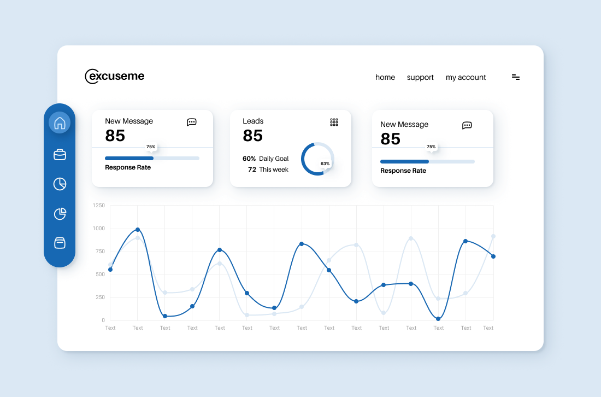

# Zerox Agent v3.2.2 Design System Specification

Date: 2026-07-06
Phase: 3 / Design System Specification
Status: canonical visual specification for Phase 4 migration planning

## 1. Authority

This document is the single source of truth for the v3.2.2 visual redesign.

The selected direction is:

**Soft Blue Desktop Control Surface**
Chinese shorthand: **柔和浅蓝桌面控制面**

The source style reference is the supplied Figma Community desktop dashboard:



This specification replaces the earlier three-option product-direction exploration. Those images remain as discarded exploration artifacts only and must not guide Phase 4 implementation.

## 2. Non-Functional Boundary

This is a surface-level design-system iteration.

### Allowed

- Token consolidation
- CSS visual migration
- Color, typography, radius, border, shadow, spacing, icon, and motion changes
- Restyling existing shell, sidebar, Chat, Runs, Tasks, Settings, composer, menus, drawers, cards, code blocks, status pills, and forms
- Visual accessibility improvements
- Responsive collision fixes for existing surfaces
- Small DOM/class adjustments only when required to apply tokens or preserve accessibility

### Not Allowed

- New product features
- New Agent capabilities
- Backend changes
- Route or navigation model changes
- Information architecture changes
- Tool authorization logic changes
- Workspace sandbox changes
- Memory behavior changes
- Goal-mode behavior changes
- Output parsing behavior changes
- New dashboard analytics because the reference contains charts

Any Phase 4 code change must be explainable as visual-system migration.

## 3. Design Language

Zerox should look like a calm desktop dashboard placed inside a pale-blue application environment. The UI should be friendly and polished like the reference, but still efficient enough for a local-first desktop Agent app.

### Keywords

- Light
- Blue
- Rounded
- Ordered
- Softly elevated
- Desktop dense
- Operational, not decorative

### Visual Translation From Figma

| Figma Reference Trait | Zerox Translation |
| --- | --- |
| Pale blue page background | App root and sidebar environment use pale blue. |
| Large white rounded workspace | Main app work surfaces become white rounded panels. |
| Floating blue vertical icon rail | Navigation active states use stronger blue icon treatments. |
| White cards with soft shadows | Cards, popovers, composer, settings panels use white fills and blue-tinted shadows. |
| Blue progress and chart accents | Active, selected, primary, and progress states use blue. |
| High-contrast black text | Primary text becomes clearer and less gray. |
| Friendly dashboard spacing | More consistent spacing, softer radius, fewer glass-blur effects. |

## 4. Token Architecture

Phase 4 must make `src/renderer/styles/tokens.css` the canonical token source.

`src/renderer/styles/legacy.css` must not declare active design-system tokens after migration. It may temporarily hold quarantined legacy selectors only if each remaining rule is documented as a migration holdover.

### Token Layers

1. Primitive tokens: raw color, spacing, radius, shadow, typography, motion values.
2. Semantic tokens: app background, surfaces, text, borders, status, focus, actions.
3. Component tokens: shell, sidebar, cards, composer, chat, settings, runs, popovers, dialogs, code.

No component CSS should use raw hex/rgb values after Phase 4 unless the value is inside `tokens.css`.

## 5. Primitive Color Tokens

These values define the v3.2.2 light theme.

### Blue Scale

| Token | Value | Use |
| --- | --- | --- |
| `--z-blue-25` | `#F6FBFF` | Lightest tinted surface |
| `--z-blue-50` | `#EEF7FF` | Hover/tinted surface |
| `--z-blue-100` | `#D9ECFA` | Selected background, progress track |
| `--z-blue-200` | `#B7D8F0` | Strong selected border |
| `--z-blue-300` | `#7FB7E4` | Secondary blue graphic |
| `--z-blue-500` | `#1C73C9` | Active state, progress fill |
| `--z-blue-600` | `#166BB7` | Primary button, nav accent |
| `--z-blue-700` | `#0F5A9C` | Primary hover |
| `--z-blue-800` | `#0B467A` | Pressed / high contrast |

### Neutral Scale

| Token | Value | Use |
| --- | --- | --- |
| `--z-neutral-0` | `#FFFFFF` | Main surface |
| `--z-neutral-25` | `#FCFEFF` | Raised white surface |
| `--z-neutral-50` | `#F8FBFF` | Inset / muted surface |
| `--z-neutral-100` | `#F2F7FC` | Subtle background |
| `--z-neutral-200` | `#D7E4EF` | Default border |
| `--z-neutral-300` | `#B7CDE0` | Strong border |
| `--z-neutral-500` | `#667085` | Supporting text |
| `--z-neutral-600` | `#475467` | Secondary text |
| `--z-neutral-900` | `#101828` | Primary text |

### App Background

| Token | Value | Use |
| --- | --- | --- |
| `--z-app-blue` | `#EAF4FC` | Root app background |
| `--z-app-blue-raised` | `#F4F9FE` | Soft bands and raised root areas |

### Semantic Accent Primitives

| Token | Value | Use |
| --- | --- | --- |
| `--z-green-600` | `#2E9E6F` | Success text/icon |
| `--z-green-50` | `#E8F7EF` | Success surface |
| `--z-green-200` | `#BCE7D0` | Success border |
| `--z-amber-600` | `#D9911B` | Warning/approval text/icon |
| `--z-amber-50` | `#FFF4D8` | Warning surface |
| `--z-amber-200` | `#F4D58A` | Warning border |
| `--z-red-600` | `#C94848` | Danger text/icon |
| `--z-red-50` | `#FCEBEC` | Danger surface |
| `--z-red-200` | `#F3BFC3` | Danger border |
| `--z-cyan-600` | `#2AB8C5` | Live/streaming detail |
| `--z-cyan-50` | `#E7FAFC` | Live/streaming surface |
| `--z-cyan-200` | `#B8EDF2` | Live/streaming border |

## 6. Semantic Color Tokens

These should be the tokens component CSS consumes.

| Token | Light Value | Purpose |
| --- | --- | --- |
| `--color-app-bg` | `var(--z-app-blue)` | Root background |
| `--color-app-bg-raised` | `var(--z-app-blue-raised)` | Raised page areas |
| `--color-surface-primary` | `var(--z-neutral-0)` | Main content panels |
| `--color-surface-raised` | `var(--z-neutral-25)` | Cards, composer, popovers |
| `--color-surface-muted` | `var(--z-neutral-50)` | Inset panels, inputs |
| `--color-surface-hover` | `var(--z-blue-50)` | Hover surfaces |
| `--color-border-subtle` | `var(--z-neutral-200)` | Default borders |
| `--color-border-strong` | `var(--z-neutral-300)` | Focused/selected borders |
| `--color-text-primary` | `var(--z-neutral-900)` | Body and headings |
| `--color-text-secondary` | `var(--z-neutral-600)` | Labels and descriptions |
| `--color-text-muted` | `#98A2B3` | Hints, timestamps |
| `--color-action-primary` | `var(--z-blue-600)` | Primary actions |
| `--color-action-primary-hover` | `var(--z-blue-700)` | Primary hover |
| `--color-action-primary-pressed` | `var(--z-blue-800)` | Primary pressed |
| `--color-action-soft` | `var(--z-blue-100)` | Active/selected background |
| `--color-focus-ring` | `rgba(28, 115, 201, 0.18)` | Focus ring |
| `--color-overlay` | `rgba(16, 24, 40, 0.24)` | Modal backdrop |

### Status Tokens

| Status | Text | Background | Border |
| --- | --- | --- | --- |
| Info | `#166BB7` | `#EEF7FF` | `#B7D8F0` |
| Live | `#177E89` | `#E7FAFC` | `#B8EDF2` |
| Success | `#247A55` | `#E8F7EF` | `#BCE7D0` |
| Warning | `#8A5E0A` | `#FFF4D8` | `#F4D58A` |
| Danger | `#A23B3B` | `#FCEBEC` | `#F3BFC3` |
| Neutral | `#475467` | `#F8FBFF` | `#D7E4EF` |

### Agent Visual State Tokens

These are visual-only state tokens. They must map onto existing states without adding new behavior.

| Agent Visual State | Text | Background | Border | Accent |
| --- | --- | --- | --- | --- |
| Planning | `#166BB7` | `#EEF7FF` | `#B7D8F0` | `#1C73C9` |
| Thinking | `#177E89` | `#E7FAFC` | `#B8EDF2` | `#2AB8C5` |
| Executing | `#166BB7` | `#F6FBFF` | `#B7D8F0` | `#1C73C9` |
| Awaiting approval | `#8A5E0A` | `#FFF4D8` | `#F4D58A` | `#D9911B` |
| Approved | `#247A55` | `#E8F7EF` | `#BCE7D0` | `#2E9E6F` |
| Denied / blocked | `#A23B3B` | `#FCEBEC` | `#F3BFC3` | `#C94848` |
| Evidence | `#247A55` | `#F8FBFF` | `#BCE7D0` | `#2E9E6F` |
| Memory | `#166BB7` | `#EEF7FF` | `#B7D8F0` | `#1C73C9` |
| Recovery | `#8A5E0A` | `#FFF4D8` | `#F4D58A` | `#D9911B` |
| Review | `#475467` | `#F8FBFF` | `#D7E4EF` | `#667085` |

## 7. Dark Mode Token Plan

Dark mode is not implemented in Phase 3, but Phase 4 token work must preserve one-to-one token parity.

| Semantic Token | Dark Value |
| --- | --- |
| `--color-app-bg` | `#071522` |
| `--color-app-bg-raised` | `#0D1F30` |
| `--color-surface-primary` | `#0F2234` |
| `--color-surface-raised` | `#13283C` |
| `--color-surface-muted` | `#0B1B2A` |
| `--color-surface-hover` | `#16324A` |
| `--color-border-subtle` | `#29445D` |
| `--color-border-strong` | `#426783` |
| `--color-text-primary` | `#F2F8FF` |
| `--color-text-secondary` | `#B7C9D9` |
| `--color-text-muted` | `#7F96AA` |
| `--color-action-primary` | `#5DA8F2` |
| `--color-action-primary-hover` | `#83BDF6` |
| `--color-focus-ring` | `rgba(93, 168, 242, 0.28)` |

Dark mode rules:

- Do not invert the palette mechanically.
- Keep blue identity, but reduce saturation in large surfaces.
- Shadows become subtle outline/elevation combinations, not black glows.
- Status colors must preserve text contrast on dark backgrounds.

## 8. Typography

### Font Families

Sans:

```css
Inter, "SF Pro Text", "PingFang SC", "Hiragino Sans GB", "Microsoft YaHei", system-ui, sans-serif
```

Display:

```css
Inter, "SF Pro Display", "PingFang SC", system-ui, sans-serif
```

Mono:

```css
"SF Mono", "JetBrains Mono", ui-monospace, Menlo, Monaco, Consolas, monospace
```

### Type Scale

| Token | Size | Line Height | Weight | Use |
| --- | ---: | ---: | ---: | --- |
| `--font-size-11` | `11px` | `16px` | `400` | Dense metadata only |
| `--font-size-12` | `12px` | `18px` | `400` | Metadata, helper text |
| `--font-size-13` | `13px` | `20px` | `400/550` | Compact controls, sidebar |
| `--font-size-14` | `14px` | `22px` | `400/550` | Default body/control |
| `--font-size-15` | `15px` | `23px` | `550/650` | Card titles |
| `--font-size-16` | `16px` | `24px` | `550/650` | Section intro |
| `--font-size-20` | `20px` | `28px` | `700` | Section title |
| `--font-size-28` | `28px` | `36px` | `700` | Page title |
| `--font-size-32` | `32px` | `38px` | `750` | Metric/value emphasis only |

Rules:

- Body/control baseline is `14px`.
- Do not use viewport-scaled type.
- Letter spacing is always `0`.
- Use metric/value emphasis sparingly; Zerox is not becoming an analytics product.
- Chinese text must not look smaller than English technical strings.

## 9. Spacing And Grid

Use a 4px base grid with desktop-density steps.

| Token | Value |
| --- | ---: |
| `--space-0` | `0` |
| `--space-1` | `4px` |
| `--space-2` | `8px` |
| `--space-3` | `12px` |
| `--space-4` | `16px` |
| `--space-5` | `20px` |
| `--space-6` | `24px` |
| `--space-8` | `32px` |
| `--space-10` | `40px` |
| `--space-12` | `48px` |
| `--space-16` | `64px` |

Layout rules:

- Desktop app outer inset: `16px`.
- Page content gap: `20px` to `24px`.
- Repeated card/list gap: `12px` to `16px`.
- Dense row vertical padding: `8px` to `10px`.
- Form field gap: `14px` to `16px`.
- Do not create large marketing-like blank zones.

## 10. Radius

| Token | Value | Use |
| --- | ---: | --- |
| `--radius-4` | `4px` | Tiny tags, code chips |
| `--radius-8` | `8px` | Dense rows, small controls |
| `--radius-10` | `10px` | Inputs, buttons, icon buttons |
| `--radius-12` | `12px` | Cards, popovers |
| `--radius-14` | `14px` | Composer, large panels |
| `--radius-18` | `18px` | App-level workspace shell |
| `--radius-full` | `999px` | Status pills only |

Rules:

- Default component radius is `10px` or `12px`.
- App shell can use `18px` to match the Figma reference.
- Avoid blanket pill styling.

## 11. Border And Shadow

### Borders

| Token | Value |
| --- | --- |
| `--border-subtle` | `1px solid var(--color-border-subtle)` |
| `--border-strong` | `1px solid var(--color-border-strong)` |
| `--border-blue` | `1px solid var(--z-blue-200)` |
| `--border-focus` | `1px solid var(--z-blue-500)` |

### Shadows

| Token | Value | Use |
| --- | --- | --- |
| `--shadow-none` | `0 0 0 transparent` | Flat elements |
| `--shadow-low` | `0 8px 20px rgba(22, 107, 183, 0.08)` | Cards |
| `--shadow-medium` | `0 14px 34px rgba(22, 107, 183, 0.12)` | Composer, primary panels |
| `--shadow-floating` | `0 18px 46px rgba(22, 107, 183, 0.16)` | Menus, popovers |
| `--shadow-focus` | `0 0 0 3px rgba(28, 115, 201, 0.18)` | Keyboard focus ring |

Rules:

- Shadows are blue-tinted.
- No black-heavy card shadows.
- No glow or decorative bokeh.
- Avoid backdrop blur as a primary material in v3.2.2.

## 12. Motion

| Token | Value | Use |
| --- | --- | --- |
| `--ease-standard` | `cubic-bezier(0.2, 0, 0, 1)` | Hover/focus/control |
| `--ease-emphasized` | `cubic-bezier(0.16, 1, 0.3, 1)` | Popovers, row enter |
| `--duration-instant` | `80ms` | Color-only state |
| `--duration-fast` | `120ms` | Hover/focus |
| `--duration-normal` | `160ms` | Popover/menu open |
| `--duration-slow` | `220ms` | Drawer/context reveal |
| `--duration-loop` | `900ms` | Streaming/progress indicator |

Rules:

- Motion clarifies state change.
- No bounce, elastic overshoot, or ornamental page transitions.
- Respect `prefers-reduced-motion: reduce`.
- Reduced motion disables loops, transform animations, and non-essential transitions.

## 13. Icon System

Phase 4 must converge navigation and control icons into one visual language.

### Geometry

| Property | Value |
| --- | --- |
| Grid | `20px` default, `16px` metadata, `24px` brand/nav emphasis |
| Stroke | `1.75px` default, `2px` for selected nav |
| Cap | Round |
| Join | Round |
| Fill | None by default |
| Active container radius | `10px` |

### Color

| State | Color |
| --- | --- |
| Inactive | `#475467` |
| Hover | `#101828` |
| Active icon on blue | `#FFFFFF` |
| Active icon on soft blue | `#166BB7` |
| Success | `#2E9E6F` |
| Warning | `#D9911B` |
| Danger | `#C94848` |
| Live | `#2AB8C5` |

### Required Icon Categories

- Chat/session
- Runs/history
- Tasks/schedule
- Settings/governance
- Workspace/folder
- Model
- Tool
- Approval
- Memory
- Evidence/check
- Recovery/checkpoint
- Send
- Stop
- More/actions
- Search
- Close

Do not add icon categories that imply new functionality.

## 14. Layout Framework

### App Shell

| Property | Target |
| --- | --- |
| Root background | `var(--color-app-bg)` |
| Desktop outer padding | `16px` where shell framing is visible |
| Sidebar width | keep existing `280px` unless Phase 4 proves a narrower visual rail can preserve behavior |
| Main workspace | white or near-white, softly rounded, no generic centered web-card treatment |
| Topbar height | `64px` |
| Main workspace radius | `18px` where visible |

Rules:

- Preserve current route structure: Chat, Runs, Tasks, Settings.
- Preserve current Settings grouping.
- Chat may keep its full-height workspace behavior, but the visible surfaces must follow the new palette and elevation.
- Do not center the whole app inside a fake marketing card if it harms desktop density.

### Sidebar

| Element | Spec |
| --- | --- |
| Sidebar background | `#EAF4FC` or `#F4F9FE` |
| Brand row | 34px mark, 13-14px title, 12px subtitle |
| New chat button | blue filled, 42px min height, `10px` radius |
| Nav item | 38-42px min height, `8px` to `10px` radius |
| Active nav | white card or blue filled icon treatment, never dark navy block |
| Pinned/recents | text-dense, no heavy cards |

### Main Workspace

| Element | Spec |
| --- | --- |
| Page title | `28px/36px`, weight `700` |
| Section title | `20px/28px`, weight `700` |
| Section gap | `20px` |
| Card grid gap | `16px` |
| List row height | `52px` to `64px` |

Rules:

- Use cards for repeated objects, not every section wrapper.
- Avoid card-inside-card styling.
- Use spacing and alignment before borders.

### Responsive Breakpoints

| Breakpoint | Rule |
| --- | --- |
| `>=1180px` | Full sidebar and workspace density |
| `900px-1179px` | Compact sidebar/top navigation allowed, preserve primary route access |
| `640px-899px` | Single-column settings/cards, no page overflow |
| `<640px` | Compact controls, all popovers collision-safe |
| `390px` | Composer, tooltips, menus, and action buttons must not clip |

## 15. Component Specifications

### Cards

| Property | Value |
| --- | --- |
| Fill | `var(--color-surface-raised)` |
| Border | `var(--border-subtle)` |
| Radius | `12px` |
| Shadow | `var(--shadow-low)` |
| Padding | `16px` to `20px` |
| Header gap | `8px` |

Use for Runs records, Settings recommendation cards, health cards, context cards, and grouped execution/tool surfaces. Do not turn every chat message into a card.

### Buttons

Primary:

- Fill: `#166BB7`
- Hover: `#0F5A9C`
- Text: `#FFFFFF`
- Radius: `10px`
- Height: `36px` compact, `42px` prominent
- Padding: `0 14px` compact, `0 18px` prominent
- Shadow: `var(--shadow-low)` only for primary/prominent buttons

Secondary:

- Fill: `#FFFFFF` or `#EEF7FF`
- Text: `#166BB7` or `#101828`
- Border: `#D7E4EF`
- Radius: `10px`

Danger:

- Default fill: `#FFFFFF` or `#FCEBEC`
- Text/border: `#C94848`
- Filled red only for final destructive confirmation or active stop.

### Inputs And Selects

| Property | Value |
| --- | --- |
| Fill | `#FFFFFF` or `#F8FBFF` |
| Border | `#D7E4EF` |
| Focus border | `#1C73C9` |
| Focus ring | `0 0 0 3px rgba(28, 115, 201, 0.18)` |
| Radius | `10px` |
| Height | `40px` default |
| Padding | `0 12px` |

### Status Pills

| Status | Fill | Text | Border |
| --- | --- | --- | --- |
| Neutral | `#F8FBFF` | `#475467` | `#D7E4EF` |
| Info | `#EEF7FF` | `#166BB7` | `#B7D8F0` |
| Live | `#E7FAFC` | `#177E89` | `#B8EDF2` |
| Success | `#E8F7EF` | `#247A55` | `#BCE7D0` |
| Warning | `#FFF4D8` | `#8A5E0A` | `#F4D58A` |
| Danger | `#FCEBEC` | `#A23B3B` | `#F3BFC3` |

Pills should use `999px` radius, `12px` text, and `24px` min height.

### Composer

The composer is restyled, not redesigned.

| Element | Spec |
| --- | --- |
| Shell fill | `#FFFFFF` |
| Shell border | `#D7E4EF` |
| Shell radius | `14px` |
| Shell shadow | `var(--shadow-medium)` |
| Textarea fill | transparent or `#FFFFFF` |
| Mode chips | `#EEF7FF`, blue/graphite text |
| Send button | blue filled icon button |
| Stop button | danger semantics |
| Menu surfaces | floating white, `12px` radius, `var(--shadow-floating)` |

Constraints:

- Existing workspace picker behavior remains.
- Existing skill mention behavior remains.
- Existing auto approval and goal mode behavior remains.
- Tooltips must be collision-safe at 390px.

### Chat And Agent Output

Visual goal: make output feel clean and inspectable within the new light-blue dashboard language.

| Surface | Spec |
| --- | --- |
| User message | pale-blue or white surface, subtle border |
| Assistant text | mostly unframed, readable line length |
| Runtime stack | grouped white/light inset surfaces |
| Tool call | light inset panel with icon, metadata, and status pill |
| Approval | warning-soft surface with amber border/accent |
| Evidence | white or muted surface with success accent |
| Code block | `#F8FBFF`, `1px #D7E4EF`, `8px` radius |
| Inline code | `#EEF7FF`, blue/graphite text, `4px` radius |
| Diff added | green-soft background |
| Diff removed | danger-soft background |

Constraints:

- Do not alter output content.
- Do not alter markdown/code parsing.
- Do not hide technical content behind style.
- Tables/code/JSON must scroll within their own regions instead of clipping.

### Runs

Runs should inherit the card discipline from the Figma reference:

- Record cards: white, `12px` radius, blue-tinted low shadow.
- Active/selected record: blue-soft background or blue left accent.
- Failure/blocked states: warning/danger semantic tokens.
- Event list rows: light inset panels with consistent status icons.
- No new run model or recovery behavior.

### Settings

Settings keeps the current v3.2.1 grouping and route semantics.

Visual migration:

- Settings shell uses white surfaces, not glass blur.
- Secondary nav active item uses blue accent and white/soft-blue surface.
- Forms use the new input tokens.
- Recommendation cards use Figma-like white card treatment.
- Advanced details remain collapsed if they currently are; styling only changes.

### Tasks

Tasks should receive the same card/input/status treatment as Runs, without adding scheduling behavior.

### Popovers And Menus

| Property | Value |
| --- | --- |
| Fill | `#FFFFFF` |
| Border | `#D7E4EF` |
| Radius | `12px` |
| Shadow | `var(--shadow-floating)` |
| Row height | `40px` to `48px` |
| Selected row | `#EEF7FF` |
| Focus | visible blue ring or row outline |

Menus must fit inside the viewport and support keyboard focus visibility.

### Dialogs And Drawers

Visual spec:

- Backdrop: `rgba(16, 24, 40, 0.24)`
- Panel fill: `#FFFFFF`
- Panel radius: `18px` desktop, `14px` narrow
- Border: `#D7E4EF`
- Shadow: `var(--shadow-floating)`

Accessibility contract:

- Modal dialogs use `role="dialog"` and `aria-modal="true"`.
- Dialogs have labelled title and description where relevant.
- Escape closes when safe.
- Focus moves into the dialog and returns to the trigger.
- Inline approval panels must not pretend to be modal unless they enforce modal behavior.

## 16. Brand And Logo

The app remains Zerox Agent. Do not rename or reposition the product.

Visual adjustments:

- Logo sits on white or pale-blue surfaces.
- Avoid cream-heavy logo islands that conflict with the blue app environment.
- Blue `#166BB7` becomes the live UI brand accent.
- Cyan `#2AB8C5` is reserved for live execution details.
- The app icon may keep its mark, but Phase 4 should visually test it against the pale-blue sidebar and white surfaces.

## 17. Accessibility

Target: WCAG 2.2 AA for visible UI.

### Contrast

| Pair | Minimum |
| --- | --- |
| Body text on surface | `4.5:1` |
| Control text on fill | `4.5:1` |
| Large text | `3:1` |
| Focus indicator against adjacent colors | `3:1` |
| Icon-only state indicator | `3:1` and not color-only |

### Focus

- Every interactive control must have visible focus.
- Use `outline: 2px solid var(--color-focus-ring)` or `box-shadow: var(--shadow-focus)`.
- Focus indicators must not be clipped by overflow.

### Text And Overflow

- Buttons must fit Chinese and English labels.
- Long paths/model names wrap or truncate with title/accessible name as appropriate.
- Code/table/JSON scrolls inside its own region.
- No page-level horizontal overflow at `390`, `640`, `900`, `1180`, `1280`, `1440`.

## 18. CSS Migration Rules For Phase 4

1. Start with `tokens.css`.
2. Add primitive, semantic, and component token sections.
3. Map old token names to new semantic tokens temporarily only if needed.
4. Replace hard-coded component colors with tokens.
5. Move any still-needed visual rules out of `legacy.css` into named CSS files.
6. Keep `styles.css` import order explicit and documented.
7. Remove unused legacy Material assumptions after affected selectors are migrated.
8. Do not change TS behavior unless a class hook is required for styling or accessibility.

### Files Expected To Change In Phase 4

- `src/renderer/styles/tokens.css`
- `src/renderer/styles/base.css`
- `src/renderer/styles/app-shell.css`
- `src/renderer/styles/sidebar.css`
- `src/renderer/styles/chat.css`
- `src/renderer/styles/composer.css`
- `src/renderer/styles/cards.css`
- `src/renderer/styles/responsive.css`
- `src/renderer/styles/legacy.css`
- possibly `src/renderer/components/Icon.tsx`
- possibly `src/shared/materialNavigation.ts`
- possibly small class-name-only adjustments in renderer components

No service, backend, runner, model, sandbox, authorization, memory, or goal logic should change.

## 19. Verification Requirements For Phase 4

Minimum checks:

1. Focused design-system tests already present in the repo.
2. `npm run harness:check`.
3. `git diff --check`.
4. `npm run verify` after substantial CSS migration.
5. Production smoke only if UI/runtime-affecting code changes are made.
6. Browser screenshots at:
   - Chat desktop `1440x900`
   - Runs desktop `1440x900`
   - Settings desktop `1440x900`
   - Chat narrow `390x844`
   - Settings narrow `390x844`
7. Visual QA against the Figma reference:
   - pale-blue environment visible
   - white rounded surfaces visible
   - blue active/action language visible
   - no dark navy dominance
   - no card-inside-card clutter
   - no page-level overflow

## 20. Phase 4 Entry Gate

Before implementation, Phase 4 must begin with a migration plan that lists:

- Token changes first
- Component batches
- Exact files touched per batch
- Behavior that must remain unchanged
- Verification command per batch
- Screenshot states to capture

No implementation should begin until that migration plan is accepted.
