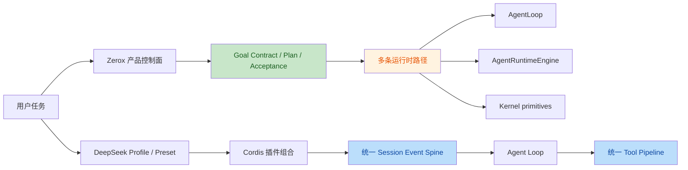
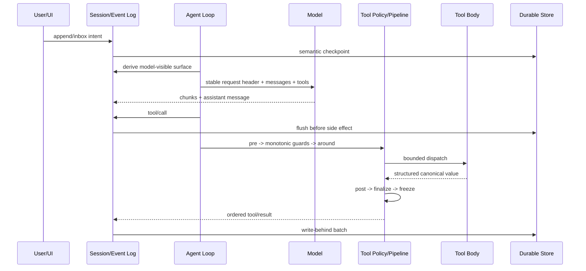

# Zerox Agent 与 DeepSeek Harness 全面审查报告

审查日期：2026-08-14

## 1. 审查对象与方法

### 版本快照

| 项目 | 审查快照 | 提交时间 | 产品阶段 |
| --- | --- | --- | --- |
| Zerox Agent | `764df0f4b1fcd05ebf36a04728bfc404d9cc86b8` | 2026-08-04 | `v3.8.1`，本地桌面产品 |
| DeepSeek Harness | [`47f943859bef60e4160492346772ded9b24f765a`](https://github.com/deepseek-ai/deepseek-harness/tree/47f943859bef60e4160492346772ded9b24f765a) | 2026-08-13 | `0.1.0-rc.5`，Developer Preview |

DeepSeek Harness 官方明确声明仍处于 Developer Preview，存在兼容性破坏。本文把它作为优秀运行时实现参考，而不是稳定 API 依赖。

### 规模基线

| 指标 | Zerox Agent | DeepSeek Harness |
| --- | ---: | ---: |
| TypeScript/TSX 代码总行数 | 205,256 | 约 568,702（另有 Python/native） |
| 生产代码行数 | 116,158 | 约 251,757 |
| 测试代码行数 | 89,098 | 约 304,188 |
| 测试文件 | 247 | 约 1,941 |
| 测试声明 | 约 2,183 | 未逐条计数 |
| 可发布/工作区包 | 单一 Electron 应用 | 219 个 Harness 包，加 9 个 vendor 包 |
| 默认持久化 | JSON/JSONL | 每会话 JSONL，可替换 SQLite |

规模并不能直接代表质量。更重要的区别是：Zerox 把复杂度集中在产品主进程，DeepSeek Harness 把复杂度分散在有明确契约的能力包和组合层。

### 审查方法

本次审查不是 README 对照，实际追踪了以下代码链路：

1. Agent turn/step/model/tool 主循环。
2. 工具可见性、授权、执行、取消、超时与结果持久化。
3. 会话事实、模型上下文投影、压缩和 token 计量。
4. JSON/JSONL/SQLite 持久化、恢复与读取扩展性。
5. Goal、Plan、验收、多 Agent、Workflow。
6. Shell/文件系统沙箱。
7. Prompt cache、工具并发和模型往返效率。
8. 单元、真实入口、浏览器、发布产物和真实 API 测试。

限制：没有在统一硬件、统一模型、统一任务集上做端到端性能 benchmark，因此报告中的效率结论来自算法复杂度、I/O 模式、模型往返次数和并发语义，不虚构吞吐数据。

## 2. 核心结论

**Zerox Agent 不是 DeepSeek Harness 的低配版本。两者的领先面不同。**

- Zerox 在产品级 Goal Contract、Direct/Debate 规划、验收证书、失败修复、用户审核学习、模型连接管理和桌面可视化方面更完整。
- DeepSeek Harness 在运行时内核统一性、插件生命周期、事件溯源、工具执行管线、真正的进程沙箱、增量投影、Code Mode、子 Agent 生命周期和测试门禁方面更成熟。
- Zerox 当前最大问题不是缺功能，而是已有能力分别长在 `AgentLoop`、`AgentRuntimeEngine`、Goal runtime、Kernel、Chat store、trajectory 和 container 中，尚未收敛成一条统一、可组合、可回放的运行时主干。
- 最值得学习的是 DeepSeek Harness 的**约束组织方式**，不是照搬 Cordis 或复制 219 个包。

一句话建议：

> 保留 Zerox 的 Goal/Plan/Acceptance 产品上层，把 DeepSeek Harness 的 Session Event Spine、Tool Pipeline、OS Sandbox、Projection Cache 和 Code Mode 思路下沉为 Zerox 的统一运行时内核。

## 3. 设计理念对比



### Zerox：产品契约优先

Zerox 的设计中心是“本地桌面控制面”：

- Goal 定义结果，Plan 定义路径，并保留 Plan lineage。
- `steps_completed` 与 `achieved` 分离，最终完成依赖验收证书。
- 普通 Chat、Goal、计划、自动任务和 UI 状态有丰富的产品语义。
- 权限、工作区、证据、恢复和用户审核学习是显式产品能力。

这些不是 DeepSeek Harness 当前轻量 Goal domain 可以替代的。Zerox 应继续保留并强化这一层。

### DeepSeek：时空可组合性优先

DeepSeek Harness 的核心是“everything is a plugin”：

- Service Definition 定义能力接口。
- Service Provider 提供本地、远程或替代实现。
- Consumer 面向模型或 UI 使用稳定接口。
- 注册、事件监听、工具、prompt section 都是可撤销副作用。
- 依赖通过服务声明解决，生命周期由插件 fiber 管理。

代码证据：

- [架构说明](https://github.com/deepseek-ai/deepseek-harness/blob/47f943859bef60e4160492346772ded9b24f765a/docs/architecture.zh.md)
- [Cordis 入门](https://github.com/deepseek-ai/deepseek-harness/blob/47f943859bef60e4160492346772ded9b24f765a/docs/cordis-primer.zh.md)
- [能力接口图](https://github.com/deepseek-ai/deepseek-harness/blob/47f943859bef60e4160492346772ded9b24f765a/docs/capability-seams.zh.md)

### 判断

DeepSeek 的组合模型适合平台生态和多种运行形态；Zerox 是单一桌面产品，不需要照搬完整插件框架。Zerox 需要的是较小的“typed runtime ports + scoped registration + disposer”内核，而不是把所有文件拆成 npm 包。

## 4. 运行时主链路对比



上图接近 DeepSeek 当前主干。Zerox 已有其中多数零件，但不是统一执行路径：

- `AgentRuntimeEngine` 会在部分任务路径中先写轨迹再执行工具。
- `runAgentLoop` 的 Chat/Goal 回调有多处 fire-and-forget 轨迹写入。
- Kernel EventBus 与 `runRuntimeKernel` 尚未成为生产唯一循环。
- Chat transcript、run checkpoint、trajectory、Goal ledger 和 Kernel events 分属不同真源。

## 5. 能力矩阵

评分只表示当前实现成熟度，不表示产品价值。

| 维度 | Zerox | DeepSeek Harness | 结论 |
| --- | --- | --- | --- |
| Goal/Plan 产品语义 | A+ | B- | Zerox 明显领先，应保留 |
| 最终验收与证书 | A | C | Zerox 明显领先 |
| Runtime 主干统一性 | C+ | A | DeepSeek 值得重点学习 |
| 工具执行管线 | B- | A | DeepSeek 的阶段化、单调 guard、结果规范化更强 |
| 工具并发 | C | A- | Zerox 同批串行；DeepSeek 安全并发、有序提交 |
| Code Mode/批处理 | C | A | DeepSeek 可显著减少模型往返 |
| OS 级进程沙箱 | C | A- | Zerox 是策略边界；DeepSeek 有平台 runner |
| 会话事件溯源 | B- | A | Zerox trajectory 丰富，但没有统一 session surface |
| 上下文压缩 | B | A | Zerox 有 rebuild；DeepSeek 可回放、带来源替换更严谨 |
| 增量读模型 | C+ | A | DeepSeek projection/watermark/cache 更成熟 |
| 持久化扩展性 | C+（默认）/B（SQLite 路径） | A- | Zerox 默认全量 JSON 是主要瓶颈 |
| 多 Agent 生命周期 | B | A | Zerox 有 handoff；DeepSeek provider/activation/冷恢复更完整 |
| Prompt cache 意识 | B | A- | 两边都有，DeepSeek 在主循环和文档契约中更系统 |
| 模型与连接 UX | A | B | Zerox 产品化更完整 |
| 可观察性 UI | A | A- | Zerox 产品呈现更强，DeepSeek 事件真源更统一 |
| 测试工程 | A- | A+ | Zerox 测试量优秀；DeepSeek 门禁维度更完整 |

## 6. 代码级高优先级问题

以下 10 项均经过两个独立审查线程逐项复核，存在性结论为 **2/2 一致，高置信度**。表中把确定性故障与战略差距分开标注，避免用同一严重度混淆当前缺陷和演进方向。

| No. | 问题 | 建议 | 代码证据 |
| ---: | --- | --- | --- |
| 1 | Tool timeout 不保证底层停稳（Major） | 取消后 drain；不协作的工具转 worker/process | [agentToolExecutor.ts:134-180](../../src/main/agentToolExecutor.ts#L134-L180) |
| 2 | Workflow deadline 不终止原任务（Major） | holder-owned run + cancel/dispose + worker terminate | [workflowRuntime.ts:177-215](../../src/main/workflow/workflowRuntime.ts#L177-L215) |
| 3 | MultiAgent SQLite trajectory 序号冲突（Major） | sequence 由 store 单点分配 | [multiAgentCoordinator.ts:139-162](../../src/main/multiAgentCoordinator.ts#L139-L162) |
| 4 | Chat 默认全量 JSON 重写与扫描（Strategic） | 消息 append row + SQLite projection | [chatSessionStore.ts:151-181](../../src/main/chatSessionStore.ts#L151-L181) |
| 5 | Run status 列与 payload 分裂（Minor） | 只保留一个可变真源 | [runRepository.ts:48-74](../../src/main/storage/repositories/runRepository.ts#L48-L74) |
| 6 | AgentLoop 工具批次串行（Strategic） | opt-in 安全并发 + 有序提交 | [agentLoop.ts:818-1120](../../src/main/agentLoop.ts#L818-L1120) |
| 7 | Shell 缺少 OS 强制沙箱（Major） | Authorization 之外增加 ProcessSandboxProvider | [agentToolExecutor.ts:2203-2259](../../src/main/agentToolExecutor.ts#L2203-L2259) |
| 8 | Context replacement 缺少 surface provenance（Strategic） | append-only source + cited replacement | [agentLoop.ts:398-472](../../src/main/agentLoop.ts#L398-L472) |
| 9 | 工具策略散落、缺少统一 pipeline（Strategic） | pre/guard/around/post/finalize/output schema | [dynamicToolRegistry.ts:178-207](../../src/main/dynamicToolRegistry.ts#L178-L207) |
| 10 | Kernel 未成为生产唯一循环（Strategic） | 先接管一个真实入口，再逐步合并 | [runtimeKernel.ts:27-121](../../src/main/kernel/runtimeKernel.ts#L27-L121) |

### F1. 工具超时可能提前返回，但底层工具仍继续运行

严重度：**Major / P0**

Zerox 对非 Shell 工具：

1. 创建一个传给 handler 的 `AbortController`。
2. 到时后 abort。
3. 再等 1500ms。
4. 用 `Promise.race` 拒绝调用方。
5. 不再等待原始 `registry.execute()` 完全停稳。

证据：[agentToolExecutor.ts:134-180](../../src/main/agentToolExecutor.ts#L134-L180)

如果 handler 不响应 abort，调用方已看到超时，底层文件写入、网络请求或 Actor 操作仍可能继续。这会破坏“取消后无迟到副作用”和运行终态真实性。

DeepSeek 的 timeout wrapper 只注入 deadline signal，但仍 `await next()`；工具契约要求 promise 在自有工作完全停稳后结算：

- [timeout-policy/src/index.ts:55-80](https://github.com/deepseek-ai/deepseek-harness/blob/47f943859bef60e4160492346772ded9b24f765a/packages/guard/timeout-policy/src/index.ts#L55-L80)
- [tools/src/index.ts:1527-1559](https://github.com/deepseek-ai/deepseek-harness/blob/47f943859bef60e4160492346772ded9b24f765a/packages/core/tools/src/index.ts#L1527-L1559)

建议：把“可协作取消”和“需要硬隔离”分开。普通工具必须声明并证明 quiescence；不能协作取消的工具放入 worker/process substrate，超时后 terminate 并 await exit。

### F2. Workflow deadline 只结束外层结果，不能终止正在运行的 workflow

严重度：**Major / P0**

Zerox `WorkflowRuntime.run()` 对已注册 workflow 函数使用 `Promise.race`。deadline 或 signal 分支 reject 后，原 `fn(args, sandbox, journal)` 没有收到派生 abort signal，也没有 worker 可终止，因此仍可继续调用 `agent/webfetch/websearch` 或修改 journal。

证据：[workflowRuntime.ts:177-215](../../src/main/workflow/workflowRuntime.ts#L177-L215)

DeepSeek 把 workflow script 放入独立 Worker，取消后先清理 child runs，超过 grace period 强制 terminate，并等待释放：

- [workflow-worker-thread/src/index.ts:31-49](https://github.com/deepseek-ai/deepseek-harness/blob/47f943859bef60e4160492346772ded9b24f765a/packages/workflow/workflow-worker-thread/src/index.ts#L31-L49)
- [workflow-worker-thread/src/host.ts](https://github.com/deepseek-ai/deepseek-harness/blob/47f943859bef60e4160492346772ded9b24f765a/packages/workflow/workflow-worker-thread/src/host.ts)

建议：Workflow 必须返回 holder-owned run handle：`result + cancel + dispose()`。deadline 走同一取消通道，dispose 等待 child 和 worker 停稳。

### F3. MultiAgentCoordinator 的 SQLite 轨迹序号会冲突

严重度：**Major / P0**

`appendParentTrajectory()` 给同一个 parent run 的所有事件固定写入 `sequence: 1`：

证据：[multiAgentCoordinator.ts:139-162](../../src/main/multiAgentCoordinator.ts#L139-L162)

SQLite 表对 `(run_id, seq)` 设置唯一约束：

- [migrationBundle.ts:69-80](../../src/main/storage/migrationBundle.ts#L69-L80)
- [runRepository.ts:76-103](../../src/main/storage/repositories/runRepository.ts#L76-L103)

带 handoff 的一次 `recordChildRun()` 连续写 `child_handoff_created` 和 `child_run_scheduled`，第二条会冲突。默认 JSON 路径不约束序号，现有 coordinator 单测使用内存数组，因此没有发现。

建议：trajectory sequence 的分配必须由 store/repository 单点拥有，并在事务中执行 `MAX(seq)+1` 或使用 per-run monotonic allocator。调用方不应自行生成存储序号。

### F4. 默认 Chat 持久化随总历史线性放大

严重度：**Strategic / P1（扩展性）**

默认后端是 JSON。所有 Chat session 和 message 都在一个 `chat-sessions.json` 中：

- 默认选择：[backendResolver.ts:1-30](../../src/main/storage/backendResolver.ts#L1-L30)
- Chat store 仍固定 JSON：[container.ts:1216-1218](../../src/main/container.ts#L1216-L1218)
- 每次 mutation 重写全量文件：[chatSessionStore.ts:151-181](../../src/main/chatSessionStore.ts#L151-L181)
- append message 重建 session 数组并全量写入：[chatSessionStore.ts:206-275](../../src/main/chatSessionStore.ts#L206-L275)
- search 全量展开全部消息：[chatSessionStore.ts:415-438](../../src/main/chatSessionStore.ts#L415-L438)

这意味着写放大为 O(全部会话历史)，搜索和冷启动也随全量数据增长。仓库已有 SQLite `sessions/chat_messages`，但生产 `chatSessionStore()` 没接入。

DeepSeek 使用 append-only session events、200ms 有界 write-behind、按会话存储，并允许 SQLite 从 `seq` 读取尾部：

- [write-behind.ts:18-158](https://github.com/deepseek-ai/deepseek-harness/blob/47f943859bef60e4160492346772ded9b24f765a/packages/session/session-persistence/src/write-behind.ts#L18-L158)
- [session-persistence-sqlite/src/index.ts:220-237](https://github.com/deepseek-ai/deepseek-harness/blob/47f943859bef60e4160492346772ded9b24f765a/packages/session/session-persistence-sqlite/src/index.ts#L220-L237)

建议：先把 Chat message 迁入 append-only SQLite 表，再把 sidebar/session-work/context 变成增量 projection。经过 dual-read 校验后让 SQLite 成为默认。

### F5. RunRepository 的状态存在两个互相矛盾的真源

严重度：**Minor / P2**

`updateStatus()` 只更新 `runs.status`，`get()` 却从 `payload` 反序列化完整 record，因此 `updateStatus()` 后 `get().status` 仍是旧值。测试明确把这一行为固定下来：

- [runRepository.ts:48-74](../../src/main/storage/repositories/runRepository.ts#L48-L74)
- [runRepository.test.ts:69-78](../../src/main/storage/repositories/runRepository.test.ts#L69-L78)

当前生产调用较少，所以爆炸半径有限，但这是存储契约层的读写分裂。后续一旦 UI、恢复或清理逻辑混用索引列与 payload，会得出不同终态。

建议：要么状态完全从列读取并合并到 record，要么事务性同步 payload；不要保留两个独立可变副本。

### F6. 同一模型响应中的工具调用全部串行

严重度：**Strategic / P1（性能）**

Zerox 对 `response.toolCalls` 使用顺序 `for...of`，每次授权、执行、offload、记录都完成后才启动下一个：

证据：[agentLoop.ts:818-1120](../../src/main/agentLoop.ts#L818-L1120)

DeepSeek：

- 工具声明 `isConcurrencySafe(args)`，未声明或异常时 fail-closed 为 exclusive。
- parallel 工具进入有界 rolling pool。
- pre-policy 与 post-policy 保持串行。
- 工具体可以并发。
- result 和 additional context 按模型原顺序提交。
- exclusive 工具形成 barrier。

证据：

- [tool-calls.ts:59-245](https://github.com/deepseek-ai/deepseek-harness/blob/47f943859bef60e4160492346772ded9b24f765a/packages/core/agent-loop/src/tool-calls.ts#L59-L245)
- [tools/src/index.ts:1270-1285](https://github.com/deepseek-ai/deepseek-harness/blob/47f943859bef60e4160492346772ded9b24f765a/packages/core/tools/src/index.ts#L1270-L1285)

建议：第一阶段只让无副作用、相互独立的 `file_stat/file_read/code_search/web_fetch` opt-in；所有写操作和未知工具默认 exclusive。

### F7. Shell 是“授权边界”，不是“内核强制边界”

严重度：**Strategic / P0（安全架构）**

Zerox 对命令做静态 `ShellPlan`、路径和网络检查，这是有价值的第一层防线；但最终直接在宿主环境调用 `execAsync(command)`：

- [toolAuthorizationService.ts:114-174](../../src/main/toolAuthorizationService.ts#L114-L174)
- [agentToolExecutor.ts:2203-2259](../../src/main/agentToolExecutor.ts#L2203-L2259)

仓库架构文档也明确说明当前 workspace 不是完整 OS container。

DeepSeek 在相同 policy 下同时约束 Shell 和文件系统：

- macOS：Seatbelt `sandbox-exec`
- Linux：bubblewrap，fallback Landlock
- Windows：restricted token + ACL
- runner 不可用时 fail closed

证据：

- [sandbox-local/src/index.ts:1-20](https://github.com/deepseek-ai/deepseek-harness/blob/47f943859bef60e4160492346772ded9b24f765a/packages/sandbox/sandbox-local/src/index.ts#L1-L20)
- [sandbox-local/src/profiles.ts:12-57](https://github.com/deepseek-ai/deepseek-harness/blob/47f943859bef60e4160492346772ded9b24f765a/packages/sandbox/sandbox-local/src/profiles.ts#L12-L57)
- [bash-sandbox/src/index.ts:88-113](https://github.com/deepseek-ai/deepseek-harness/blob/47f943859bef60e4160492346772ded9b24f765a/packages/shell/bash-sandbox/src/index.ts#L88-L113)

建议：保留 `ToolAuthorizationService` 作为意图授权层，再增加 `ProcessSandboxProvider` 作为执行强制层。两者是叠加关系，不是替换关系。

### F8. Context compaction 缺少可重建的来源图

严重度：**Strategic / P1**

Zerox 在内存 `messages` 数组上直接替换压缩结果：

- [agentLoop.ts:398-472](../../src/main/agentLoop.ts#L398-L472)
- [contextManager.ts:63-149](../../src/main/contextManager.ts#L63-L149)

`RebuildFromCheckpoint` 是正确方向，但当前 microcompaction 不能可靠识别原工具名，注释也承认它会保守地把所有大工具结果视为可再生：

- [compactionStrategy.ts:243-339](../../src/main/kernel/compactionStrategy.ts#L243-L339)

DeepSeek 保留 append-only 原始事件，通过 `surfaceOp: replace` 建立模型可见表层，并要求 replacement 引用所有被遮蔽节点。压缩摘要、原始输出、模型、usage、shadow token 都可回放：

- [session/src/surface.ts:210-347](https://github.com/deepseek-ai/deepseek-harness/blob/47f943859bef60e4160492346772ded9b24f765a/packages/core/session/src/surface.ts#L210-L347)
- [compaction-basic/src/region.ts:426-513](https://github.com/deepseek-ai/deepseek-harness/blob/47f943859bef60e4160492346772ded9b24f765a/packages/compaction/compaction-basic/src/region.ts#L426-L513)

建议：不要继续在 `ChatMessage[]` 上叠加更多压缩特例。引入 `SessionSurfaceNode` 和来源 seq，再让现有 checkpoint rebuild 成为一种 replacement producer。

### F9. 工具策略散落，缺少一个不可绕过的管线

严重度：**Strategic / P1**

Zerox 的工具生命周期分布在：

- `DynamicToolRegistry`：注册和浅层参数校验。
- `AgentLoop`：调用记录、授权、失败循环、offload。
- `ToolAuthorizationService`：任务、规则、风险和用户批准。
- `AgentToolExecutor`：Plan guard、workspace guard、timeout 和具体实现。

`DynamicToolRegistry` 只校验 required 和一层 JSON type：

- [dynamicToolRegistry.ts:178-207](../../src/main/dynamicToolRegistry.ts#L178-L207)
- [dynamicToolRegistry.ts:234-285](../../src/main/dynamicToolRegistry.ts#L234-L285)

DeepSeek 统一为 `pre -> monotonic guards -> execute around -> post -> tool-owned finalize -> immutable result`，并要求每个成功结果符合 output schema：

- [tools/src/index.ts:142-197](https://github.com/deepseek-ai/deepseek-harness/blob/47f943859bef60e4160492346772ded9b24f765a/packages/core/tools/src/index.ts#L142-L197)
- [tools/src/index.ts:1328-1361](https://github.com/deepseek-ai/deepseek-harness/blob/47f943859bef60e4160492346772ded9b24f765a/packages/core/tools/src/index.ts#L1328-L1361)
- [tools/src/index.ts:1792-1862](https://github.com/deepseek-ai/deepseek-harness/blob/47f943859bef60e4160492346772ded9b24f765a/packages/core/tools/src/index.ts#L1792-L1862)

建议：把现有授权服务作为 monotonic guard 接入统一 pipeline。任何后续 hook 只能继续拒绝，不能覆盖前序拒绝。

### F10. Kernel 尚未成为生产唯一内核

严重度：**Strategic / P1**

`runRuntimeKernel` 有独立 turn loop、stop policy 和 checkpoint 语义，但生产检索显示它主要由测试使用；生产 container 只直接暴露 `KernelEventBus` 给 UI：

- [runtimeKernel.ts:27-121](../../src/main/kernel/runtimeKernel.ts#L27-L121)
- [container.ts:1061-1063](../../src/main/container.ts#L1061-L1063)
- [main.ts:828-833](../../src/main/main.ts#L828-L833)

与此同时，`AgentLoop`、`AgentRuntimeEngine`、Goal runtime 和 compatibility runner 各自保留循环与状态。结果是“内核事件”“trajectory”“checkpoint”“Chat activity”“Goal ledger”都像真源。

建议：不要继续向独立 Kernel 添加平行能力。先让 Kernel 接管一个真实入口，例如 scheduled task；稳定后依次接管 Chat 和 Goal milestone。

## 7. 全链路效率分析

### 7.1 模型往返次数

DeepSeek 的 Code Mode 把多个工具调用包装成一次 `run_code`：

- 模型只看到 `run_code` 和生成的 typed SDK。
- 程序内部可以并发调用工具。
- 子调用完整记录，但只有外层精炼结果进入模型上下文。
- Worker 有 compute/wall/output/heap 上限。

证据：

- [tools/src/code-mode.ts:283-357](https://github.com/deepseek-ai/deepseek-harness/blob/47f943859bef60e4160492346772ded9b24f765a/packages/core/tools/src/code-mode.ts#L283-L357)
- [code-runtime-worker-thread/src/index.ts:231-311](https://github.com/deepseek-ai/deepseek-harness/blob/47f943859bef60e4160492346772ded9b24f765a/packages/code-runtime/code-runtime-worker-thread/src/index.ts#L231-L311)

Zerox 已有 Actor 和 Workflow 基础，但没有把“模型生成的小型工具编排程序”作为 AgentLoop 的 presentation mode。对代码审查、目录盘点、并行读取等任务，Code Mode 能同时减少：

- 模型轮数。
- 重复 tool schema token。
- 中间工具结果回传 token。
- 串行 I/O 墙钟时间。

建议先做 `read_code` 模式，只开放只读工具；不要一开始允许写工具或任意 Shell。

### 7.2 工具执行延迟

当前 Zerox 一批 N 个独立读取工具的延迟接近 `sum(Ti)`。安全并发后接近 `max(Ti)`，再加有序 pre/post 的小开销。

并发必须由工具定义 opt-in，不能用 `Promise.all(response.toolCalls)` 粗暴替换。写操作、Actor、批准交互和未知来源必须是 barrier。

### 7.3 上下文计量成本

Zerox 每个模型请求前多次全量遍历 `messages` 估算 token：

- reminder 前估算。
- compaction 内估算。
- usage/report 再估算。

`estimateTotalTokens()` 是 O(当前完整 message/tool-call 内容)：

- [contextManager.ts:40-57](../../src/main/contextManager.ts#L40-L57)

DeepSeek `TokenMeter` 按 session event watermark 增量折叠，只消费新尾部；surface replacement 才重建相关状态：

- [token-meter/src/index.ts:159-180](https://github.com/deepseek-ai/deepseek-harness/blob/47f943859bef60e4160492346772ded9b24f765a/packages/llm/token-meter/src/index.ts#L159-L180)

限定：DeepSeek 的内部 fold 是增量的，但 `measure()` 为返回隔离快照仍会 clone 当前 surface，因此单次读取不是严格 O(delta)，而是保留 O(surface) 的输出成本。

建议：给 Zerox message/event 节点存不可变估算值和累计前缀；provider usage 作为锚点，新增表层只计算 delta。

### 7.4 持久化 I/O

Zerox：

- Chat 默认每次 mutation 全量 JSON stringify + temp write + rename。
- trajectory 是 append JSONL 或同步 SQLite。
- Goal/Plan/Run 各有独立 store。

DeepSeek：

- Session append 热路径不阻塞 I/O。
- 每会话 write-behind 有固定最大等待窗口。
- 模型调用和工具副作用前有语义 durability checkpoint。
- SQLite batch 在一个事务中写入。
- JSONL 支持 packed chunks 和 zstd frame。

Zerox 不必复制 zstd，但应采用：

1. per-session append rows。
2. write-behind batching。
3. 请求前和副作用前的 flush boundary。
4. list/search 读 projection/index，不读完整 payload。

### 7.5 Prompt/KV cache

DeepSeek 把 request header（provider、model、system、tools、call config）作为持久快照，只在变化时追加。Prompt section 和 tool schema 有确定性顺序。压缩请求逐字回放原前缀，把摘要指令追加在尾部，从而复用 KV cache。

证据：

- [agent-loop/src/agent.ts:403-494](https://github.com/deepseek-ai/deepseek-harness/blob/47f943859bef60e4160492346772ded9b24f765a/packages/core/agent-loop/src/agent.ts#L403-L494)
- [system-prompt/src/index.ts:159-182](https://github.com/deepseek-ai/deepseek-harness/blob/47f943859bef60e4160492346772ded9b24f765a/packages/core/system-prompt/src/index.ts#L159-L182)

Zerox 已有 `CachePrefix` 和 provider cache usage，但主要服务 Actor/fork 与特定 provider。下一步应把“规范 request envelope + stable tool order + cache hit ratio”提升到普通 Chat/Goal 的运行时指标。

## 8. Zerox 应重点学习的机制

### P0：立即处理

1. **Quiescent cancellation**
   - 修复 Tool 和 Workflow 提前结算。
   - 统一 `cancel -> drain/terminate -> settle` 契约。

2. **OS 强制 Process Sandbox**
   - macOS 先实现 Seatbelt provider。
   - Shell/Test/外部 MCP subprocess 必须经同一 provider。
   - runner 不可用时对受限模式 fail closed。

3. **Trajectory sequence 单点所有权**
   - 修复 MultiAgent SQLite 冲突。
   - store 分配 per-run monotonic sequence。

### P1：建立统一内核

4. **Session Event Spine**
   - 定义 `turn/start`, `step/start`, `model/*`, `tool/*`, `checkpoint/*`, `goal/*`。
   - 原始日志 append-only。
   - Chat、trajectory、Kernel、Goal ledger 逐步变成同一事件流的投影。

5. **Tool Pipeline**
   - `visibility -> pre -> authorization guards -> around -> body -> post -> output validation -> immutable result`。
   - 现有 `ToolAuthorizationService` 作为核心 guard，不绕过。

6. **安全工具并发**
   - 默认 exclusive。
   - 只读工具显式 opt-in。
   - 有界 rolling pool + 模型顺序提交。

7. **SQLite Chat + Projection**
   - message append row。
   - sidebar/session-work/context/usage 纯 fold。
   - watermark + projection version + tail replay。

8. **Replay-safe compaction**
   - 原始事件不删除。
   - replacement 必须引用 shadowed nodes。
   - tool call/result 边界不可拆。

### P2：降低模型成本与扩展成本

9. **受限 Code Mode**
   - Worker Thread。
   - 仅暴露结构化 async bindings。
   - 限 compute/wall/output/heap。
   - 子调用仍经过完整 Tool Pipeline。

10. **Subagent provider seam**
   - 把 in-process Actor、fork、未来 ACP/外部 coding agent 统一为 provider。
   - 区分 one-shot run 与 continuable activation。
   - 唯一 inbox、明确 parent authority、child-first dispose。

11. **Prompt assembly registry**
   - 有名 section、稳定 order、scope override、动态 context snapshot。
   - 只在内容变化时追加上下文，而不是重写旧前缀。

12. **真实组合和发布产物门禁**
   - JSON、SQLite、dual 三种真实入口。
   - macOS sandbox world verification。
   - packaged Electron smoke。
   - 真实 provider key 可选 e2e。

## 9. 不应照搬的部分

### 不要直接引入 Cordis 作为全局重写

Zerox 已有大量稳定产品契约。直接迁移到 Cordis 会同时改变依赖注入、生命周期、配置、工具、UI transport 和测试，风险过高。

更合适的是：

- 先定义小型 TypeScript ports。
- 注册返回 disposer。
- scope 只覆盖 run/session。
- 用事件 middleware 替代硬编码 callback。
- 在内部稳定后再考虑独立包。

### 不要复制 219 包的颗粒度

DeepSeek 的包边界服务于 npm 插件生态、Web/headless/Python SDK 和多平台发布。Zerox 当前可以先拆成 6-10 个内部边界：

1. session/event。
2. agent-loop。
3. tools/policy。
4. model adapters。
5. sandbox/subprocess。
6. persistence/projection。
7. goal/plan/acceptance。
8. subagent/workflow。
9. desktop transport。

### 不要退化 Zerox 的强验收

DeepSeek 当前 Goal domain 主要是同会话 objective、phase、round cap 和 continuation。Zerox 的 Goal Contract、acceptance checks、evidence manifest、failure fingerprint、cold judge 和 certificate 更强，不应为了内核统一而简化。

### 不要把 Plan 只做成软提示

DeepSeek 文档明确 Plan Mode 本身是软指引，真正约束依赖 sandbox/approval。Zerox 当前 Planning 阶段有工具可见性和执行端双重只读门禁，这一安全属性应保留。

### 不要引入未审核自修改

DeepSeek 有 Cordis 创造模式，可让模型修改运行时组合。Zerox 的边界明确禁止未审核自修改。可以学习配置组合和 preset，但所有持久改变仍应经过用户审核。

## 10. Zerox 当前值得保留和反向强化的优势

1. **Goal Contract 与 Plan lineage**
   - 目标语义和执行路径分离。
   - Direct/Debate 共用冻结 contract。
   - runtime replan 不覆盖历史。

2. **完成真实性**
   - Plan steps complete 不等于 Goal achieved。
   - 验收证书与确定性 checks 优先。

3. **Debate 规划**
   - A/B/C 隔离、Claim Ledger、冷审和质量门禁。
   - 这比 DeepSeek 当前 Plan Mode 更适合高风险长期目标。

4. **Reviewed learning**
   - 候选经验不自动改变未来行为。
   - 用户接受后才写 procedural memory 或 promoted eval。

5. **桌面控制面**
   - 模型连接、Runs、Tasks、Goal 恢复、证据和权限都可见。
   - DeepSeek 的插件内核不能替代这一产品价值。

6. **测试投入**
   - 约 8.9 万行测试、2,183 个测试声明、确定性 Agent/Memory eval 和生产 smoke 已经是扎实基础。

## 11. 建议落地路线

### Phase 0：2-3 个小版本

目标：先修复正确性，不做大重构。

- 修复 Tool/Workflow quiescence。
- 修复 trajectory sequence。
- 修复 RunRepository status 真源。
- 为三个问题增加 SQLite/真实异步回归测试。

验收：

- timeout 返回后无文件、网络、Actor 迟到事件。
- 同一 parent run 可连续写 100 条 trajectory。
- 任意 repository 读路径返回一致 status。

### Phase 1：统一 Tool Runtime

目标：把策略从 AgentLoop 中抽出。

- 新建 typed `ToolRuntime`.
- 迁移 AuthorizationService、timeout、offload、audit。
- 工具定义增加 output schema、concurrency mode、timeout contract。
- AgentLoop 只负责调度和追加 call/result。

验收：

- Chat、Goal、scheduled、Plan 共用同一 pipeline。
- 不存在绕过 `ToolAuthorizationService` 的执行路径。
- 工具 hook 不能把 deny 改回 allow。

### Phase 2：Session Event Spine 与 SQLite

目标：一个事实流，多种投影。

- 先让新 Chat session 双写 event log。
- 建立 transcript、session list、activity、usage projection。
- 对比旧 JSON projection，直到一致。
- 切换 SQLite 默认，保留只读 JSON 导入。

验收：

- 10 万消息时 append 不重写全库。
- sidebar 加载不读取完整 transcript。
- crash 后 tool call/result 和 turn 边界可修复或明确拒绝。

### Phase 3：Sandbox 与并发

目标：提升安全和墙钟效率。

- macOS Seatbelt substrate。
- readonly tool safe concurrency。
- 进程、MCP、测试命令共享 sandbox provider。

验收：

- world-verified workspace escape 测试。
- 同批 10 个独立读取可并行，结果仍按模型顺序。
- 写工具永远是 barrier。

### Phase 4：Code Mode 与 Subagent providers

目标：减少模型往返并统一委派。

- 只读 Code Mode pilot。
- Worker limits。
- Actor/fork provider 统一。
- continuable child inbox 和 cold resume。

验收：

- 典型代码审查任务模型轮数下降。
- 每个子调用仍有授权、轨迹和结果。
- worker/child dispose 后无残留。

## 12. 测试与评测建议

### Zerox 应新增的确定性测试

1. timeout 后 handler 延迟写文件，断言最终没有写入。
2. Workflow deadline 后 host hook 不再被调用。
3. SQLite MultiAgent 连续 handoff trajectory。
4. 同一工具批次 parallel/exclusive barrier 顺序。
5. compaction replacement 来源完整性。
6. projection checkpoint version 失配后的全量 refold。
7. sandbox runner 缺失时 fail closed。
8. sandbox 内尝试 symlink/hardlink/workspace escape。

### CI 应增加的车道

| 车道 | 目的 |
| --- | --- |
| coverage | 关键 runtime/persistence/sandbox 文件按文件门禁 |
| SQLite composition | 不使用 mock store 的真实 Chat/Goal/MultiAgent 路径 |
| packaged smoke | 构建后的 Electron 入口，不由 tsx 掩盖模块问题 |
| sandbox e2e | 在 macOS runner 验证真实 Seatbelt 拒绝 |
| browser snapshot | 核心 Chat/Goal/permission journey |
| real provider e2e | 有 key 时运行，keyless CI 自动跳过 |
| performance regression | 长会话 append/list、工具批次延迟、上下文计量 |

## 13. 最终优先级

| 优先级 | 工作项 | 价值 | 风险 |
| --- | --- | --- | --- |
| P0 | Tool/Workflow quiescent cancellation | 正确性、安全 | 中 |
| P0 | MultiAgent trajectory sequence | 修复 SQLite 阻断 | 低 |
| P0 | macOS Process Sandbox | 信任边界升级 | 高 |
| P1 | Unified Tool Pipeline | 降低绕过与重复 | 中 |
| P1 | SQLite Chat + projections | 冷启动、写放大、搜索 | 中高 |
| P1 | Safe parallel tool scheduler | 墙钟性能 | 中 |
| P1 | Session Event Spine | 恢复、审计、统一真源 | 高 |
| P1 | Replay-safe compaction/token meter | 长任务稳定性 | 中高 |
| P2 | Read-only Code Mode | 模型轮数与 token 成本 | 中高 |
| P2 | Subagent provider/activation | 多 Agent 可演进性 | 高 |
| P2 | Package/CI hygiene | 长期工程效率 | 中 |

## 14. 最终判断

Zerox 当前更像“功能成熟但内核尚未完全收敛的本地 Agent 产品”；DeepSeek Harness 更像“产品语义仍在生长，但运行时边界极其清晰的 Agent 平台”。

最合理的演进不是把 Zerox 改造成 DeepSeek Harness，而是形成如下分层：

```text
Zerox Desktop Product
  Chat / Runs / Tasks / Settings
  Goal Contract / Direct-Debate Plan / Acceptance Certificate
                     |
                     v
Zerox Unified Runtime Core
  Session Event Spine
  Agent Loop + Inbox
  Tool Pipeline + Safe Scheduler
  Context Surface + Projection Cache
  Subagent / Workflow Ports
                     |
                     v
Local Execution Substrates
  SQLite / JSONL
  Process Sandbox
  Worker Thread Code Runtime
  Model / MCP / Web / Filesystem Providers
```

这样既保留 Zerox 已经建立的产品差异，也能获得 DeepSeek Harness 在可组合性、可恢复性、全链路效率和工程验证上的核心收益。
