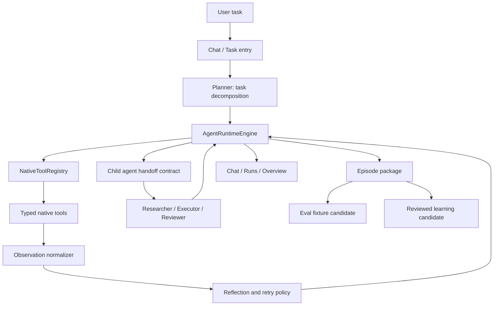

# Agent Capability P2 Design

设计日期：2026-06-10

## Goal

把 Zerox Agent 从“可控、可恢复、可审计地执行”推进到“更稳定地完成复杂任务”。这一轮以通用底层能力基建为主，同时用代码工程和研究写作两个真实场景验收，避免只做抽象 framework。

第一期的产品目标是：用户给出一个复杂任务后，Agent 能拆计划、调用更安全的原生工具、观察结果、反思失败、有限重试、必要时派生一个受限子 Agent，并在最后产出可审计 episode 与验收证据。

## Positioning

这一轮不是做一个单独的“代码助手”或“研究助手”，而是建设 Agent Capability P2：

- **Native Capability Layer**：减少 shell fallback，把高频能力沉淀成 typed native tools。
- **Autonomous Run Loop**：让运行循环具备计划拆解、观察、反思、重试、预算管理和 episode 复盘能力。
- **Multi-Agent Handoff**：引入轻量可审计的子 Agent handoff，不做复杂调度平台。

代码工程和研究写作是验收场景，不是唯一产品边界。

## Design Principles

1. **Local-first remains the trust boundary.** 所有任务、证据、episode、eval 生成仍存本地。
2. **Typed tools before shell power.** 原生工具要有 schema、权限、审计、trajectory，而不是把 shell 包成万能入口。
3. **Autonomy must be budgeted.** 计划、工具调用、重试、子 Agent 都必须有预算和终止条件。
4. **Reflection must be evidence-based.** 反思只基于 trajectory、tool result、eval finding、用户输入，不凭空自信。
5. **Multi-agent is a contract, not theater.** 子 Agent 必须有明确输入、权限、artifact 输出和 review gate。
6. **Product visibility matters.** 底层能力要在 Chat、Runs、Overview 中露出可理解的状态和证据。
7. **Episode becomes regression fuel.** 真实运行包应能沉淀为 eval fixtures 或 learning candidates。

## Scope

### In Scope

- 原生工具注册表与 capability discovery。
- 第一批 P2 原生工具：代码搜索、文件补丁、git status/diff、测试运行、网页抓取、引用记录、Markdown 报告生成。
- run loop 的计划、观察、反思、有限重试、预算、checkpoint resume 扩展。
- 子 Agent handoff contract：primary 可以派一个 researcher、executor 或 reviewer 子角色完成受限子任务。
- episode replay summary 与 eval fixture generation 的第一版。
- UI 可见入口：Chat 工作状态、Runs episode/eval 入口、Overview capability score。
- 两条 golden path 验收：代码工程、研究写作。

### Out Of Scope

- 不做云端 worker、云同步或远程执行。
- 不做完整 OS containerization。
- 不做复杂多 Agent 调度平台、长期后台 swarm 或自动并行大规模任务。
- 不做未审核的自我改代码、自我改 skill 或自动发布。
- 不把研究写作扩展成浏览器自动登录、付费站点访问或敏感数据上传。
- 不在第一期覆盖 Windows/Linux 打包和 Apple notarization。

## Architecture

### Native Capability Layer

Add a typed registry that describes available native capabilities:

- `id`: stable tool id.
- `kind`: code, file, git, test, web, citation, report, orchestration.
- `inputSchema`: serializable JSON schema or equivalent typed descriptor.
- `permissionScope`: file paths, workspace, web domains, shell policy, memory read/write.
- `riskLevel`: low, medium, high.
- `observableEvents`: expected trajectory events.
- `executor`: main-process implementation.

The registry should support discovery so the planner can choose tools based on capability metadata, not hardcoded prompt memory.

Initial tools:

- `code_search`: structured search over workspace with rg-backed implementation.
- `file_patch`: apply bounded patches inside workspace with preview and audit.
- `git_status`: structured status for current workspace.
- `git_diff`: scoped diff summary and raw diff artifact reference.
- `test_run`: run allowed test commands with timeout and structured result.
- `web_fetch_document`: fetch readable page text with source metadata and domain policy.
- `citation_record`: store source title, URL, accessedAt, excerpt hash, and notes.
- `markdown_report_write`: create a report artifact from structured sections and citations.

Shell remains available for explicitly approved advanced cases, but the planner should prefer native tools when equivalent.

### Autonomous Run Loop

The run loop should become a budgeted state machine:

1. **Plan**：produce task decomposition with expected tools, verification, and artifact targets.
2. **Act**：invoke one or more native tools within policy.
3. **Observe**：normalize tool results into compact observations and trajectory evidence.
4. **Reflect**：classify success, retryable failure, permission failure, missing context, or verification gap.
5. **Retry or Handoff**：retry with changed arguments within budget, or delegate one bounded subtask.
6. **Verify**：run focused checks or source-quality checks.
7. **Summarize**：write final summary with evidence links and episode export readiness.

Budgets:

- `stepBudget`: maximum planned steps.
- `toolCallBudget`: maximum native tool calls.
- `retryBudget`: maximum retry attempts per failure class.
- `childRunBudget`: maximum child agent runs.
- `wallClockBudgetMs`: optional time budget.

Budget exhaustion is not a crash. It becomes a classified partial result with next recommended action.

### Reflection Policy

Reflection should be deterministic enough to test:

- It must cite the observation or trajectory event that triggered it.
- It must never retry the exact same failed tool arguments more than once.
- It must distinguish permission denial from missing file, test failure, network failure, invalid model output, and verification gap.
- It must emit `reflection_added` or an equivalent trajectory event with redaction flags.
- It must create reviewed learning candidates only after terminal run states or explicit episode review.

### Multi-Agent Handoff

First phase supports one-level child runs:

- `primary`: owns user goal, plan, final summary.
- `researcher`: gathers sources and citations.
- `executor`: performs bounded code/file/test operations.
- `reviewer`: checks diff, evidence, or report quality.

Handoff contract:

- `handoffId`
- `parentRunId`
- `childRole`
- `objective`
- `allowedTools`
- `workspaceRoot`
- `budget`
- `expectedArtifacts`
- `reviewGate`

Child output contract:

- `childRunId`
- `status`
- `summary`
- `artifacts`
- `trajectoryEventIds`
- `openQuestions`
- `recommendedNextAction`

The parent may accept, reject, or request one revision from the child output. That decision must be visible in trajectory and Runs UI.

## Product Experience

### Chat

Chat should show the live phase in plain language:

- Planning
- Using tools
- Reflecting
- Delegating
- Verifying
- Summarizing

It should show compact cards for current plan, current tool, retry reason, and child handoff when present. The UI should avoid verbose internal logs; deep evidence belongs in Runs.

### Runs

Runs should become the main audit surface:

- Plan steps with actual status and tool evidence.
- Reflection events and retry decisions.
- Child handoff cards with role, objective, status, and artifacts.
- Episode export entry point.
- “Generate eval candidate” entry point for completed or failed runs.

### Overview

Overview should keep harness score and add Agent Capability Score:

- native tool coverage
- eval pass rate
- retry success rate
- child handoff success rate
- pending learning/eval candidates

This score is a product signal, not a vanity metric. It should degrade when failed runs pile up without review.

## Golden Paths

### A. Code Engineering

Input: “Make a small scoped code change and verify it.”

Expected behavior:

1. Agent inspects repo context and chooses focused files.
2. Agent creates a short plan with verification target.
3. Agent uses native code search and file patch tools.
4. Agent runs focused tests through `test_run`.
5. Agent summarizes diff and verification.
6. Runs panel shows plan, tools, test result, and episode export.
7. Episode can become an eval fixture candidate.

Minimum acceptance:

- No shell fallback for status, diff, search, or focused test when native tools exist.
- Failed tests trigger one reflection and an adjusted next action.
- Final summary includes changed files and verification commands.

### B. Research Writing

Input: “Research a topic and produce a short sourced Markdown report.”

Expected behavior:

1. Agent plans research questions.
2. Agent fetches allowed web documents.
3. Agent records citations with URL, title, accessedAt, and evidence snippets.
4. Agent writes a Markdown report artifact.
5. Agent verifies that every factual claim group has at least one citation.
6. Runs panel shows sources, report artifact, and episode export.

Minimum acceptance:

- No unsupported source claims in the report summary.
- Citation evidence is stored separately from prose.
- Final summary distinguishes sourced facts from model inference.

## Data Model Additions

Proposed shared types:

- `NativeToolDescriptor`
- `NativeToolInvocation`
- `NativeToolObservation`
- `RunBudget`
- `ReflectionEvent`
- `AgentHandoffRequest`
- `AgentHandoffResult`
- `AgentCapabilityScore`
- `EvalCandidate`

These should live in shared modules so main process, renderer, and tests use the same contracts.

## Error Handling

- **Permission denied**：stop or ask approval; do not retry with broader paths automatically.
- **Tool failure**：reflect once with changed arguments or abandon with evidence.
- **Test failure**：classify as verification failure and summarize failing test output.
- **Network failure**：mark source unavailable and continue only if enough sources remain.
- **Citation gap**：block report completion or label unsourced inference explicitly.
- **Child failure**：parent records rejection or fallback decision, not silent continuation.
- **Budget exhaustion**：return partial result with next recommended action.

## Verification Strategy

### Unit Tests

- Native registry validates descriptors and permission scopes.
- Each native tool has focused success/failure tests.
- Reflection policy rejects duplicate retries and classifies common failures.
- Handoff contract validates child budgets and allowed tools.
- Capability score changes with native coverage and pending review backlog.

### Integration Tests

- Code golden path fixture: search, patch, test, summary, episode.
- Research golden path fixture: fetch, citation, report, citation verification, episode.
- Child handoff fixture: parent delegates one child task and records review gate.

### Evals

- Extend agent eval runner with contract assertions for:
  - tool preference over shell fallback
  - reflection after retryable failure
  - no duplicate failed retry
  - child handoff event order
  - citation coverage
  - eval candidate generation from episode

### Manual QA

- Browser QA for Chat phase cards, Runs handoff/episode controls, and Overview capability score.
- `npm run verify`
- `npm run harness:check`
- `npm run harness:score`
- `npm run smoke:prod`

## Phased Plan

### P2.1 Native Tools And Capability Score

- Add registry and first native tools for code engineering.
- Add Agent Capability Score in Overview.
- Add Runs evidence for native tool invocations.
- Golden path: code engineering task.

### P2.2 Reflection And Episode Eval Generation

- Add budgeted reflection loop.
- Add duplicate retry prevention.
- Add episode-to-eval candidate generation.
- Golden path: failed test recovery and eval candidate creation.

### P2.3 Research Writing Tools

- Add web fetch, citation record, report writer, citation coverage check.
- Golden path: sourced Markdown report.

### P2.4 Lightweight Multi-Agent Handoff

- Add one-level child handoff contract.
- Add researcher/executor/reviewer roles.
- Add Runs UI for child handoff review gate.
- Golden path: primary delegates one bounded research or review subtask.

## Success Metrics

- `npm run verify` passes.
- `npm run smoke:prod` passes.
- `npm run harness:check` passes.
- Agent evals include both code and research golden paths.
- Overview shows Agent Capability Score.
- Runs can inspect native tool evidence, reflection, child handoff, and episode export.
- A completed code task uses native tools for search/diff/test.
- A completed research task produces citation-backed Markdown.
- Failed tool/test attempts create reflection events and do not repeat identical failed calls.

## Open Design Decisions

1. **Tool schema representation**：prefer TypeScript descriptors first; add JSON Schema export only when external tool discovery needs it.
2. **Citation storage**：store citation evidence as run artifacts first; promote to memory only after review.
3. **Child roles**：ship three named roles, but keep behavior controlled by handoff objective and allowed tools.
4. **Eval candidate review**：generate candidates automatically, but require user review before adding permanent eval fixtures.

## First Implementation Slice

The first implementation plan should start with P2.1:

- shared native tool descriptor types
- main-process registry
- git status/diff, code search, test run tools
- trajectory events for native tool invocation/observation
- Overview Agent Capability Score
- code engineering golden path eval

This creates a shippable foundation before reflection, research tooling, and multi-agent handoff expand the system.
