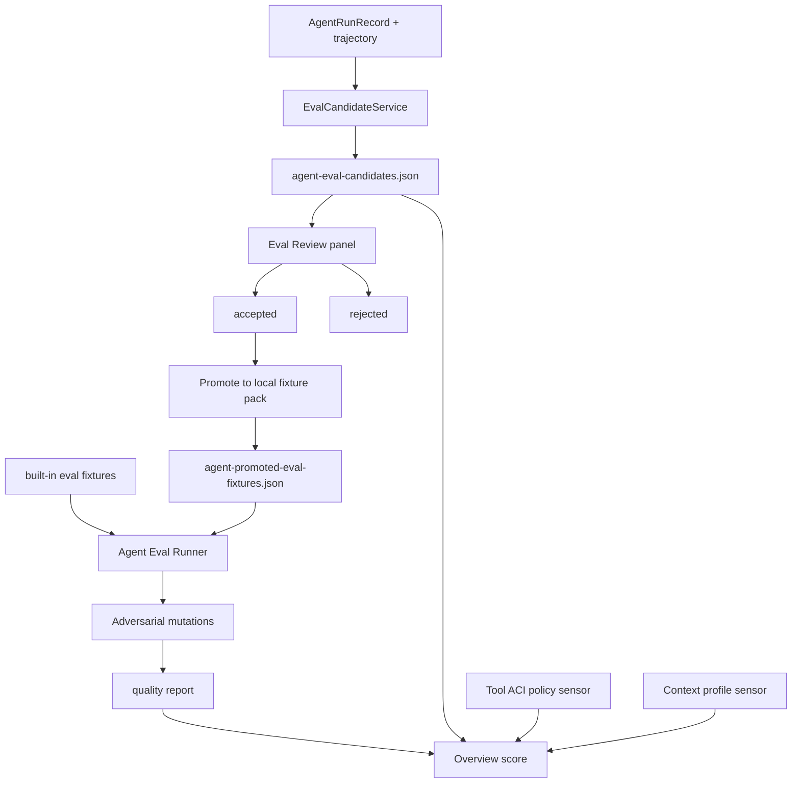

# Agent Learning Harness Loop P3 Design

设计日期：2026-06-10

## Goal

把 Zerox Agent 从 v1.4.0 的“可恢复、可审计、可评测的本地 Agent”推进到 P3 的“会从真实运行中学习的 harness”。这一轮的核心不是继续堆更多工具，而是建立一条闭环：

```text
真实运行 episode
  -> eval candidate
  -> 用户审核
  -> local promoted eval fixture
  -> built-in + promoted + adversarial eval
  -> Overview / CLI score
  -> 下一轮 harness 改进依据
```

P3 的产品目标是：失败、成功、重试、handoff、研究引用、代码验证这些运行证据，都能被治理成可审核的测试资产；同时补齐 deep research 指出的三类最高 ROI 方向：Tool ACI Poka-Yoke、分层上下文组装、对抗性 eval。

## Research Basis

本设计综合以下项目内材料：

- `_knowledge_base/harness-engineering-deep-research-20260610.md`
- `docs/superpowers/specs/2026-06-09-harness-engineering-iteration-spec.md`
- `docs/superpowers/specs/2026-06-10-agent-capability-p2-design.md`
- `docs/architecture/agent-learning-loop.md`

关键研究结论：

1. **Harness 是模型周围的完整工程层**：执行环境、工具接口、上下文、编排、可观测性、验证、治理共同决定 Agent 质量。
2. **简单、可组合模式优于厚框架**：Anthropic 的经验是先用简单 prompt、工具和 eval 把闭环跑稳，再引入复杂 Agent 系统。
3. **ACI 比 prompt 更值得工程投入**：工具参数、权限、输出格式、绝对路径、防错约束直接决定任务成功率。
4. **错误恢复是工程问题**：外部反馈、工具结果、反思记忆和 retry guard 能让失败恢复可解。
5. **eval 要有独立压力**：确定性 fixture 是基础，下一层要做 payload/order assertions、变异测试、pass^k 一致性和 promoted local fixtures。
6. **长期记忆不是单一路径**：向量、结构化 DB、自然语言记忆流、知识图谱和分层上下文都可行；Zerox 应利用已有五类记忆和 RRF 检索做诚实的分层上下文，而不是追逐单一“压缩引擎”叙事。

## Current State

v1.4.0 已完成 P2 Agent Capability 基础：

- 18 个内置工具，其中 8 个 native capability tool。
- `AgentRuntimeEngine`、checkpoint、trajectory、failure classification 已具备。
- `reflection_added`、`child_handoff_*`、research writing citation tools 已有 deterministic eval 覆盖。
- learning candidate 已有本地审核闭环：`pending_review -> accepted/rejected -> applied`。
- episode export 已能生成 `eval-candidate.json`，但这个 candidate 仍只是导出包里的 artifact。
- `npm run verify` 通过 88 个 Vitest 文件 / 393 项测试、11 个 Agent eval fixture、2 个 memory eval fixture。
- `npm run harness:score` 当前评分 9.31/10。

## Gap Analysis

### G1 Eval Candidate 还不是治理对象

现在 `src/main/agentEvalCandidateGenerator.ts` 可以从 episode 生成 candidate，但没有本地 store、列表、审核、去重、状态流转、promotion。它还没有像 learning candidate 一样成为产品内的“待处理工作队列”。

### G2 Eval 仍偏静态

`createAgentEvalFixtures()` 是 built-in fixture 集合。它能验证事件存在、payload、order，但无法加载用户真实运行沉淀出的 local fixtures，也没有 adversarial mutation 来证明 eval runner 能拒绝坏样本。

### G3 Overview 的 pendingEvalCandidates 是静态 0

Agent Capability Score 已设计了 `pendingEvalCandidates` 输入，但 renderer 目前传入 0。这导致 score 无法反映 eval 审核积压，也无法把治理成本反馈给用户。

### G4 Tool ACI Poka-Yoke 还缺少系统性传感器

工具已经类型化、受权限控制，但缺少一层可测试的 ACI policy：

- 哪些工具必须使用绝对路径。
- 哪些 native tools 必须使用 `workspaceRoot`。
- descriptor 是否有 risk、permission、observable events。
- 文件路径参数是否有互斥或模糊写法。
- 工具输出是否足够 agent-legible。

P3 不需要一次重写所有工具，但需要先建立 lint/sensor，让 harness score 能感知 ACI 质量。

### G5 上下文压缩存在，但还不是分层策略

`contextManager.ts` 能估算 token 并压缩旧对话，`agentProceduralMemory.ts` 会注入 reviewed procedural memory。缺口是缺少明确的 core/hot/cold profile 和按任务意图选择记忆类型的规则。这会影响长任务成本和稳定性。

### G6 子 Agent 失败恢复仍偏手动

P2.4 已有 handoff contract 和 review gate。P3 不做复杂多 Agent 调度平台，但应该把 child handoff 的失败和审核结果纳入 eval candidate、adversarial eval 和 score 信号。

## Target State

P3 后，Zerox Agent 应具备一条可见、可审核、可回归的学习型 harness：

- Runs 可以从任意 terminal run 生成或查看 eval candidate。
- Eval Review 面板列出 pending/accepted/rejected/promoted candidates。
- 用户接受 candidate 后，可以 promotion 到 local fixture pack。
- Agent eval runner 合并 built-in fixtures 和 local promoted fixtures。
- 对抗性 eval 能验证 runner 会拒绝缺事件、错 payload、错 order 的变异样本。
- Overview 的 Agent Capability Score 使用真实 pending eval count。
- Tool ACI policy 能作为 harness sensor 检查 native descriptors 和关键工具参数。
- Context profile 能把 core/hot/cold/message compression 与 memory-kind selection 变成可测试策略。

## Architecture



### Design Principles

1. **Review before behavior change.** Eval candidates do not affect quality gates until accepted and promoted.
2. **Local fixtures, not source mutation.** Promotion writes to userData config by default; it does not edit `src/main/eval/agentEvalFixtures.ts`.
3. **Deterministic first.** Candidate generation, promotion, and adversarial mutation are pure or file-backed deterministic functions before any LLM-based evaluator is introduced.
4. **Sensors over ceremony.** ACI and context improvements start as measurable policies and eval checks, not as broad rewrites.
5. **Keep P3 shippable.** Graph workflow engine, cross-device sync, full benchmark suite, and automatic child-agent recovery remain future work.

## Requirements

### R1 Eval Candidate Store

Add a local store at:

```text
userData/config/agent-eval-candidates.json
```

Stored shape:

```ts
type StoredAgentEvalCandidates = {
  schemaVersion: 1;
  candidates: AgentEvalCandidate[];
};
```

`AgentEvalCandidateStatus` becomes:

```ts
type AgentEvalCandidateStatus =
  | "pending_review"
  | "accepted"
  | "rejected"
  | "promoted";
```

The store must support:

- `create(input: AgentEvalCandidate): Promise<AgentEvalCandidate>`
- `createFromEpisode(input: { run; trajectory; createdAt }): Promise<AgentEvalCandidate>`
- `list(options?: { status?: AgentEvalCandidateStatus }): Promise<AgentEvalCandidate[]>`
- `setStatus(candidateId, status): Promise<AgentEvalCandidate | null>`
- duplicate prevention by `sourceRunId + fixture.id`
- timestamps preserving `createdAt` and updating `updatedAt`

### R2 Eval Candidate Service

Add a main-process service that coordinates run store, trajectory store, candidate generator, and candidate store:

- `generateForRun(runId)` loads the run and trajectory, rejects missing/non-terminal runs, creates or returns existing candidate.
- `promoteAccepted(candidateId)` accepts only `accepted` candidates, writes them to the local fixture pack, then marks candidate `promoted`.
- terminal statuses allowed for generation: `succeeded`, `failed`, `cancelled`.

### R3 Local Promoted Fixture Pack

Add local fixture pack at:

```text
userData/config/agent-promoted-eval-fixtures.json
```

Stored shape:

```ts
type StoredPromotedAgentEvalFixtures = {
  schemaVersion: 1;
  fixtures: AgentEvalFixture[];
};
```

Rules:

- Dedupe by `fixture.id`.
- Preserve full trajectory event evidence.
- Never mutate built-in source fixtures.
- `runAgentEvals()` can receive built-in + promoted fixtures.
- CLI scripts can read promoted fixtures when passed `--config-dir` or `BUILDING_AGENT_CONFIG_DIR`.

### R4 IPC And Product Surfaces

Expose desktop APIs:

- `listEvalCandidates(options?)`
- `generateEvalCandidateForRun(runId)`
- `acceptEvalCandidate(candidateId)`
- `rejectEvalCandidate(candidateId)`
- `promoteEvalCandidate(candidateId)`

Runs panel:

- Show a compact Eval Candidate card for selected terminal run.
- Button: generate candidate.
- Show candidate status when already generated.

Eval Review panel:

- New navigation section `evals` or a clearly separated panel within review/governance.
- List pending first, then accepted, promoted, rejected.
- Pending candidates can be accepted/rejected.
- Accepted candidates can be promoted.
- Each card shows source run, required event types, assertion count, recoverability requirement, and rationale.

Overview:

- Load pending eval candidates.
- Pass real `pendingEvalCandidates` into `computeAgentCapabilityScore`.
- Add attention item when pending eval candidates exist.

### R5 Eval Runner With Built-in, Local, And Adversarial Modes

Add helper functions:

- `createCombinedAgentEvalFixtures(builtIn, promoted)`
- `runAgentEvals(fixtures)` remains deterministic.
- `createAdversarialAgentEvalCases(fixtures)` returns mutated fixtures with expected failure reasons.
- `runAdversarialAgentEvals(fixtures)` passes only when the runner rejects every invalid mutation.

Minimum adversarial mutations:

- remove one required event
- change one asserted payload value
- move an asserted event before its `after` dependency

This does not need stochastic benchmark infrastructure. It is a harness sensor that proves eval assertions are not decorative.

### R6 Tool ACI Poka-Yoke Policy

Add a shared policy module that checks tool definitions and native descriptors:

- descriptor exists for native tools
- descriptor has risk level, permission scope, observable events
- file-writing tools require absolute `path`
- workspace tools require absolute `workspaceRoot`
- web fetch tools require URL-like `url`
- shell/test tools require template-approved command
- tool names and descriptions use concrete parameter names

P3 should first surface this as a report:

```ts
type ToolAciPolicyReport = {
  passed: boolean;
  findings: ToolAciPolicyFinding[];
};
```

This report can later become a hard quality gate. In P3 it should be covered by unit tests and included in harness score output.

### R7 Layered Context Profile

Add a pure shared context profile:

```ts
type AgentContextLayer = "core" | "hot" | "cold";
type AgentTaskIntent = "code" | "research" | "writing" | "memory" | "general";
type AgentContextProfile = {
  coreBudgetTokens: number;
  hotTurnCount: number;
  coldSummaryBudgetTokens: number;
  memoryKinds: MemoryKind[];
};
```

Rules:

- Code tasks prefer `procedural`, `semantic`, then `episodic`.
- Research tasks prefer `semantic`, `episodic`, then `procedural`.
- Memory/governance tasks can include all reviewed memory kinds.
- The profile is used to configure `ContextManager` and procedural memory recall limit in a later integration step.

P3 only needs the policy and first integration point; it does not need a full context rewrite.

### R8 Harness Score Integration

`npm run harness:score` should include:

- built-in eval report
- promoted eval report when config dir exists
- adversarial eval report
- pending learning candidate count
- pending eval candidate count
- ACI policy report

The CLI should fail only when:

- normal evals fail
- adversarial evals fail to catch invalid mutations
- score tone is `bad`

### R9 Documentation

Update:

- `docs/architecture/agent-learning-loop.md` with eval candidate lifecycle.
- README with P3 learning harness loop and commands.
- `.zerox/feature_list.json` and `.zerox/progress.md` after implementation.

## Non-Goals

- No full DAG workflow engine in P3.
- No automatic mutation of `src/main/eval/agentEvalFixtures.ts`.
- No LLM-generated eval assertions without review.
- No automatic skill/code rewriting from eval findings.
- No remote execution, cloud sync, or cross-device state sync.
- No large SWE-bench-style benchmark runner yet.
- No multi-level Agent swarm.

## Success Metrics

### Product

- Runs can generate an eval candidate for a terminal run.
- Eval Review can accept, reject, and promote candidates.
- Overview displays real pending eval candidate count.
- Agent Capability score degrades when eval/learning review backlog grows.

### Harness

- Built-in evals still pass.
- Promoted local fixtures are included when present.
- Adversarial eval catches removed events, wrong payloads, and wrong order.
- ACI policy report passes for current native descriptors or emits actionable findings.
- Context profile tests prove task intent maps to memory kinds and budgets.

### Verification Commands

```bash
npm test -- src/main/agentEvalCandidateStore.test.ts src/main/agentEvalCandidateService.test.ts src/main/eval/agentPromotedEvalFixtures.test.ts
npm test -- src/main/eval/agentEvalAdversary.test.ts src/shared/toolAciPolicy.test.ts src/shared/agentContextProfile.test.ts
npm run verify
npm run harness:score
npm run smoke:prod
```

## Phased Delivery

### P3.1 Eval Candidate Governance

Build eval candidate store, service, IPC, Runs generation card, and Overview pending count.

### P3.2 Promotion And Local Fixture Pack

Promote accepted candidates to local fixtures and make eval runner/CLI load built-in + promoted fixtures.

### P3.3 Adversarial Eval Sensor

Add deterministic mutation cases and CLI reporting so the harness proves it rejects invalid behavior.

### P3.4 ACI And Context Sensors

Add Tool ACI Poka-Yoke policy and layered context profile. Integrate reports into harness score without broad runtime rewrites.

### P3.5 Documentation And Release Readiness

Update docs, README, `.zerox`, and run full verification.

## Future Work

P4 candidates after this loop is stable:

- child-agent automatic recovery and role health scoring
- aggregate observability dashboard for failure trends, token cost, and eval drift
- pass^k repeated-run benchmark for non-deterministic live tasks
- DAG workflow engine for complex fan-in/fan-out orchestration
- SWE-bench-like periodic coding benchmark pack
